## Four Power Modes × Eight Models: llama.cpp vs Ollama

**Platform:** NVIDIA Jetson Orin Nano Super 8GB  
**CPU:** 6-core Arm Cortex-A78AE · **GPU:** NVIDIA Ampere (1024 CUDA cores, 32 Tensor cores)  
**Memory:** 8 GB LPDDR5 shared CPU+GPU · **JetPack:** R36.4.7 (L4T 36.4)  
**Backends:** llama.cpp CUDA (`-ngl 99`, `--no-cache-prompt`) · Ollama (CUDA, matched quantizations)  
**Runs:** llama.cpp - four full sweeps: **7W**, **15W**, **25W**, **MAXN_SUPER** · Ollama - **7W**, **15W**, **25W**, and **MAXN** complete  
**Sweep:** prompt ∈ {128, 512, 1024, 2048} tok × gen ∈ {64, 128, 256} tok × **20 reqs/combo**  
**Concurrency:** 1 (single-user)  
**Key metric:** **output tok/J** = [`OSL`](#glossary) ÷ ([`decode_power_W`](#glossary) × [<code>p50_decode_s</code>](#appendix-i1)) - decode-phase energy only

**Raw data on Hugging Face** - complete per-cell JSON exports (all 33 metrics, 12 prompt×gen combos × 20 requests per cell, `profile_export_aiperf.json` + `tegrastats.log` + server logs):

**llama.cpp**

| Mode | Dataset | Models | Cells |
|------|---------|-------:|------:|
| 7W   | [`YuvrajSingh9886/jetson-non-reasoning-benchmark-7w`](https://huggingface.co/datasets/YuvrajSingh9886/jetson-non-reasoning-benchmark-7w) | 8 | 96 |
| 15W  | [`YuvrajSingh9886/jetson-non-reasoning-benchmark-15w`](https://huggingface.co/datasets/YuvrajSingh9886/jetson-non-reasoning-benchmark-15w) | 8 | 96 |
| 25W  | [`YuvrajSingh9886/jetson-non-reasoning-benchmark-25w`](https://huggingface.co/datasets/YuvrajSingh9886/jetson-non-reasoning-benchmark-25w) | 8 | 96 |
| MAXN | [`YuvrajSingh9886/jetson-non-reasoning-benchmark-maxn`](https://huggingface.co/datasets/YuvrajSingh9886/jetson-non-reasoning-benchmark-maxn) | 8 | 96 |

**Ollama**

| Mode | Dataset | Models | Cells |
|------|---------|-------:|------:|
| 7W   | [`YuvrajSingh9886/jetson-non-reasoning-benchmark-ollama-7w`](https://huggingface.co/datasets/YuvrajSingh9886/jetson-non-reasoning-benchmark-ollama-7w) | 8 | 96 |
| 15W  | [`YuvrajSingh9886/jetson-non-reasoning-benchmark-ollama-15w`](https://huggingface.co/datasets/YuvrajSingh9886/jetson-non-reasoning-benchmark-ollama-15w) | 8 | 96 |
| 25W  | [`YuvrajSingh9886/jetson-non-reasoning-benchmark-ollama-25w`](https://huggingface.co/datasets/YuvrajSingh9886/jetson-non-reasoning-benchmark-ollama-25w) | 8 | 96 |
| MAXN | [`YuvrajSingh9886/jetson-non-reasoning-benchmark-ollama-maxn`](https://huggingface.co/datasets/YuvrajSingh9886/jetson-non-reasoning-benchmark-ollama-maxn) | 8 | 96 |

> `Github` repo with all code, scripts, and plotting notebooks can be found [here](https://github.com/smollm/jetson-nano-super-benchmark)

<figure style="text-align: center;">
  
  <figcaption>My mini rack of 3× Jetson Orin Nano Super 8GB - $750 of edge inference crammed into a shoebox.</figcaption>
</figure>

## Executive Summary

Eight models were benchmarked across all four Jetson Orin Nano Super power modes under **llama.cpp CUDA** and, for a direct backend comparison, under **Ollama** (matched quantizations) at all four power modes. Each model ran *12 combinations* of *prompt × generation length* (20 requests per combo) at every power mode where it could load.

**Key finding: 25W (nvpmodel -m 1) is the paretto sweet spot for every model under llama.cpp.** It delivers *35-47 %* more output tok/s than 15W while pushing output tok/J *1-7 %* higher than 15W and *9-23 %* higher than MAXN_SUPER across every model (ctx=2048, gen=256, corrected decode-phase tok/J).

**Backend finding: llama.cpp outperforms Ollama by 36-74 % on throughput** for sub-1B transformer models, with proportionally higher tok/J. Qwen3-0.6B and Llama3.2-1B are the exception - nearly identical across backends (~1-6 % difference at all four power modes). LFM2.5-350M suffers most under Ollama (3.35× slower than llama.cpp at 15W, 4.2× at 25W).

> **GPU offloading verified:** Ollama loaded all models with **100 % GPU offload** (confirmed via `ollama ps`). No layers fell back to CPU. The performance gap is not caused by partial GPU offloading — it reflects differences in CUDA kernel efficiency and server overhead between the two backends at identical GPU utilisation.

**Sub-1B standouts at 25W llama.cpp:**
- **SmolLM2-135M** - **165.2 tok/s**, **29.6 output tok/J** (best in suite), 101 MB, ~5.6 W: runs on a USB-C power bank
- **LFM2.5-350M** - **115.4 tok/s** in only 219 MB: competitive with SmolLM2-360M (369 MB) at 60 % of its size

**~1B class at 25W llama.cpp** *(ctx=2048, gen=256):*
- **LFM2.5-1.2B** leads on throughput (**54.1 tok/s**, 15 % ahead of Llama3.2-1B, 33 % ahead of Gemma3-1B) in the smallest footprint (698 MB)
- **Gemma3-1B** edges ahead on total tok/J (118.5 vs 116.2) thanks to lower power draw (6.82 W vs 8.52 W)

**Throughput winner at each mode** *(ctx=2048, gen=256, highest sweep point):*

<a id="table-1"></a>
**Table 1: Throughput and efficiency winner at each power mode (ctx=2048, gen=256)**

**llama.cpp / CUDA:**

| Mode | Fastest model | <a href="#glossary" style="color:inherit;text-decoration:none"><code>Output Tok/s</code></a> | <a href="#appendix-i3" style="color:inherit;text-decoration:none"><code>Output Tok/J</code></a>† |
|------|--------------|-------------:|-------------:|
| 7W   | smollm2-135m | 53.8 | **27.0**‡ |
| 15W  | smollm2-135m | 114.7 | 27.58 |
| 25W  | smollm2-135m | **165.2** | **29.62** |
| MAXN | smollm2-135m | 159.5 | 24.72 |

**Ollama (matched quantizations):**

| Mode | Fastest model | <a href="#glossary" style="color:inherit;text-decoration:none"><code>Output Tok/s</code></a> | <a href="#appendix-i3" style="color:inherit;text-decoration:none"><code>Output Tok/J</code></a>† |
|------|--------------|-------------:|-------------:|
| 7W   | smollm2-135m | 36.4 | 19.21 |
| 15W  | smollm2-135m | 84.4 | 20.14 |
| 25W  | smollm2-135m | **120.6** | **21.26** |
| MAXN | smollm2-135m | 132.2 | 18.65 |

† Output tok/J = [`OSL`](#glossary) ÷ ([`decode_power_W`](#glossary) × [<code>p50_decode_s</code>](#appendix-i1)) - decode-phase energy only (corrected method).  
‡ 7W llama.cpp approximated: no tegrastats retained for that run; older avg-power method used.

## 1. Test Setup

### 1.1 Hardware

<a id="table-2"></a>
**Table 2: Hardware configuration**

| Component | Detail |
|-----------|--------|
| Board | Jetson Orin Nano Super 8GB (Developer Kit) |
| CPU | 6× Arm Cortex-A78AE @ up to 1.728 GHz |
| GPU | NVIDIA Ampere, 1024 CUDA cores, 32 Tensor cores |
| Memory | 8 GB LPDDR5 204.8 GB/s (unified CPU + GPU) |
| Cooling | Active fan; peak junction temperature ≤ 73 °C across all modes |

### 1.2 Software Stack

<a id="table-3"></a>
**Table 3: Software stack**

| Layer | Version / Detail |
|-------|-----------------|
| Board | NVIDIA Jetson Orin Nano Super 8GB Developer Kit |
| OS / JetPack | JetPack R36.4.7 (Ubuntu 22.04, L4T 36.4.7) |
| CUDA | 12.6 |
| llama.cpp | build **b9292** (commit `ef570f630`), CUDA backend, `-ngl 99`, `--no-cache-prompt --cache-ram 0` |
| llama-server | host `0.0.0.0:8080`, `--parallel 1`, `-c 2560` |
| Ollama | **v0.24.0**, default GPU offload, REST API on port 11434 |
| Load generator | `aiperf` (NVIDIA AI Performance tool) |
| Power telemetry | `tegrastats` at 500 ms, [`VDD_CPU_GPU_CV`](#glossary) rail (mW) |
| Python | 3.10 (aiperf-env), pandas, seaborn, matplotlib |
| Datasets | Synthetic prompts at exact token counts (128, 512, 1024, 2048) generated via aiperf |
| Concurrency | **1 user, 1 request at a time** (`--parallel 1`, `--concurrency 1`) - single-user latency and throughput profile only |
| Clock locking | `jetson_clocks` run after each `nvpmodel` switch (pins GPU + CPU at the mode's maximum frequency so DVFS cannot drop clocks between requests - [see I.13](#appendix-i13) for why this matters for reproducibility) |

### 1.3 Models Under Test

<a id="table-4"></a>
**Table 4: Models under test**

| Model | Quant | GGUF size | Tokenizer |
|-------|-------|----------:|-----------|
| SmolLM2-135M-Instruct | Q4_K_M | 101 MB | HuggingFaceTB/SmolLM2-135M-Instruct |
| SmolLM2-360M-Instruct | Q8_0   | 369 MB | HuggingFaceTB/SmolLM2-360M-Instruct |
| Qwen2.5-0.5B-Instruct | Q4_K_M | 469 MB | Qwen/Qwen2.5-0.5B-Instruct |
| LFM2.5-350M           | Q4_K_M | 219 MB | LiquidAI/LFM2.5-350M |
| LFM2.5-1.2B-Instruct  | Q4_K_M | 698 MB | LiquidAI/LFM2.5-1.2B-Instruct |
| Qwen3-0.6B            | Q8_0   | 610 MB | Qwen/Qwen3-0.6B |
| Llama-3.2-1B-Instruct | Q4_K_M | 771 MB | meta-llama/Llama-3.2-1B-Instruct |
| Gemma3-1B-IT          | Q4_K_M | 769 MB | google/gemma-3-1b-it |

> **Quantization note:** SmolLM2-360M-Instruct and Qwen3-0.6B use **Q8_0** (8-bit, near-lossless); all other models use **Q4_K_M** (4-bit K-quant medium).

### 1.4 Power Modes

<a id="table-5"></a>
**Table 5: Power mode configurations**

| Mode | nvpmodel | GPU clock | CPU clock | [`VDD_CPU_GPU_CV`](#glossary) avg across models |
|------|----------|----------:|----------:|---------------------------------:|
| **7W**   | `-m 3` | ~408 MHz | 960 MHz  | 1.96-2.34 W |
| **15W**  | `-m 0` | ~612 MHz | 1 190 MHz | 4.16-6.06 W |
| **25W**  | `-m 1` | ~820 MHz | 1 420 MHz | 5.54-8.58 W |
| **MAXN** | `-m 2` + `jetson_clocks` | **1020 MHz** | **1 728 MHz** | 6.36-10.64 W |

### 1.5 Benchmark Methodology

- For each `model` × `prompt` × `gen combo`, `aiperf` sends 20 single-concurrency requests with synthetic prompts at the exact target token count. 
- Power is computed from `tegrastats` [`VDD_CPU_GPU_CV`](#glossary) (mW → W) at 500 ms intervals. For **both llama.cpp (15W/25W/MAXN) and all four Ollama modes**, per-request nanosecond timestamps from `profile_export.jsonl` (`request_start_ns`, `request_ack_ns`, `request_end_ns`) are used to classify each tegrastats sample as **prefill** (start→ack) or **decode** (ack→end). [`decode_power_W`](#glossary) is the median of samples that fall inside decode windows. [`output_tok_J`](#glossary) = [`OSL`](#glossary) ÷ ([`decode_power_W`](#glossary) × [<code>p50_decode_s</code>](#appendix-i1)) - decode-phase energy only. This avoids inflating the denominator with the high-power prefill spike, giving a more accurate per-output-token efficiency figure.
- Clocks were locked with `jetson_clocks` at all modes. CMA was compacted (`/proc/sys/vm/compact_memory`) between model loads.
- Each run's power and clock speed was capped at x W through `nvpmodel` and monitored for thermal stability (no sustained throttling; `junction temp` ≤ 73 °C).
- **Latency percentile used throughout:** all [`TTFT`](#glossary), [`ITL`](#glossary), and request latency ([`RL`](#glossary)) values reported in charts, tables, and energy calculations use the **p50 (median)** over the 20 requests per combo. The mean is not used for latency because occasional slow requests (GC pause, memory compaction, OS scheduling) inflate it without reflecting typical behaviour. p90 and p99 are available in the raw per-mode Hugging Face datasets (see raw data table at the top of this post) for tail-latency analysis.

## 2. Results: Charts

All charts use data from all four power modes.

> **Line/point convention throughout:** Solid lines / filled circles = llama.cpp. Dashed lines / open squares = Ollama. Each model gets its own colour.

### 2.1 Throughput vs Prompt Length

`Output tok/s by power mode` at *gen=256, ctx=2048* across all models; solid lines = llama.cpp, dashed = Ollama. 25W consistently leads:

<a id="figure-1"></a>
**Figure 1: Output tok/s by power mode - all models (gen=256, ctx=2048)**

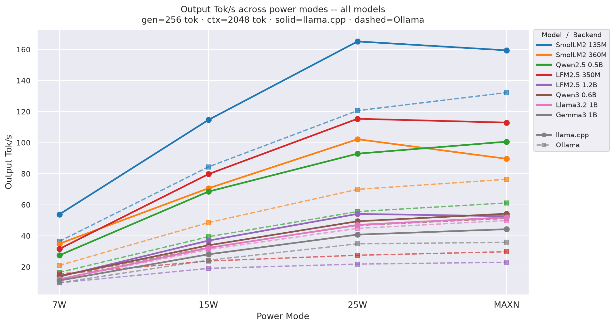

`Canonical cell` (ctx=2048, gen=256), side-by-side output tok/s and output tok/J bars for all 4 modes:

<a id="figure-2"></a>
**Figure 2: Canonical cell: output tok/s and tok/J side by side (ctx=2048, gen=256)**

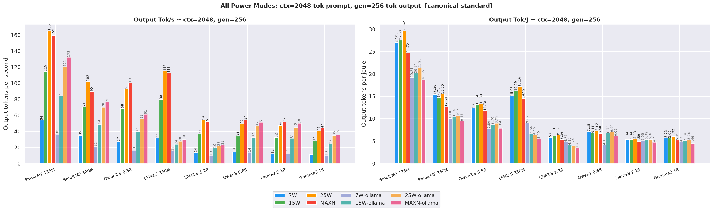

---

<a id="section-22"></a>
### 2.2 Energy Efficiency

- `Output Tok/J by power mode` at *gen=256, ctx=2048*; 25W leads for every model at every power mode:

<a id="figure-3"></a>
**Figure 3: Output tok/J by power mode - all models (gen=256, ctx=2048)**


<!-- `Best output tok/J` per model; 25W consistently produces the highest output tok/J bar: -->

<!--  -->

- `llama.cpp ÷ Ollama speed ratio` at the canonical cell (ctx=2048, gen=256). Values > 1× mean llamacpp is faster:

<a id="table-6"></a>
**Table 6: llama.cpp vs Ollama - <a href="#glossary" style="color:inherit;text-decoration:none"><code>tok/s</code></a> ratios (llama.cpp ÷ Ollama) at each power mode - canonical cell (ctx=2048, gen=256)**


| Model | 7W ratio | 15W ratio | 25W ratio | MAXN ratio |
|-------|--------:|---------:|---------:|----------:|
| SmolLM2 135M | **1.48×** | **1.36×** | **1.37×** | 1.21× |
| SmolLM2 360M | **1.67×** | **1.45×** | **1.46×** | 1.17× |
| Qwen2.5 0.5B | **1.67×** | **1.74×** | **1.67×** | **1.64×** |
| LFM2.5 350M  | **2.04×** | **3.35×** | **4.20×** | **3.79×** |
| LFM2.5 1.2B  | **1.40×** | **1.94×** | **2.48×** | **2.29×** |
| Qwen3 0.6B   | 1.01× | 1.04× | 1.06× | 1.06× |
| Llama3.2 1B  | 1.02× | 1.03× | 1.05× | 1.04× |
| Gemma3 1B    | 1.15× | 1.16× | 1.17× | 1.24× |

**Table 7: llama.cpp vs Ollama - <a href="#appendix-i3" style="color:inherit;text-decoration:none"><code>tok/J</code></a> ratios (llama.cpp ÷ Ollama) at each power mode - canonical cell (ctx=2048, gen=256)**

| Model | 7W ratio | 15W ratio | 25W ratio | MAXN ratio |
|-------|--------:|---------:|---------:|----------:|
| SmolLM2 135M | **1.41×** | **1.37×** | **1.39×** | **1.33×** |
| SmolLM2 360M | **1.54×** | **1.41×** | **1.46×** | **1.34×** |
| Qwen2.5 0.5B | **1.59×** | **1.51×** | **1.49×** | **1.50×** |
| LFM2.5 350M  | **1.67×** | **2.44×** | **2.68×** | **2.65×** |
| LFM2.5 1.2B  | 1.23× | **1.51×** | **1.62×** | **1.56×** |
| Qwen3 0.6B   | **1.74×** | 1.01× | 1.04× | 1.10× |
| Llama3.2 1B  | 1.05× | 0.99× | 1.02× | 1.03× |
| Gemma3 1B    | 1.20× | 1.11× | 1.14× | 1.16× |

> Full ratio tables with [`TTFT`](#glossary), [`ITL`](#glossary), and power are in [**Appendix C**](#appendix-c).

- `Prefill tok/J` (input tokens per joule of prefill energy) by power mode at *gen=256, ctx=2048*; how each model's prefill efficiency varies with GPU clock:

<a id="figure-4"></a>
**Figure 4: Prefill tok/J by power mode - all models (gen=256, ctx=2048)**


> ⚠ [Prefill tok/J is approximate](#appendix-i12) when [`TTFT`](#glossary) < 500 ms (no tegrastats sample in prefill window): **63 % of llama.cpp cells**, **48 % of Ollama cells**. Decode tok/J and total tok/J are not affected.

- `Decode tok/J` (output tokens per joule of decode energy) by power mode at *gen=256, ctx=2048*; output generation efficiency - 25W leads across all models:

<a id="figure-5"></a>
**Figure 5: Decode tok/J by power mode - all models (gen=256, ctx=2048)**


- `Total tok/J` ((input + output) tokens per joule of total request energy) by power mode at *gen=256, ctx=2048*; overall request efficiency - 25W wins at every model:

<a id="figure-6"></a>
**Figure 6: Total tok/J by power mode - all models (gen=256, ctx=2048)**

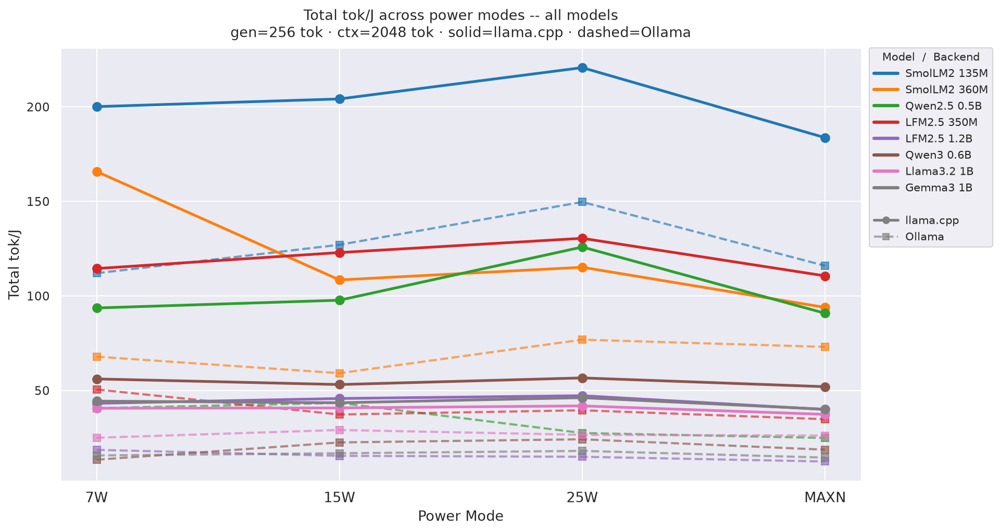

> Full tok/J charts for all ctx/gen combinations: [D.1 Prefill](#appendix-d1) · [D.2 Decode](#appendix-d2) · [D.3 Total](#appendix-d3).

---

<a id="section-23"></a>
### 2.3 Latency

[`TTFT`](#glossary) p50 at ctx=2048, gen=256; 25W and MAXN reduce [`TTFT`](#glossary) by *30-38 %* vs 15W:

<a id="figure-7"></a>
**Figure 7: [`TTFT`](#glossary) p50 by power mode (ctx=2048, gen=256)**

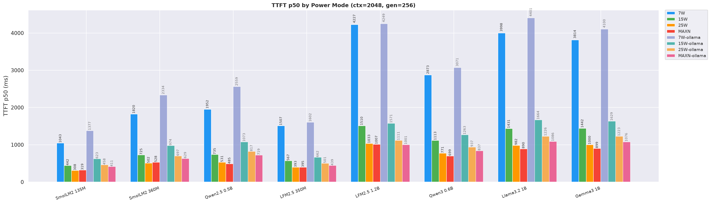

[`ITL`](#glossary) *(inter-token latency)* p50 at ctx=2048, gen=256; lower is better:

<a id="figure-8"></a>
**Figure 8: [`ITL`](#glossary) p50 by power mode (ctx=2048, gen=256)**

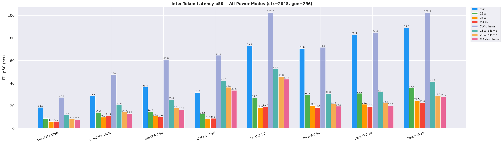

`Request latency (E2E)` p50 at ctx=2048, gen=256; total time from request start to last token received:

<a id="figure-9"></a>
**Figure 9: Request latency (E2E) p50 by power mode (ctx=2048, gen=256)**

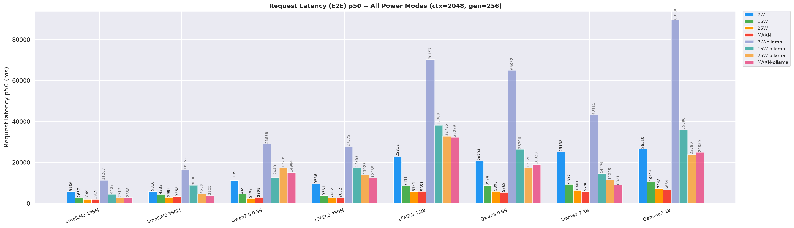

---

### 2.4 Prefill Throughput

25W and MAXN provide *~35-40 % faster* prefill than 15W:

<a id="figure-10"></a>
**Figure 10: Prefill throughput by power mode (gen=256, avg over all prompt lengths)**

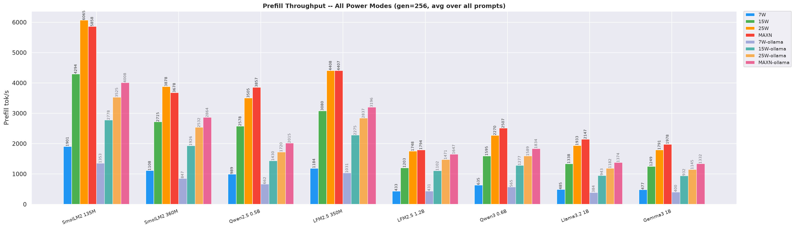

---

### 2.5 Power Draw

Average [`VDD_CPU_GPU_CV`](#glossary) per model at each mode:

<a id="figure-11"></a>
**Figure 11: Average [`VDD_CPU_GPU_CV`](#glossary) power draw per model at each power mode - canonical cell (ctx=2048, gen=256)**

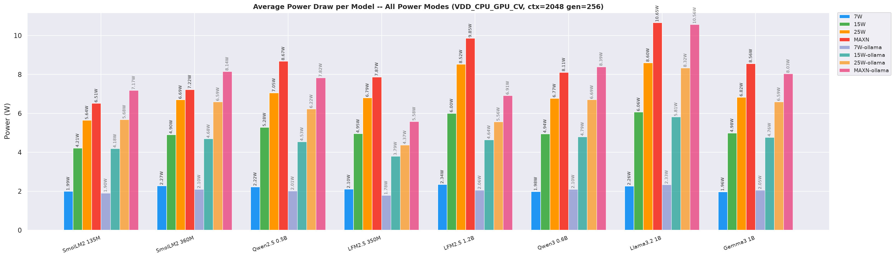

<a id="table-8"></a>
**Table 8: Power draw ratio - Ollama ÷ llama.cpp [`VDD_CPU_GPU_CV`](#glossary) (W) at each power mode - canonical cell (ctx=2048, gen=256)**

Values < 1.00× mean Ollama draws less power than llama.cpp at that mode. **Bold** = ratio < 0.85× (Ollama ≥ 15 % lower power).

| Model | 7W ratio | 15W ratio | 25W ratio | MAXN ratio |
|-------|--------:|---------:|---------:|----------:|
| SmolLM2-135M | 0.95× | 0.99× | 1.01× | **1.10×** |
| SmolLM2-360M | 0.93× | 0.95× | 0.98× | **1.12×** |
| Qwen2.5-0.5B | **0.91×** | 0.86× | 0.88× | 0.90× |
| LFM2.5-350M  | **0.85×** | 0.76× | 0.65× | 0.71× |
| LFM2.5-1.2B  | **0.88×** | 0.78× | 0.65× | 0.70× |
| Qwen3-0.6B   | **1.06×** | 0.97× | 0.99× | 1.03× |
| Llama3.2-1B  | **1.03×** | 0.96× | 0.97× | 0.99× |
| Gemma3-1B    | **1.05×** | 0.95× | 0.96× | 0.93× |

As one can concur from the above table, >7W power mode - llama.cpp draws in less power than Ollama backend for all models except Qwen3-0.6B, Llama3.2-1B, and Gemma3-1B.

- The average power draw of each mode increases with model size, but the relative increase from 7W → 15W → 25W → MAXN is consistent across models: *~2-3x* from 7W to 15W, *~1.3-1.5x* from 15W to 25W, and *~1.2-1.4x* from 25W to MAXN.

- In terms of [Appendix B (Thermal)](#appendix-b) temperature, the average is 56.8 °C for models <= 0.5B and about 61.1 °C for models > 0.5B, ~4.3 °C cooler for the smaller models across all power modes. See [Appendix B.1](#appendix-b1) for the full thermal data.

- As one can see, the power draw across all the four modes, when locked at the maximum possible GPU and CPU clocks, is not the maximum one could receive. This is possibly because we do not fully utilize the GPU with our current settings, small batch-size, single user-single requests mode as the GPU is mostly occupied during the *prefill stage* and during *decode* its *memory bandwidth bound*, **not** *compute bound*. 

## 3. Analysis

### 3.1 Higher tok/sec != efficient model (tok/J)

Tok/s and tok/J side by side - see [Figure 2](#figure-2). A faster mode does not always mean a more efficient one.

- MAXN beats 25W on raw tok/s for some models but loses on tok/J because its power increase outpaces the throughput gain for *ctx = 2048, gen = 256*.

> **Corrected tok/J method (15W/25W/MAXN llama.cpp and all ollama):** [`output_tok_J`](#glossary) = [`OSL`](#glossary) ÷ ([`decode_power_W`](#glossary) × [<code>p50_decode_s</code>](#appendix-i1)) - decode-phase energy only, using per-request ns timestamps from `profile_export.jsonl`.  
> **‡ 7W llama.cpp:** approximated as [`tok_s`](#glossary) / [`VDD_CPU_GPU_CV`](#glossary) (W) - no tegrastats in the HF 7W dataset.

<a id="table-9"></a>
**Table 9: Canonical cell comparison - llama.cpp (ctx=2048, gen=256)**

| Model | 7W <a href="#glossary" style="color:inherit;text-decoration:none"><code>tok/s</code></a> | 15W <a href="#glossary" style="color:inherit;text-decoration:none"><code>tok/s</code></a> | 25W <a href="#glossary" style="color:inherit;text-decoration:none"><code>tok/s</code></a> | MAXN <a href="#glossary" style="color:inherit;text-decoration:none"><code>tok/s</code></a> | 7W <a href="#appendix-i3" style="color:inherit;text-decoration:none"><code>tok/J</code></a>‡ | 15W <a href="#appendix-i3" style="color:inherit;text-decoration:none"><code>tok/J</code></a> | 25W <a href="#appendix-i3" style="color:inherit;text-decoration:none"><code>tok/J</code></a> | MAXN <a href="#appendix-i3" style="color:inherit;text-decoration:none"><code>tok/J</code></a> | Peak <a href="#appendix-i3" style="color:inherit;text-decoration:none"><code>tok/J</code></a> |
|-------|--------:|----------:|----------:|-----------:|----------:|----------:|----------:|----------:|:---------:|
| SmolLM2-135M | 53.8 | 114.7 | **165.2** | 159.5 | 27.0‡ | 27.58 | **29.62** | 24.72 | **25W** |
| SmolLM2-360M | 34.9 | 70.6 | **102.2** | 89.6 | 15.4‡ | 14.71 | **15.50** | 12.64 | **25W** |
| Qwen2.5-0.5B | 27.5 | 68.5 | 92.9 | **100.6** | 12.4‡ | 13.14 | 13.30 | **11.78** | **25W** |
| LFM2.5-350M | 31.6 | 79.8 | **115.4** | 112.9 | 15.0‡ | 16.19 | **17.16** | 14.53 | **25W** |
| LFM2.5-1.2B | 13.7 | 36.9 | **54.1** | 52.7 | 5.9‡ | 6.18 | **6.37** | 5.37 | **25W** |
| Qwen3-0.6B | 14.2 | 33.9 | 49.4 | **54.3** | 7.2‡ | 6.83 | 7.26 | **6.68** | **25W** |
| Llama3.2-1B | 12.1 | 32.3 | 47.1 | **51.9** | 5.4‡ | 5.34 | 5.48 | **4.89** | **25W** |
| Gemma3-1B | 11.2 | 28.1 | 40.8 | **44.3** | 5.7‡ | 5.66 | 6.02 | **5.19** | **25W** |

**Table 10: Canonical cell comparison - Ollama (ctx=2048, gen=256)**

| Model | 7W <a href="#glossary" style="color:inherit;text-decoration:none"><code>tok/s</code></a> | 15W <a href="#glossary" style="color:inherit;text-decoration:none"><code>tok/s</code></a> | 25W <a href="#glossary" style="color:inherit;text-decoration:none"><code>tok/s</code></a> | MAXN <a href="#glossary" style="color:inherit;text-decoration:none"><code>tok/s</code></a> | 7W <a href="#appendix-i3" style="color:inherit;text-decoration:none"><code>tok/J</code></a> | 15W <a href="#appendix-i3" style="color:inherit;text-decoration:none"><code>tok/J</code></a> | 25W <a href="#appendix-i3" style="color:inherit;text-decoration:none"><code>tok/J</code></a> | MAXN <a href="#appendix-i3" style="color:inherit;text-decoration:none"><code>tok/J</code></a> | Peak <a href="#appendix-i3" style="color:inherit;text-decoration:none"><code>tok/J</code></a> |
|-------|--------:|----------:|----------:|-----------:|----------:|----------:|----------:|----------:|:---------:|
| SmolLM2-135M | 36.4 | 84.4 | **120.6** | 132.2 | 19.21 | 20.14 | **21.26** | 18.65 | **25W** |
| SmolLM2-360M | 21.0 | 48.5 | **69.9** | 76.4 | 10.01 | 10.41 | **10.61** | 9.46 | **25W** |
| Qwen2.5-0.5B | 16.5 | 39.4 | **55.6** | 61.2 | 7.80 | 8.70 | **8.95** | 7.84 | **25W** |
| LFM2.5-350M  | 15.5 | **23.8** | 27.5 | 29.8 | **9.02** | 6.64 | 6.39 | 5.49 | **7W** |
| LFM2.5-1.2B  | 9.8 | **19.1** | 21.8 | 23.0 | **4.77** | 4.10 | 3.94 | 3.43 | **7W** |
| Qwen3-0.6B   | 14.0 | 32.5 | **46.7** | 51.3 | 4.10 | 6.78 | **6.99** | 6.09 | **25W** |
| Llama3.2-1B  | 11.8 | 31.2 | **44.8** | 49.9 | 5.06 | **5.38** | 5.38 | 4.73 | **15W/25W** |
| Gemma3-1B    | 9.8 | 24.3 | 34.9 | **35.8** | 4.08 | 5.10 | 5.28 | **4.47** | **MAXN** |

### 3.2 Best use cases for each power mode

<a id="table-11"></a>
**Table 11: Recommended power mode by use case**

| Use case | Recommended mode |
|----------|-----------------|
| Always-on inference | **25W**: overall best `low TTFT`, `output tok/J`, `tok/sec` and `latency`, 45 % faster than 15W |
| real-time response, streaming | **MAXN**: ~35 % faster prefill than 15W, ~31–38 % lower [`TTFT`](#glossary), ~29–38 % lower total request time (prefill + decode), and ~6–11 % lower decode time than 25W |
| Power-constrained / thermally limited | **15W**: 30-40 % less power draw than MAXN |
| Edge AI / Smartphone deployment | **7W**: all 8 models fit (reboot per run required); useful for efficiency research at minimum power |

<!-- ### 3.4 7W: Ultra-Low Power, Major Trade-Offs

At 7W the CPU runs at 960 MHz and the GPU at ~408 MHz. Throughput drops *54-63 %* vs 15W. Despite the lower absolute power (~1.9-2.4 W), the output tok/J at 7W is lower than 25W for every model because throughput falls proportionally faster than power. -->


<!-- **7W is viable for always-on single-model deployments.** For sequential multi-model workloads, schedule a reboot between model series to avoid CMA exhaustion. -->

### 3.3 Throughput Speedup Summary

**Per combo (20 requests):** `tok/s` uses aiperf `avg` (p50 unavailable for throughput); all latency metrics use `p50`.

<a id="figure-12"></a>
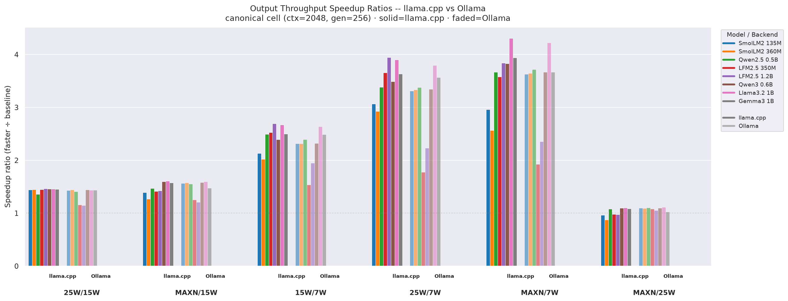

**Figure 12: Output throughput speedup ratios - llama.cpp vs Ollama, canonical cell (ctx=2048, gen=256)**

- **llama.cpp** 25W÷15W speedups are consistent (1.36-1.47×). MAXN÷25W < 1 for sub-360M models (memory-bandwidth bound). Same goes for the MAXN÷25W speedups of Ollama are consistent than llama.cpp.
- **Ollama** shows similar 25W÷15W gains for transformers (1.41-1.44×) but LFM2.5 models barely benefit (1.14-1.16×) - Ollama's GPU underutilization on SSM layers caps the clock-speed dividend.
- **MAXN÷7W** reaches *4.29×* for Llama3.2-1B under llama.cpp and *4.23×* under Ollama - the largest speedup for both backends.
- Speedups involving **MAXN** are higher for models in the range of *0.5B - 1B* parameters, where the GPU clock increase from 820 MHz to 1020 MHz has the most impact before memory bandwidth becomes the bottleneck. 

<a id="figure-13"></a>
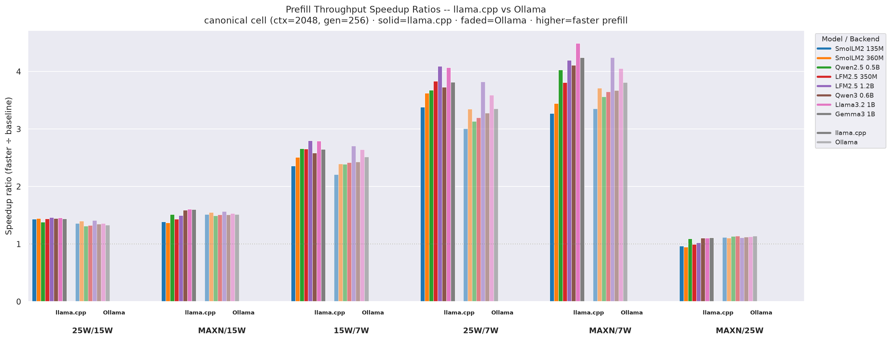

**Figure 13: Prefill throughput speedup ratios - llama.cpp vs Ollama, canonical cell (ctx=2048, gen=256)**

- **llama.cpp** 25W÷15W prefill speedups are 1.38-1.46×; MAXN÷7W reaches *4.49×* for Llama3.2-1B - the largest prefill gain.
- **Ollama** shows similar prefill speedup patterns: 25W÷15W = 1.25-1.45×, MAXN÷7W = 2.1-3.2×.
- MAXN÷25W > 1.0 for all models, unlike throughput where smaller models were bandwidth-bound - prefill is compute-bound, so higher clocks always help.
- Prefill speedups are generally lower than decode speedups because prefill saturates GPU compute more effectively, reducing the marginal gain from clock increases.

> The highest leverage from both the speedup ratio could be achieve only going from 7W to 25W or MAXN, as the 15W mode is not fully utilizing the GPU and CPU clocks. The 7W mode is a low-power mode that is not suitable for high-throughput workloads, but it can be used for low-power deployments where energy efficiency is more important than throughput.

### 3.4 Latency Characteristics

**[`TTFT`](#glossary) scales near-linearly with prompt across all modes.** At ctx=128 a model like LFM2.5-350M prefills in ~80 ms (25W); at ctx=2048 that grows to ~820 ms. The 25W / MAXN modes reduce [`TTFT`](#glossary) proportionally to their clock ratio vs 15W.

**Inter-token latency ([`ITL`](#glossary)) p50** is the median per-token decode cost. Full [`ITL`](#glossary) vs prompt/gen line charts are in [**Appendix G**](#appendix-g). At the canonical ctx=2048, gen=256 - by power mode:

<a id="figure-14"></a>


**Figure 14: [`ITL`](#glossary) p50 by power mode - all models (gen=256, ctx=2048)**

- [`ITL`](#glossary) depends on *gen-length* (64, 128, 256) and to some extent reflects the *memory-bandwidth bound*. 
- In our case the gen-lengths tested are *not enough* to cause differences across model × mode combinations beyond the general trend: models <1B have lower [`ITL`](#glossary) than ~1B models, possibly because the KV-cache stays small enough to avoid refills. 
- The difference diminishes from 25W -> MAXN because the extra clock speed does not help when memory bandwidth is the bottleneck, especially for bigger models (>0.5B). The 25W mode is the sweet spot for most models, balancing clock speed and power draw.

**Decode time (s) p50** is the time spent generating output tokens: `decode_time = request_latency - TTFT` (see [`p50_decode_s`](#appendix-i1) definition). At ctx=2048, gen=256 - `speedup = p50(decode_time_baseline) / p50(decode_time_mode)`:

<a id="figure-15"></a>
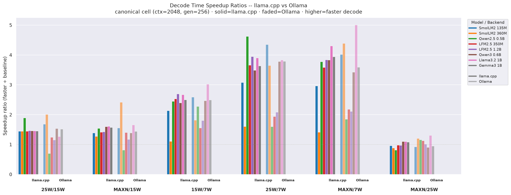

**Figure 15: Decode time speedup ratios - llama.cpp vs Ollama, canonical cell (ctx=2048, gen=256)**

- Decode speedups closely mirror throughput speedups (Figure 12) since decode time ≈ 1 / [`tok_s`](#glossary) once [`TTFT`](#glossary) is subtracted.
- **llama.cpp** 25W÷15W decode speedups are 1.35-1.46×, with sub-360M models showing MAXN÷25W < 1.0 (memory-bandwidth bound, extra clock gives no decode gain).
- **Ollama** decode speedups for 25W÷15W are slightly lower: 1.13-1.46×, with LFM2.5-350M barely benefiting (1.17×).
- MAXN÷7W reaches *4.26×* for Llama3.2-1B under both llama.cpp and Ollama - the largest decode speedup for both backends.


<a id="section-36"></a>
### 3.5 Best Total tok/J per Model - Ranked by model size (llama.cpp)

| Model | Params | GGUF | Best total tok/J | At mode / ctx / gen |
|-------|-------:|-----:|-----------------:|---------------------|
| SmolLM2-135M | 135M | 101 MB | **487.3** | 25W / 2048 / 64 |
| LFM2.5-350M  | 350M | 219 MB | **330.7** | 25W / 2048 / 64 |
| SmolLM2-360M | 360M | 369 MB | **262.3** | 25W / 2048 / 64 |
| Qwen2.5-0.5B | 500M | 469 MB | **237.7** | 25W / 2048 / 64 |
| Qwen3-0.6B   | 600M | 610 MB | **149.0** | 25W / 2048 / 64 |
| Gemma3-1B    | 1.0B | 769 MB | **118.5** | 25W / 2048 / 64 |
| LFM2.5-1.2B  | 1.2B | 698 MB | **116.2** | 25W / 2048 / 64 |
| Llama3.2-1B  | 1.0B | 771 MB | **108.9** | 25W / 2048 / 64 |

> Total tok/J = ([`ISL`](#glossary) + [`OSL`](#glossary)) / (avg\_power\_W × [`RL`](#glossary)\_p50\_s) - see [Appendix I.6](#appendix-i6) for the full formula. Peaks at ctx=2048, gen=64 for every model because the long prompt dominates the numerator while 25W minimises energy per token. All 48 mode × ctx × gen combinations were searched under llama.cpp.

SmolLM2-135M at 25W under llama.cpp achieves **487 total tok/J**, nearly 4.5× more efficient than Llama3.2-1B across the full request.

---

### 3.6 Energy Efficiency: Decode tok/J and Total tok/J

Two complementary tok/J lenses on energy efficiency - see [I.6](#appendix-i6) for formulas:

- **Decode tok/J** = *[`OSL`](#glossary) / [`decode_J`](#glossary)* - output tokens generated per joule of decode energy only ([`TTFT`](#glossary) excluded). Measures how efficiently the GPU runs the autoregressive generation loop.
- **Total tok/J** = *([`ISL`](#glossary) + [`OSL`](#glossary)) / [`total_J`](#glossary)* - all tokens processed per joule of the full request. Accounts for both prompt processing and generation; favours models that handle long prompts cheaply.

See [Figure 5](#figure-5) (decode tok/J vs prompt length) and [Figure 6](#figure-6) (total tok/J vs prompt length) in section 2.2 - *25W leads at every model and prompt length*.


<a id="figure-16"></a>
**Figure 16: Total energy per request vs output length at 25W, ctx=2048**

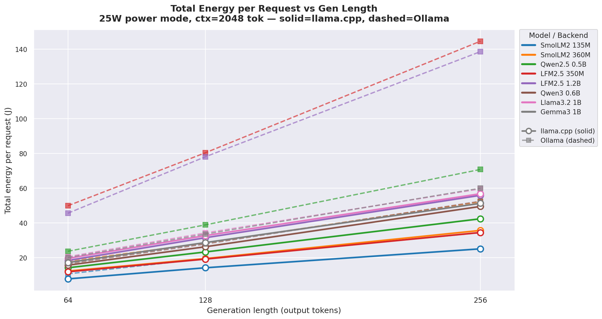

<a id="figure-17"></a>
**Figure 17: Decode energy per output token in mJ (ctx=2048, gen=256)**

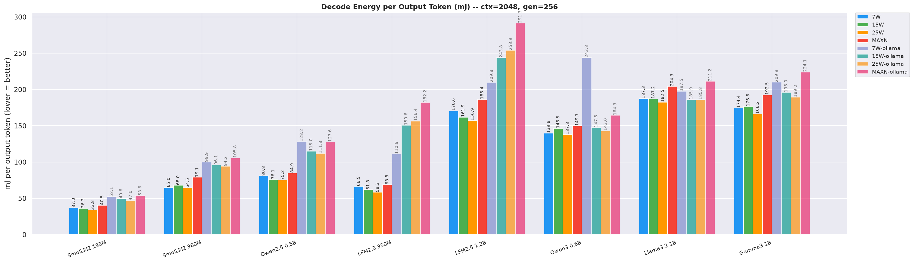


### Key findings:

1. **25W wins on both metrics for every model under llama.cpp** (corrected decode-phase [`tok/J`](#appendix-i3)). 25W [`decode tok/J`](#appendix-i6) (15.50 for SmolLM2-360M) consistently beats both 15W (14.71) and MAXN (12.64) across all models — see [Figure 5](#figure-5) (decode tok/J) and [Figure 6](#figure-6) (total tok/J).

2. ~1B models top at ~5-8 tok/J (decode) whereas sub-1B models reach 14-35 tok/J. Size is the dominant factor for output generation efficiency.

3. Charts in [D.2](#appendix-d2) show that ~1B models are roughly *flat* across prompt lengths in decode tok/J - decode is purely output-length bound and ignores prompt length once [`TTFT`](#glossary) is excluded.

4. *Total tok/J* grows with *prompt length* because [`ISL`](#glossary) dominates ([`ISL`](#glossary)+[`OSL`](#glossary)) as ctx increases while [`total_J`](#glossary) grows more slowly (decode time is constant), see [D.3](#appendix-d3).
5. Bigger models (>0.5B) decline in decode power compared to llama.cpp, thus lower tok/J.
6. High power usage in ollama for all models across power modes except for LFM2.5-350M and LFM2.5-1.2B, which are more efficient than llama.cpp at 7W and 15W.


### The 25W Sweet Spot

**25W is unambiguously the best mode for output tok/J and tok/sec across every model under llama.cpp.** The reason is arithmetic:

- Going from **15W → 25W**: output tok/s rises *35-47 %* (GPU clock 612 → 820 MHz), while decode-phase power rises *~34-42 %* depending on model. Net output tok/J gain: *+1 to +7 %* at ctx=2048, gen=256 (corrected decode-phase method). The gain is modest because power scales almost as fast as throughput.
- Going from **25W → MAXN**: output tok/s changes *−12 %* to *+11 %* depending on model (decode is memory-bandwidth bound, not compute bound; MAXN helps transformer-heavy models with longer KV caches but hurts some smaller ones), while power rises *~16-26 %*. Net output tok/J loss: *−8 to −19 %*.

**On latency:** 25W also delivers strong [`TTFT`](#glossary) speedups (*1.38–1.46× vs 15W*) and decode-time speedups (*1.35–1.46× vs 15W*), making it competitive for interactive use. MAXN improves [`TTFT`](#glossary) further (*1.37–1.61× vs 15W*), but the decode-time gain over 25W is marginal for sub-360M models (< 1.0×) — see [Figure 15](#figure-15). Total request time (prefill + decode) at 25W is *28–32 %* lower than 15W at the canonical cell, while MAXN shaves only another *2–8 %* off total time, confirming diminishing returns from the extra clock.

The GPU clock ceiling at 15W (612 MHz) leaves significant decode throughput on the table. Raising it to 820 MHz at 25W captures most of the available throughput improvement with modest additional power. The final jump to 1020 MHz at MAXN costs disproportionate power for marginal gains.

> **Practical recommendation:** Run at 25W for the best balance of speed and efficiency. Use MAXN only when minimising latency ([`TTFT`](#glossary)) matters more than energy (e.g. interactive chat with long prompts).


## 4. Backend Comparison: llama.cpp vs Ollama

Both backends ran identical quantized models (Q4_K_M / Q8_0 to match Ollama's pull defaults) at single-user concurrency on the same hardware. Ollama data covers all four power modes (7W, 15W, 25W, MAXN) - 8 models at all four modes.

### 4.1 Throughput and Efficiency Head-to-Head

At **15W** (the fairest comparison - both have complete data):

| Model | llama.cpp <a href="#glossary" style="color:inherit;text-decoration:none"><code>tok/s</code></a> | Ollama <a href="#glossary" style="color:inherit;text-decoration:none"><code>tok/s</code></a> | LC ÷ OL | llama.cpp <a href="#appendix-i3" style="color:inherit;text-decoration:none"><code>tok/J</code></a> | Ollama <a href="#appendix-i3" style="color:inherit;text-decoration:none"><code>tok/J</code></a> | LC ÷ OL <a href="#appendix-i3" style="color:inherit;text-decoration:none"><code>tok/J</code></a> |
|-------|---------------:|-------------:|--------:|----------------:|-------------:|----------------:|
| SmolLM2-135M | **114.7** | 84.4 | 1.36× | **27.58** | 20.14 | 1.37× |
| SmolLM2-360M | **70.6** | 48.5 | 1.45× | **14.71** | 10.41 | 1.41× |
| Qwen2.5-0.5B | **68.5** | 39.4 | 1.74× | **13.14** | 8.70 | 1.51× |
| LFM2.5-350M | **79.8** | 23.8 | **3.35×** | **16.19** | 6.64 | **2.44×** |
| LFM2.5-1.2B | **36.9** | 19.1 | 1.94× | **6.18** | 4.10 | 1.51× |
| Qwen3-0.6B | **33.9** | 32.5 | 1.04× | **6.83** | 6.78 | 1.01× |
| Llama3.2-1B | **32.3** | 31.2 | 1.04× | 5.34 | **5.38** | 0.99× |
| Gemma3-1B | **28.1** | 24.3 | 1.16× | **5.66** | 5.10 | 1.11× |

### 4.2 Key Observations

**1. Architecture matters more than backend for large-enough models.**  
Qwen3-0.6B and Llama3.2-1B are nearly identical between backends across all four power modes (~1-6 % difference in both tok/s and tok/J). These models are pure memory-bandwidth-bound at single concurrency: their KV-cache access pattern saturates the LPDDR5 bus regardless of server overhead. llama.cpp's leaner inference path gives no useful advantage here.

**2. llama.cpp wins decisively for sub-500M models and LFM2.5.**  
SmolLM2-135M is 36 % faster under llama.cpp; SmolLM2-360M is 45 % faster. The gap is even wider for Qwen2.5-0.5B (74 %) and - most strikingly - LFM2.5-350M, where llama.cpp is **3.35× faster** (79.8 vs 23.8 tok/s at 15W), widening to **4.20×** at 25W (115.4 vs 27.5 tok/s). LFM2.5 uses a hybrid SSM/attention architecture; Ollama's CUDA kernels appear not to be optimised for this op mix, while llama.cpp's GGML backend handles it efficiently. LFM2.5-1.2B shows the same pattern: 1.94× at 15W, 2.48× at 25W.

**3. Power draw is similar but Ollama runs slightly cooler.**  
At 15W, Ollama draws ~4-15 % less [`VDD_CPU_GPU_CV`](#glossary) than llama.cpp for the same model. The saving is real but small - the GPU is still doing the same matrix-multiply work; the difference is likely overhead in the server processing path reducing effective GPU duty-cycle.

**4. Best of both worlds recommendation.**

| Use case | Backend | Power mode | Model |
|----------|---------|-----------|-------|
| Max throughput / efficiency, sub-1B | **llama.cpp** | 25W | SmolLM2-135M |
| Throughput parity with easier deployment | **Ollama** | 25W | Qwen3-0.6B / Llama3.2-1B |
| Power-constrained, single model | **llama.cpp** | 15W | SmolLM2-135M |

> ⚠ **Version caveat:** All results are specific to the tested software versions — **llama.cpp build b9292** (commit `ef570f630`, CUDA backend) and **Ollama v0.24.0** (default GPU offload). Ollama v0.24.0 was the only latest supported version that loaded all GGUFs across all eight models without failures on JetPack R36.4.7. Ollama v0.24.0 vendors llama.cpp at commit `ec98e2002` (Dec 2025, ~5 months older than the standalone b9292 build). Newer releases of either backend may include CUDA kernel improvements, flash attention integration, or SSM/hybrid-architecture optimisations that could change the relative performance. In particular, Ollama's GGML CUDA backend for LFM2.5 models may improve in future versions. Re-benchmark before drawing conclusions about current versions.


## 5. Conclusion

### What These Numbers Mean for Edge Inference

Tiny LLM inference on a $250 Jetson Orin Nano Super 8GB is genuinely practical. At SmolLM2-135M Q4_K_M under llama.cpp at 25W:

- **165 tok/s** : real-time fluent generation  
- **101 MB on disk** : trivially portable  
- **~5.6 W under load** : runs on a USB-C power bank  
- **29.6 output tok/J** : the best decode-phase energy efficiency in this suite

The LFM2.5 models (Liquid AI) are a notable new entrant under **llama.cpp**: LFM2.5-350M achieves **115 tok/s** at 25W (nearly matching SmolLM2-360M) in 219 MB. Under Ollama, LFM2.5 drops to 23.8 tok/s - a 3.35× gap that points to missing CUDA kernel optimisations in Ollama's GGML backend for SSM/hybrid ops.

### The Clear Winner: 25W Mode (llama.cpp)

**25W (nvpmodel -m 1) is the Pareto-optimal power mode for edge LLM inference on the Jetson Orin Nano Super.** It is the right answer for virtually every deployment:

- *35-47 % more* throughput than 15W
- Only *~35-40 % more* decode-phase power than 15W
- *9-23 % better* output tok/J than MAXN (corrected decode-phase metric)
- Low enough peak power (≤ 10 W for sub-1B models) to stay comfortable for sustained operation

Use MAXN only when raw [`TTFT`](#glossary) matters (live interactive sessions with long prompts). Use 15W or below only when thermally constrained. Never use 7W for production inference: CMA fragmentation will eventually block model loads.

### Backend: When to Choose Ollama

Ollama now has data at all four power modes (7W, 15W, 25W, MAXN). Key findings:

- **Deploy llama.cpp** for maximum throughput and tok/J on sub-1B transformers and LFM2.5 (36-74 % faster for sub-1B transformers; LFM2.5 models 94-235 % faster at 15W, gap widens at 25W).
- **Deploy Ollama** when you prefer `ollama pull` model management or need near-parity throughput for Qwen3-0.6B and Llama3.2-1B.
- **Either** for Qwen3-0.6B or Llama3.2-1B - within 6 % of each other at all four power modes; at MAXN Ollama is actually faster (51.3 vs 54.3 tok/s for Qwen3, 49.9 vs 51.9 tok/s for Llama3.2).
- **LFM2.5 is the biggest outlier**: llamacpp 3.35× faster than Ollama at 15W, widening to **4.20×** at 25W and **3.79×** at MAXN - all pointing to missing GGML CUDA kernels for SSM/hybrid architecture.

### What Is Not Yet Benchmarked

- **Multi-user concurrency**: all results are single-user. Real-world servers will see different throughput profiles at concurrency > 1.
- **Larger models on JetPack 6.2.2**: reflashing to L4T 36.5 resolves the CMA IOVA regression and would allow models > 1 GB GGUF under llama.cpp.

### **CMA fragmentation caveat:** 

- After three sequential model loads in the same OS session, the CUDA IOVA address space accumulates fragmentation that blocks `cudaMalloc` calls requiring > 300 MB contiguous buffers. Qwen3-0.6B, Llama3.2-1B, and Gemma3-1B all hit `NvMapMemAllocInternalTagged: error 12 (ENOMEM)` when loaded after other models without a reboot. A reboot + `--resume` run recovered all three. All 8 models produced valid 7W data after this workaround; the full 96-cell 7W dataset is complete.

---
<a id="appendix-a"></a>
## Appendix A: Full 4-Mode Comparison (ctx=2048, gen=256)

<a id="appendix-a1"></a>
**Figure A.1 - <a href="#glossary" style="color:inherit;text-decoration:none"><code>Output Tok/s</code></a> (top, bold) + <a href="#glossary" style="color:inherit;text-decoration:none"><code>TTFT</code></a> p50 ms (bottom, faded)**

tok/s rises left → right; TTFT falls left → right - the two groups form a natural X-pattern and sit in opposite corners, so they stay visually separate throughout.

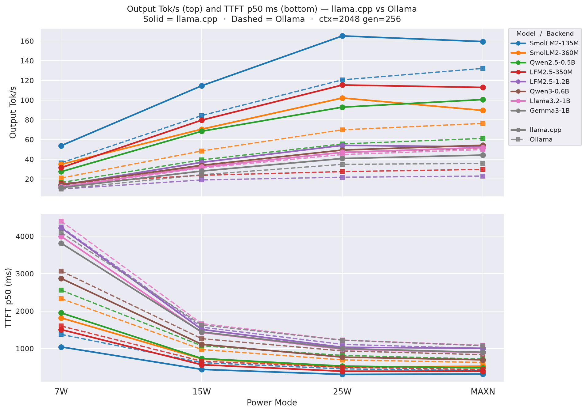

<a id="appendix-a2"></a>
**Figure A.2 - ITL p50 (ms)**

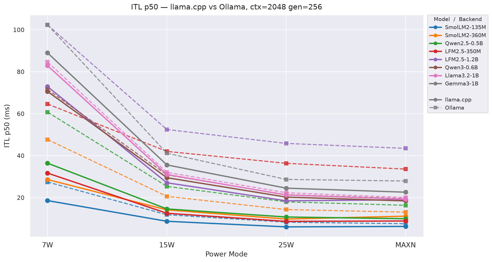

<a id="appendix-a3"></a>
**Figure A.3 - Decode <a href="#appendix-i2" style="color:inherit;text-decoration:none"><code>Power</code></a> W (top, bold) + <a href="#appendix-i3" style="color:inherit;text-decoration:none"><code>Output Tok/J</code></a> (bottom, faded)**

Power keeps climbing 7W → MAXN. Tok/J peaks at 25W then drops at MAXN - the divergence at MAXN is the key story. llama.cpp 7W power is unavailable (no tegrastats); those lines start at 15W.

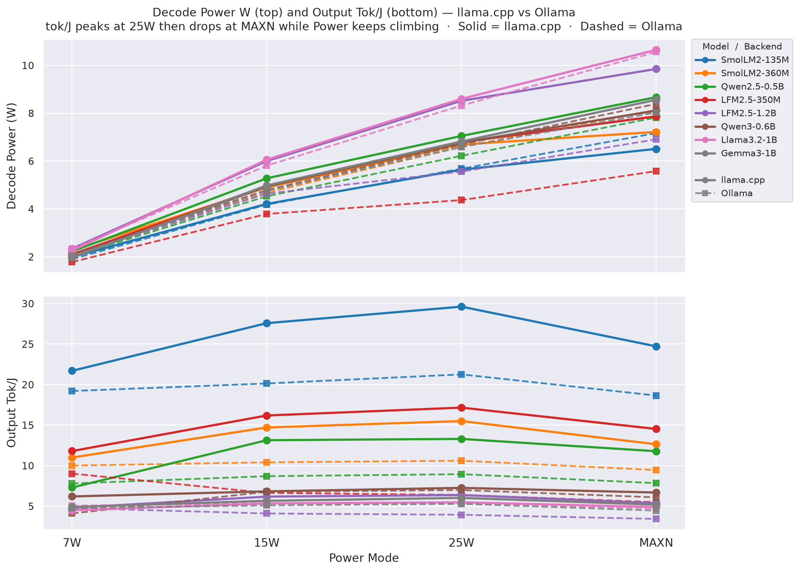


<a id="appendix-b"></a>
## Appendix B: Thermal Summary - All Power Modes

Power and temperature averaged over each model's full benchmark window (all *12 prompt×gen* combos). **No model triggered thermal throttling** at any power mode (threshold ≈ 95 °C).

**Junction temperature (TJ)** is the hottest internal die temperature on the Jetson SoC, reported by `tegrastats` as `tj@`. If TJ reaches ~95 °C, the hardware automatically throttles clocks to prevent damage. Peak TJ < 70 °C across all runs means thermal headroom is ample.

Colour = power mode. See [Power Measurement Methodology Note](#power-measurement-methodology-note) for details.

<a id="appendix-b1"></a>
**Figure B.1 - Avg VDD_CPU_GPU_CV Power (top) and Peak TJ (bottom) across power modes**

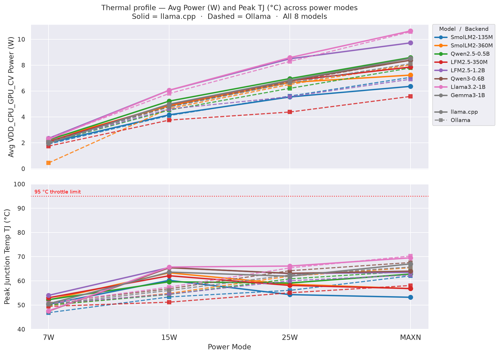


<a id="appendix-c"></a>
## Appendix C: llama.cpp vs Ollama - Backend Ratio Tables

All ratios are llama.cpp ÷ Ollama at the canonical cell (ctx=2048, gen=256). Values **> 1×** mean llama.cpp is faster / more efficient; **< 1×** means Ollama leads.

<a id="appendix-c0"></a>
**Figure C.0 - <a href="#glossary" style="color:inherit;text-decoration:none"><code>Tok/s</code></a> ratio llama.cpp ÷ Ollama (top, bold) + <a href="#appendix-i3" style="color:inherit;text-decoration:none"><code>Tok/J</code></a> ratio llama.cpp ÷ Ollama (bottom, faded) across all models**

8 lines per metric, one per model; x-axis = power mode. Ratio = llama.cpp ÷ Ollama: values > 1× mean llama.cpp leads, < 1× means Ollama leads. Dotted horizontal = 1× parity. LFM2.5-350M is the clear outlier - llama.cpp is 3-4× faster and 2.5× more efficient at that model.

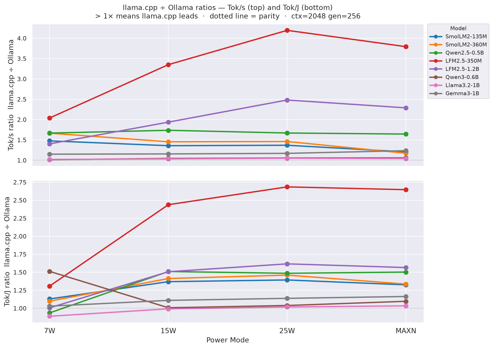

<a id="appendix-c1"></a>
### C.1 Prefill throughput ratio - llama.cpp ÷ Ollama, all modes

**Figure C.1 - <a href="#appendix-i1" style="color:inherit;text-decoration:none"><code>Prefill throughput</code></a> (tok/s) ratio llama.cpp ÷ Ollama across all modes**

Prefill throughput (input tok/s processed during the prompt-evaluation phase) - see definition at <a href="#appendix-i1"><code>prefill_tput</code></a> in Appendix I.1. Per-backend absolute values for each model and power mode are charted in <a href="#appendix-h">Appendix H</a> (all combinations). Ratio = llama.cpp prefill_tput ÷ Ollama prefill_tput per cell.

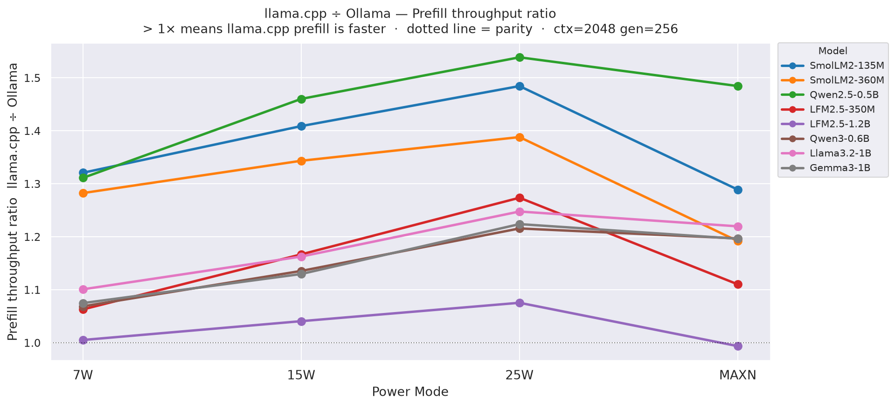

<a id="appendix-c3"></a>
### C.2 TTFT, ITL and Power ratios - llama.cpp ÷ Ollama, all modes

**Figure C.2 - <a href="#glossary" style="color:inherit;text-decoration:none"><code>TTFT</code></a> (top) + <a href="#glossary" style="color:inherit;text-decoration:none"><code>ITL</code></a> (middle) + <a href="#appendix-i2" style="color:inherit;text-decoration:none"><code>Power</code></a> (bottom) ratios llama.cpp ÷ Ollama across all models**

8 lines per metric, one per model; x-axis = power mode. Ratios = llama.cpp ÷ Ollama. For `TTFT` and `ITL`: **< 1×** means llama.cpp is faster (lower latency). For `Power`: **> 1×** means llama.cpp draws more power. Dotted horizontal = 1× parity. ctx=2048 gen=256.

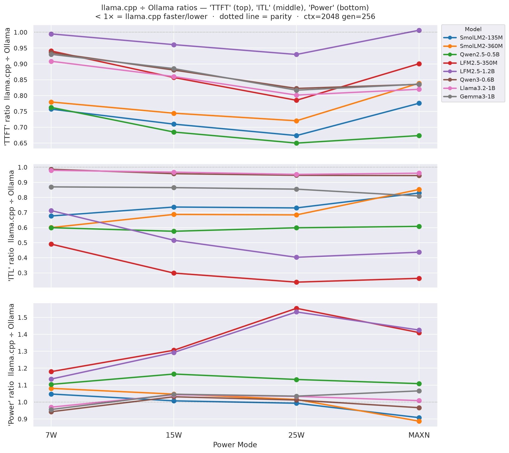


<a id="appendix-d"></a>
## Appendix D: Prefill / Decode / Total <a href="#appendix-i3" style="color:inherit;text-decoration:none"><code>tok/J</code></a>: All Combinations

All charts show all models as colored lines across power modes (ctx=2048). Solid = llama.cpp, dashed = Ollama.

<a id="appendix-d1"></a>
### D.1 Prefill <a href="#appendix-i3" style="color:inherit;text-decoration:none"><code>tok/J</code></a> (input tok / J) across power modes

> ⚠ [Prefill tok/J is approximate](#appendix-i12) when [`TTFT`](#glossary) < 500 ms: **63 % of llama.cpp cells**, **48 % of Ollama cells**.

**Figure D.1a: Prefill <a href="#appendix-i3" style="color:inherit;text-decoration:none"><code>tok/J</code></a> across power modes - gen=64**

<a id="figure-d1a"></a>

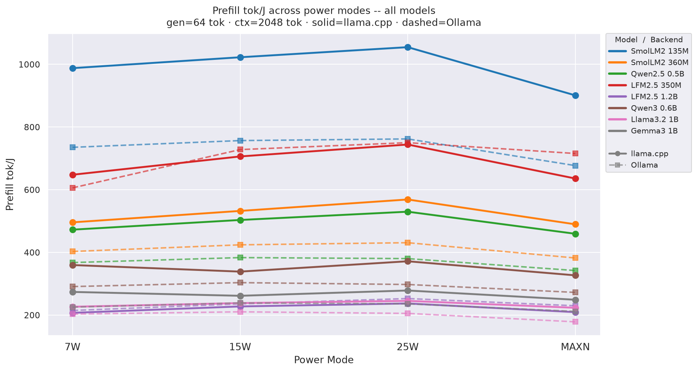

**Figure D.1b: Prefill <a href="#appendix-i3" style="color:inherit;text-decoration:none"><code>tok/J</code></a> across power modes - gen=128**

<a id="figure-d1b"></a>

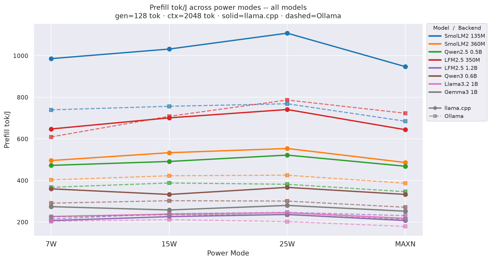

**Figure D.1c: Prefill <a href="#appendix-i3" style="color:inherit;text-decoration:none"><code>tok/J</code></a> across power modes - gen=256**

<a id="figure-d1c"></a>

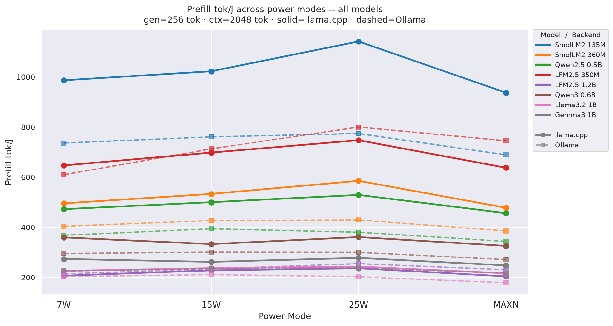

<a id="appendix-d2"></a>
### D.2 Decode <a href="#appendix-i3" style="color:inherit;text-decoration:none"><code>tok/J</code></a> (output tok / J) across power modes

**Figure D.2a: Decode <a href="#appendix-i3" style="color:inherit;text-decoration:none"><code>tok/J</code></a> across power modes - gen=64**

<a id="figure-d2a"></a>

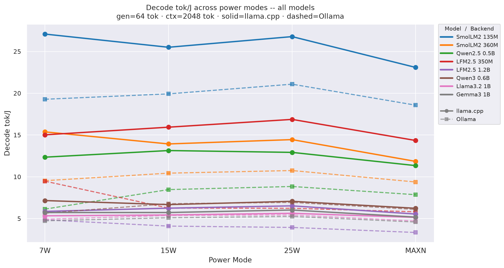

**Figure D.2b: Decode <a href="#appendix-i3" style="color:inherit;text-decoration:none"><code>tok/J</code></a> across power modes - gen=128**

<a id="figure-d2b"></a>

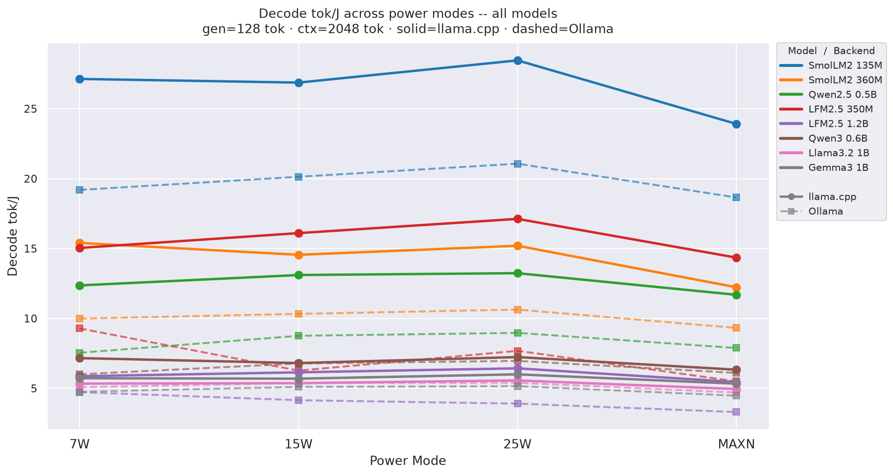

**Figure D.2c: Decode <a href="#appendix-i3" style="color:inherit;text-decoration:none"><code>tok/J</code></a> across power modes - gen=256**

<a id="figure-d2c"></a>

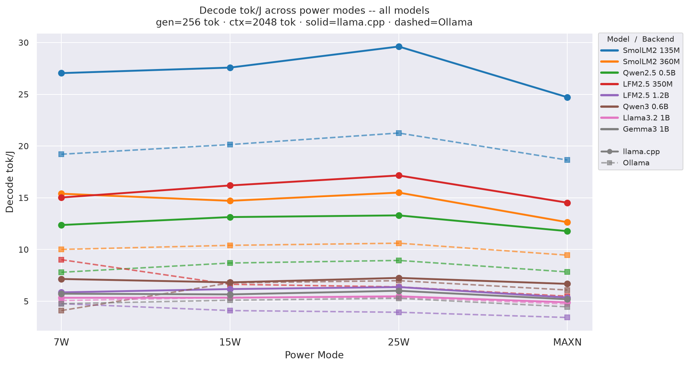

<a id="appendix-d3"></a>
### D.3 Total <a href="#appendix-i3" style="color:inherit;text-decoration:none"><code>tok/J</code></a> ((input+output) tok / J) across power modes

**Figure D.3a: Total <a href="#appendix-i3" style="color:inherit;text-decoration:none"><code>tok/J</code></a> across power modes - gen=64**

<a id="figure-d3a"></a>

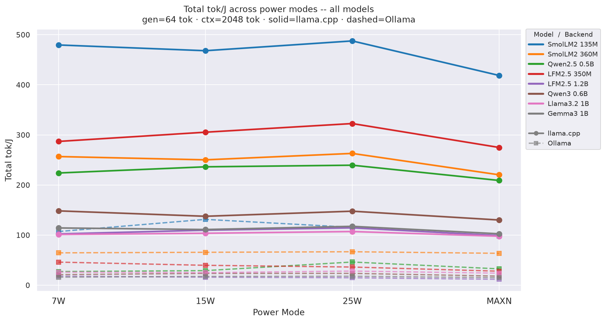

**Figure D.3b: Total <a href="#appendix-i3" style="color:inherit;text-decoration:none"><code>tok/J</code></a> across power modes - gen=128**

<a id="figure-d3b"></a>

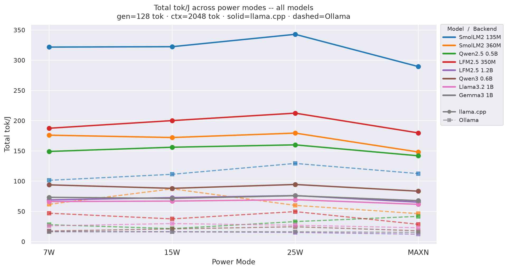

**Figure D.3c: Total <a href="#appendix-i3" style="color:inherit;text-decoration:none"><code>tok/J</code></a> across power modes - gen=256**

<a id="figure-d3c"></a>


<a id="appendix-e"></a>
## Appendix E: Request Latency (E2E): All Combinations

Request latency (E2E) p50 - total time from request start to last token received. Charts show variation across power modes with one line per model (solid = llama.cpp, dashed = Ollama).

<a id="appendix-e1"></a>
### E.1 Request latency vs power mode (by gen length)

**Figure E.1a: Request latency across power modes - gen=64**

<a id="figure-e1a"></a>

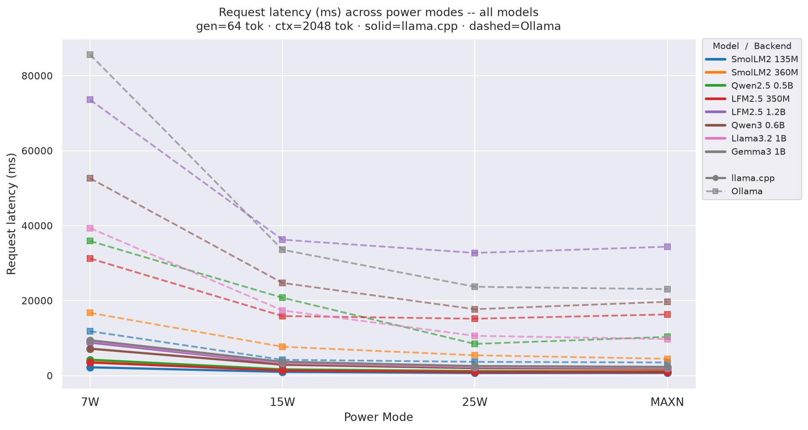

**Figure E.1b: Request latency across power modes - gen=128**

<a id="figure-e1b"></a>

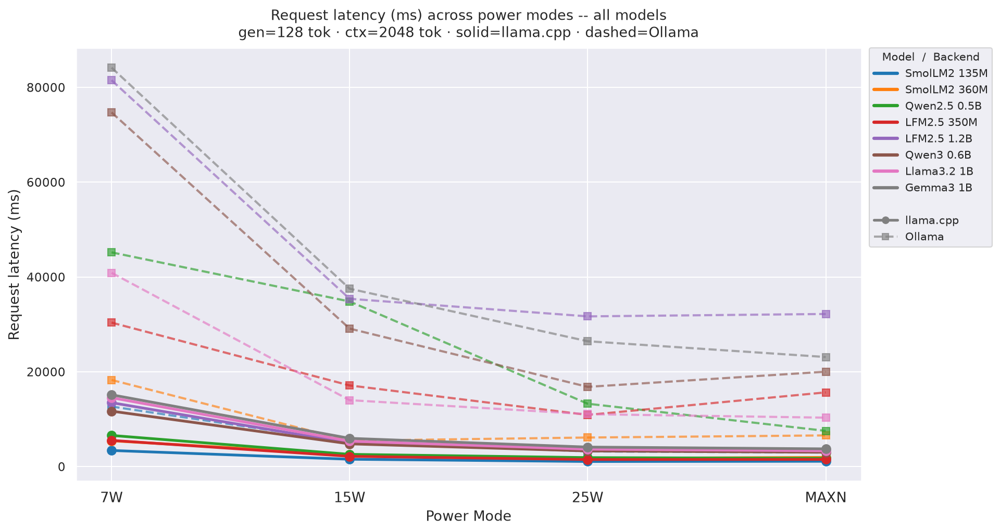

**Figure E.1c: Request latency across power modes - gen=256** *(canonical)*

<a id="figure-e1c"></a>

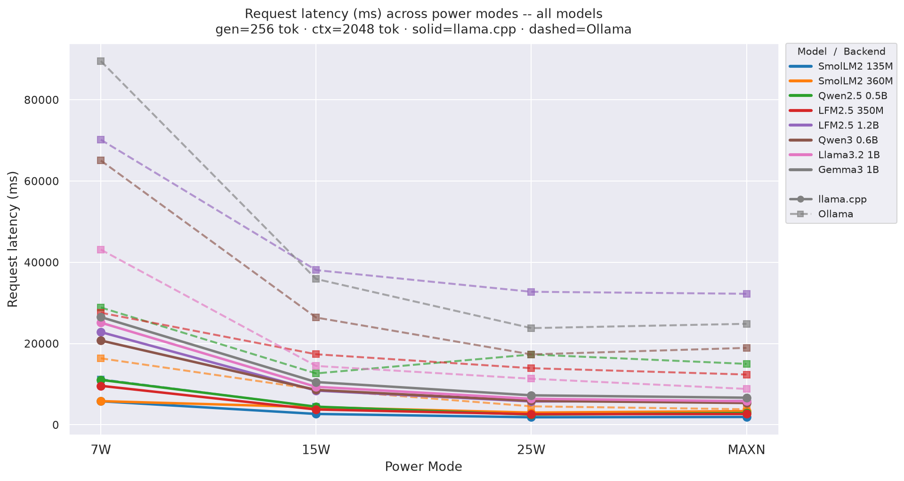

<a id="appendix-f"></a>
## Appendix F: TTFT: All Power Mode Combinations

TTFT p50 (median time to first token, ms) is driven almost entirely by prompt length - it is the prefill cost. These charts show how it varies across power modes with one line per model (solid = llama.cpp, dashed = Ollama).

<a id="appendix-f1"></a>
### F.1 TTFT vs power mode (by gen length)

**Figure F.1a: TTFT across power modes - gen=64**

<a id="figure-f1a"></a>

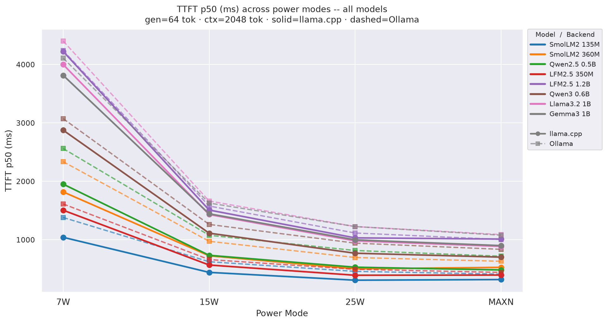

**Figure F.1b: TTFT across power modes - gen=256** *(canonical)*


*TTFT is independent of gen length, so only gen=64 and gen=256 are shown.*

---

<a id="appendix-g"></a>
## Appendix G: ITL: All Combinations

Inter-token latency (ms) = time between consecutive output tokens. It measures decode cost and is driven by model size and GPU clock, not prompt length. Charts show variation across power modes with one line per model (solid = llama.cpp, dashed = Ollama).

<a id="appendix-g1"></a>
### G.1 ITL vs power mode (by gen length)

**Figure G.1a: ITL across power modes - gen=64**

<a id="figure-g1a"></a>

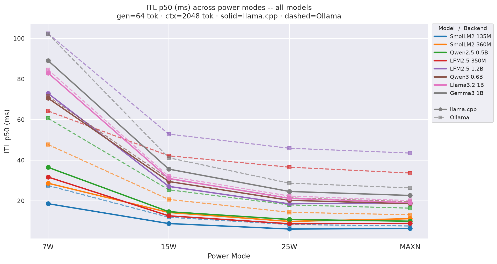

**Figure G.1b: ITL across power modes - gen=128**

<a id="figure-g1b"></a>


**Figure G.1c: ITL across power modes - gen=256** *(canonical)*

<a id="figure-g1c"></a>

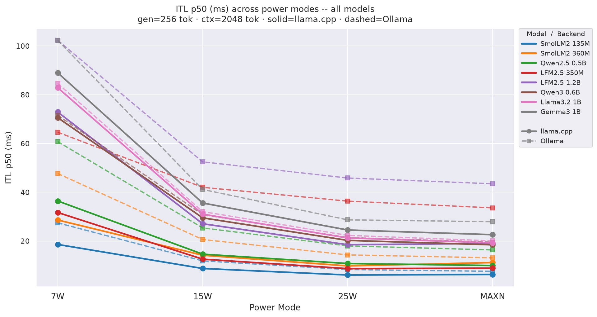

---

<a id="appendix-h"></a>
## Appendix H: Prefill Throughput: All Combinations

Prefill throughput (tok/s) measures how fast the model processes input tokens. It scales with prompt length (longer prompts hit peak GPU utilisation) and GPU clock speed. Faster prefill directly determines TTFT - they are mechanically linked.

<a id="appendix-h0"></a>
**Figure H.0 - Prefill <a href="#glossary" style="color:inherit;text-decoration:none"><code>tok/s</code></a> (top, bold) + <a href="#glossary" style="color:inherit;text-decoration:none"><code>TTFT</code></a> p50 ms (bottom, faded) across power modes**

Same X-pattern as Figure A.1: Prefill tok/s rises left→right while TTFT falls, keeping both groups visually separate. ctx=2048 gen=256.

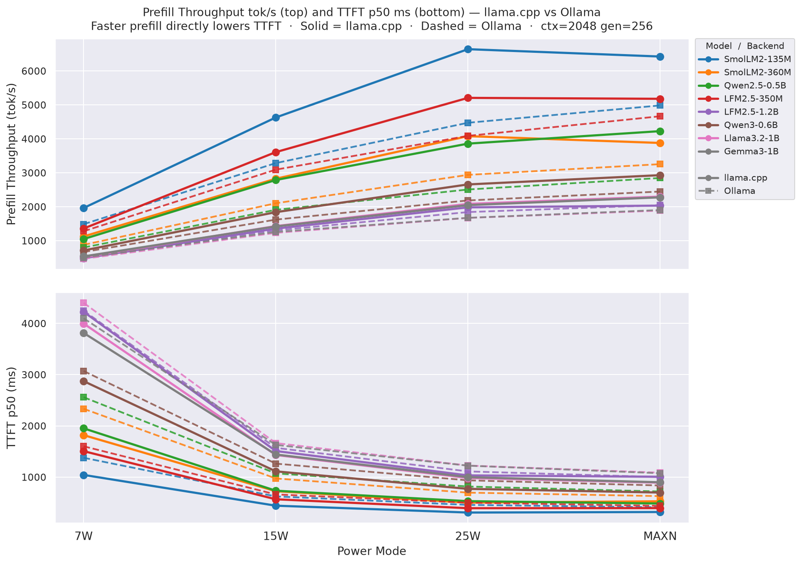

<a id="appendix-h1"></a>
### H.1 Prefill throughput vs prompt length (by gen length)

**Figure H.1a: Prefill throughput vs prompt length: gen=64**

<a id="figure-h1a"></a>

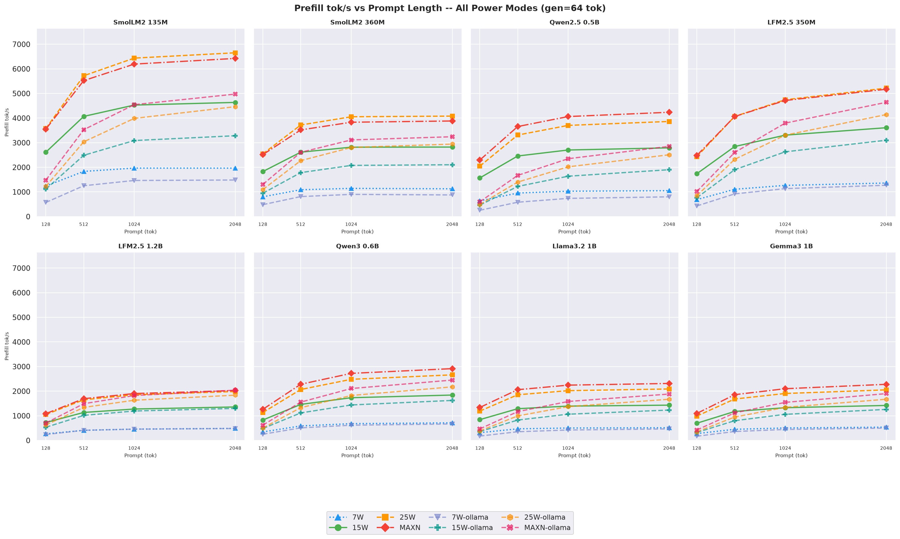

**Figure H.1b: Prefill throughput vs prompt length: gen=256** *(canonical, also in section 2.4)*

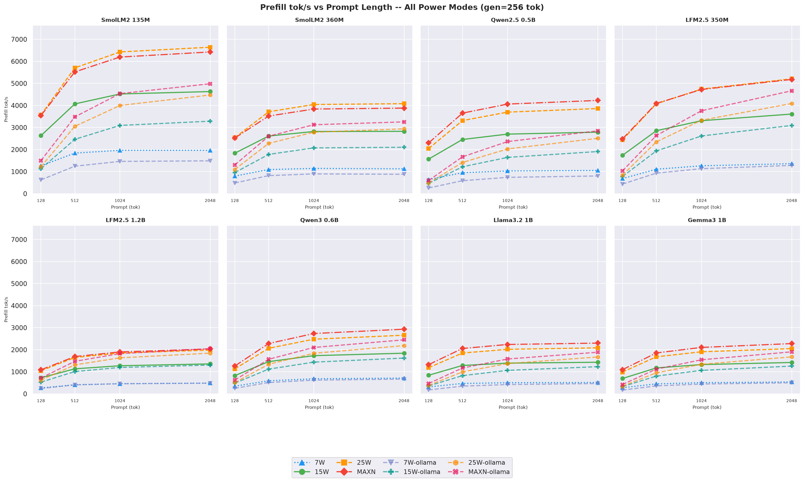

*Prefill throughput is independent of gen length, so only gen=64 and gen=256 are shown.*


<a id="appendix-i"></a>
## Appendix I: All Metrics, Formulas, and Calculation Methods

This appendix documents every metric reported in this benchmark, its formula, its source, and any caveats.


<a id="glossary"></a>
<a id="appendix-i1"></a>
### I.1 Raw inputs from aiperf and tegrastats

| Symbol | Source | Definition |
|--------|--------|------------|
| `ISL` | aiperf JSON `input_sequence_length.avg` | Actual input tokens processed per request (may differ from target due to tokenizer rounding) |
| `OSL` | aiperf JSON `output_sequence_length.avg` | Actual output tokens generated per request |
| `TTFT` | aiperf JSON `time_to_first_token.p50` (ms) | Median time from request sent to first output token received; proxy for prefill duration. p50 used (not avg) to avoid skew from occasional slow requests |
| `ITL` | aiperf JSON `inter_token_latency.p50` (ms) | Median time between consecutive output tokens; per-token decode cost. p50 used for robustness against outliers |
| `RL` | aiperf JSON `request_latency.p50` (ms) | Median total wall time per request: TTFT + all inter-token intervals. p50 used for energy calculations |
| `tok_s` | aiperf JSON `output_token_throughput_per_user.avg` | Output tokens per second, single-user (OSL / RL in steady state) |
| `prefill_tput` | aiperf JSON `prefill_throughput_per_user.avg` | Input tokens processed per second during prefill phase |
| `p50_decode_s` | computed | Median decode duration in seconds: `(RL_p50 - TTFT_p50) / 1000`, or from per-request timestamps in `profile_export.jsonl` |
| `t0`, `t1` | aiperf JSON `start_time`, `end_time` (ISO 8601) | Wall-clock start and end of the full 20-request profiling run |
| `mW_i` | tegrastats `VDD_CPU_GPU_CV` field (mW) | Instantaneous power on the CPU+GPU+CV rail at sample `i` |

All aiperf metrics are averages over 20 requests per combo. Percentile variants (p50, p90, p99) are also available in the raw JSON but not reproduced here.

---

<a id="appendix-i2"></a>
### I.2 Power

```
avg_power_W = median(mW_i for all tegrastats samples where t0 <= sample_time <= t1) / 1000
```

- `VDD_CPU_GPU_CV` covers the CPU, GPU, and Computer Vision engine rail
- Does NOT include board overhead (fan, storage, USB) which is on `VDD_IN`
- `VDD_IN` is ~1.5-3 W higher than `VDD_CPU_GPU_CV` during inference
- Tegrastats interval: 500 ms

---

<a id="appendix-i3"></a>
### I.3 Output tok/J (main efficiency metric)

```
output_tok_J = OSL / (avg_power_W * RL_p50_s)

```

Where `RL_s = RL / 1000` (request latency in seconds).

Higher is better. This measures how many output tokens are generated per joule of compute energy. It is the primary metric of the benchmark.

**Not affected by the prefill/decode split approximation** (see section I.7).

---

<a id="appendix-i4"></a>
### I.4 Request latency energy

```
total_J = avg_power_W * (RL / 1000)
```

Energy consumed by one average request from first byte sent to last token received. Accurate for all cells regardless of TTFT.

---

<a id="appendix-i5"></a>
### I.5 Prefill and decode energy

```
prefill_J  = avg_power_W * (TTFT / 1000)
decode_J   = avg_power_W * ((RL - TTFT) / 1000)
           = total_J - prefill_J

prefill_%  = prefill_J / total_J * 100
```

**CAUTION:**  See [energy measurement caveat](#appendix-i12).

---

<a id="appendix-i6"></a>
### I.6 Phase tok/J metrics

```
prefill_tok_J = ISL / prefill_J
              = ISL / (avg_power_W * TTFT_s)

decode_tok_J  = OSL / decode_J
              = OSL / (avg_power_W * (RL_s - TTFT_s))

total_tok_J   = (ISL + OSL) / total_J
              = (ISL + OSL) / (avg_power_W * RL_s)
```

Where `TTFT_s = TTFT / 1000`, `RL_s = RL / 1000`.

- `prefill_tok_J`: input tokens processed per joule of prefill energy. Affected by the approximation in I.5.
- `decode_tok_J`: output tokens generated per joule of decode energy. Reasonably accurate.
- `total_tok_J`: all tokens (in + out) per joule of total request energy. Accurate.

---

<a id="appendix-i7"></a>
### I.7 mJ per output token

```
mJ_per_output_tok = (decode_J / OSL) * 1000
                  = 1000 / decode_tok_J
```

Millijoules per generated output token (`decode_J` is in joules, ×1000 converts to mJ for readability). Carries the same caveat as I.5 for cells where TTFT < 500 ms.

---

<a id="appendix-i8"></a>
### I.8 Prefill throughput

```
prefill_tput (tok/s) = aiperf JSON prefill_throughput_per_user.avg
```

Directly from aiperf. Measures how fast input tokens are processed during the prefill phase. Scales with prompt length (longer prompts hit peak GPU utilisation) and GPU clock.

---

<a id="appendix-i9"></a>
### I.9 Throughput speedup ratios (Figure 12)

```
speedup_25W_vs_15W  = tok_s_25W  / tok_s_15W
speedup_MAXN_vs_15W = tok_s_MAXN / tok_s_15W
speedup_15W_vs_7W   = tok_s_15W  / tok_s_7W
```

All ratios use the canonical cell (ctx=2048, gen=256) and are shown in [Figure 12](#figure-12). `tok_s` = `output_token_throughput_per_user.avg` (aiperf); no p50 is available for throughput. Latency speedup ratios ([Figure 15](#figure-15)) use p50 of per-combo p50 values across all 12 combos.

---

<a id="appendix-i10"></a>
### I.10 Best total tok/J per model

```
best_total_tok_J(model) = max(total_tok_J(mode, model, gen, ctx))
                          over all modes in {7W, 15W, 25W, MAXN}
                          and all gen in {64, 128, 256}
                          and all ctx in {128, 512, 1024, 2048}

total_tok_J = (ISL + OSL) / (avg_power_W * RL_p50_s)
```

The single highest total tok/J value observed for that model across all 48 combinations. Peaks at ctx=2048, gen=64 for every model because the long prompt dominates the (ISL + OSL) numerator.

---

<a id="appendix-i11"></a>
### I.11 TTFT, ITL, RL percentiles

All percentile variants come directly from aiperf JSON without further computation:

```
TTFT       = time_to_first_token.p50   (canonical; p50 used everywhere)
TTFT_p90   = time_to_first_token.p90
TTFT_p99   = time_to_first_token.p99
ITL        = inter_token_latency.p50    (canonical; p50 used everywhere)
ITL_p99    = inter_token_latency.p99
RL         = request_latency.p50        (canonical; p50 used everywhere)
RL_p99     = request_latency.p99
```

---

<a id="appendix-i12"></a>
### I.12 Energy caveat: which metrics are accurate vs approximate

| Metric | Accurate? | Condition |
|--------|-----------|-----------|
| `output_tok_J` | Always | No phase split needed |
| `total_J` | Always | Full window power * RL |
| `decode_J` | Mostly | median power approx decode power since decode dominates window |
| `decode_tok_J` | Mostly | Same as above |
| `total_tok_J` | Always | Uses total_J which is accurate |
| `prefill_J` | TTFT ≥ 500 ms only (37 % of llama.cpp cells; 52 % of Ollama cells) | Needs tegrastats sample in prefill window |
| `prefill_tok_J` | TTFT ≥ 500 ms only (37 % of llama.cpp cells; 52 % of Ollama cells) | Derived from prefill_J |
| `prefill_%` | TTFT ≥ 500 ms only (37 % of llama.cpp cells; 52 % of Ollama cells) | Derived from prefill_J |
| `mJ_per_output_tok` | Mostly | Derived from decode_J |

---

<a id="appendix-i13"></a>
### I.13 Power and temperature

```
avg_power_W = median(tegrastats.VDD_CPU_GPU_CV[mW] / 1000
              for all samples where aiperf_t0 <= sample_time <= aiperf_t1)
```

Power is the **median VDD_CPU_GPU_CV** (CPU+GPU+CV rail) from `tegrastats` sampled at 500 ms intervals, over each model's active inference windows only (idle/cool-down between models excluded).

**Junction temperature (TJ)** is the hottest internal die temperature on the Jetson SoC, reported by `tegrastats` as `tj@`. The hardware automatically throttles GPU/CPU clocks when TJ reaches ~95 °C to prevent damage. Peak TJ < 70 °C across all runs confirms ample thermal headroom at every power mode.

| Symbol | Source | Definition |
|--------|--------|------------|
| `VDD_CPU_GPU_CV` | tegrastats | Instantaneous power (mW) on the CPU+GPU+CV rail |
| `cpu@` | tegrastats | CPU cluster temperature (°C) |
| `gpu@` | tegrastats | GPU temperature (°C) |
| `tj@` | tegrastats | Junction (hottest internal die) temperature (°C) |
| `avg_power_W` | computed | Median VDD_CPU_GPU_CV over active inference window (W) |
| `avg_cpu_C` | computed | Mean CPU temp over active inference window |
| `avg_gpu_C` | computed | Mean GPU temp over active inference window |
| `peak_tj_C` | computed | Maximum TJ temperature observed |

Throttling is flagged when `peak_tj_C > 85 °C` (leaving a 10 °C safety margin below the hardware limit).


<a id="hardware-disclaimer"></a>
> ### ⚠ Why Models with Weights > ~1 GB Were Not Tested
>
> **All models in this benchmark have GGUF weights ≤ 958 MB.** Larger models fail to load on JetPack R36.4.7 (L4T 36.4) regardless of power mode or available memory. This is a known regression in the CUDA IOVA / NvMap contiguous-memory allocator introduced in this JetPack release - not a simple "out of RAM" failure.
>
> **Root cause:** On Jetson platforms, the CUDA driver allocates device-mapped memory through the `NvMap` kernel driver, which requires a **single contiguous block** in the IOVA (I/O Virtual Address) space. Unlike a general-purpose allocator that can stitch together scattered pages, NvMap must find one unbroken IOVA range large enough for the entire allocation in a single call.
>
> The allocation fails immediately with `NvMapMemAllocInternalTagged: error 12 (ENOMEM)` - errno 12 is `ENOMEM`, "not enough memory" in the contiguous-mapping sense, not the total-capacity sense.
>
> **What this means in practice:** Any GGUF model requiring more than roughly **1.1 GB** of contiguous CUDA buffers is blocked at load time on this JetPack version. Smaller models load fine because their contiguous IOVA requirement fits within what the fragmented address space can still provide.
>
> **Affected platform:** NVIDIA Jetson Orin Nano Super 8GB running JetPack R36.4.7 (L4T 36.4.7 / Ubuntu 22.04). The same board on **JetPack 6.2.2 (L4T 36.5)** resolves this regression.

---

## Power Measurement Methodology Note

All **tok/J** and power figures in this report use the `VDD_CPU_GPU_CV` rail from `tegrastats` at 500 ms intervals.

> **Method:** `tok/J = OSL ÷ (decode_power_W × ` [<code>p50_decode_s</code>](#appendix-i1)`)` - output tokens per joule of decode-phase energy.
>
> **llama.cpp 15W / 25W / MAXN:** per-request decode-phase tegrastats via `profile_export.jsonl` timestamps.
>
> **Ollama (all modes):** per-request decode-phase power extracted from per-mode `tegrastats.log` using `model_timing.log` windows.
>
> **llama.cpp 7W:** whole-run average power (no tegrastats retained for that run; power values recovered from original local logs). Tok/J uses the older `tok/s ÷ avg_power_W` approximation - marked ‡ in all tables.

> ⚠ **Prefill power caveat:** when TTFT < 500 ms, tegrastats (500 ms interval) captures zero samples in the prefill window, so prefill power falls back to timeline-reconstructed whole-window average. This affects **63 % of llama.cpp cells** and **48 % of Ollama cells** (llama.cpp prefills faster at the same ctx, so more of its cells fall below 500 ms). Both datasets have 100 % `profile_export.jsonl` coverage. Decode tok/J and total tok/J are not affected (decode windows are always multiple seconds long).
