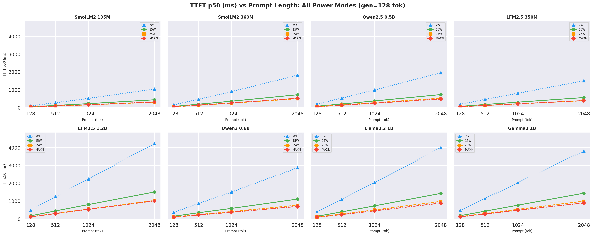
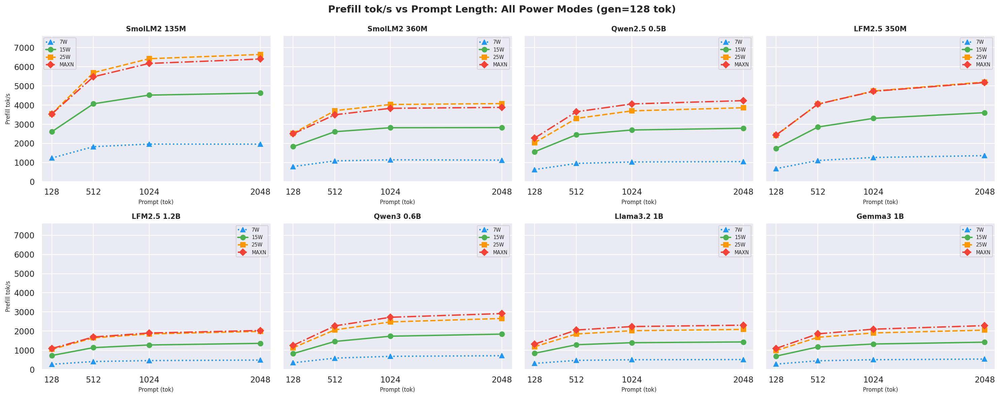

# Bonsai LLM Benchmark: Jetson Orin Nano Super 8GB


## Benchmark Configuration
 
**Platform:** NVIDIA Jetson Orin Nano Super 8GB  
**CPU:** 6-core Arm Cortex-A78AE · **GPU:** NVIDIA Ampere (1024 CUDA cores, 32 Tensor cores)  
**Memory:** 8 GB LPDDR5 shared CPU+GPU · **JetPack:** R36.4.7 (L4T 36.4)  
**Backend:** llama.cpp CUDA, `-ngl 99` (all layers on GPU), `--no-cache-prompt`  
**Runs:** Four full sweeps: **7W**, **15W**, **25W**, **MAXN_SUPER**  
**Sweep:** prompt ∈ {256, 512, 1024, 2048} tok × gen ∈ {128, 256, 512} tok × **20 reqs/combo**  
**Concurrency:** 1 (single-user) 
· **Key metric:** **output tok/J** = [OSL](#glossary) ÷ ([`avg_power_W`](#glossary) × ([RL](#glossary)\_p50\_s − [TTFT](#glossary)\_p50\_s))


## Executive Summary

Five Bonsai-family 1-1.53bit LLMs were benchmarked across all four Jetson Orin Nano Super power modes: **7W**, **15W**, **25W**, and **MAXN_SUPER**. Each model ran 12 combinations of prompt × generation length (20 requests per combo) at every power mode where it could load.

**Key finding: 25W is the energy-efficiency sweet spot for all models ≤4B parameters. For Bonsai-8B, 15W and 25W deliver near-identical output tok/J (~1 % difference), making 15W the more power-conservative choice. MAXN costs 10–11 % more energy per token than 25W across every model tested.** 25W delivers *41–48 %* more output tok/s than 15W while maintaining or improving output tok/J for sub-4B models (ctx=2048, gen=256).

**Throughput and efficiency winner at each mode** *(ctx=2048, gen=256, Ternary-Bonsai-1.7B dominates):*

<a id="table-1"></a>
**Table 1: Throughput and efficiency winner at each power mode**

| Mode | Fastest model | Output Tok/s | Output Tok/J |
|------|--------------|-------------:|-------------:|
| 7W   | Ternary-Bonsai-1.7B | 9.1  | 4.63 |
| 15W  | Ternary-Bonsai-1.7B | 23.5 | 4.83 |
| 25W  | Ternary-Bonsai-1.7B | **34.8** | **5.00** |
| MAXN | Ternary-Bonsai-1.7B | 38.1 | 4.46 |


**Ternary-Bonsai-8B (Q2_0, ~1.4 GB)** failed at every power mode: OOM in 8 GB unified memory when combined with KV cache and CUDA overhead. All five remaining models have complete data across all four power modes.

> **Raw data** — complete per-cell JSON exports (all metrics, 12 prompt×gen combos × 20 requests) for all four power modes are on Hugging Face: [7W](https://huggingface.co/datasets/YuvrajSingh9886/jetson-bonsai-benchmark-7w) · [15W](https://huggingface.co/datasets/YuvrajSingh9886/jetson-bonsai-benchmark-15w) · [25W](https://huggingface.co/datasets/YuvrajSingh9886/jetson-bonsai-benchmark-25w) · [MAXN](https://huggingface.co/datasets/YuvrajSingh9886/jetson-bonsai-benchmark-maxn). Each dataset includes `profile_export_aiperf.json`, `tegrastats.log`, and per-model server logs.

## 1. Test Setup

### 1.1 Hardware

<a id="table-2"></a>
**Table 2: Hardware configuration**

| Component | Detail |
|-----------|--------|
| Board | Jetson Orin Nano Super 8GB (Developer Kit) |
| CPU | 6× Arm Cortex-A78AE @ up to 1.728 GHz |
| GPU | NVIDIA Ampere, 1024 CUDA cores, 32 Tensor cores |
| Memory | 8 GB LPDDR5 204.8 GB/s (unified CPU + GPU) |
| CMA | 256 MB (contiguous memory pool; depletes across sequential model loads) |
| Cooling | Active fan; peak junction temperature ≤ 75 °C across all modes |

### 1.2 Software Stack

<a id="table-3"></a>
**Table 3: Software stack**

| Layer | Version / Detail |
|-------|-----------------|
| OS / JetPack | JetPack R36.4.7 (Ubuntu 22.04, L4T 36.4) |
| CUDA | 12.6 |
| llama.cpp | CUDA backend, `-ngl 99`, `--no-cache-prompt --cache-ram 0` |
| Inference server | `llama-server`: host `0.0.0.0:8080`, `--parallel 1`, `-c 2560` |
| Load generator | `aiperf` (NVIDIA AI Performance tool) |
| Power telemetry | `tegrastats` at 500 ms, [`VDD_CPU_GPU_CV`](#glossary) rail (mW) |
| Python | 3.10 (aiperf-env), pandas, seaborn, matplotlib |
| Datasets | Synthetic prompts at exact token counts (256, 512, 1024, 2048) generated synthetically via aiperf |
| Concurrency | **1 user, 1 request at a time** (`--parallel 1`, `--concurrency 1`) — single-user latency and throughput profile only |
| Batch size | **512 tokens** physical (`-ub` / ubatch, default) · 2048 logical (`-b`, default) for llama.cpp |

### 1.3 Models Under Test

<a id="table-4"></a>
**Table 4: Models under test**

| Model | Quant | GGUF size | Tokenizer |
|-------|-------|----------:|-----------|
| Bonsai-1.7B | Q1_0 | ~237 MB | Qwen/Qwen3-1.7B |
| Bonsai-4B | Q1_0 | ~540 MB | Qwen/Qwen3-4B |
| Bonsai-8B | Q1_0 | ~1.1 GB | Qwen/Qwen3-8B |
| Ternary-Bonsai-1.7B | Q2_0 | ~300 MB | Qwen/Qwen3-1.7B |
| Ternary-Bonsai-4B | Q2_0 | ~700 MB | Qwen/Qwen3-4B |
| Ternary-Bonsai-8B | Q2_0 | ~1.4 GB | N/A |

<!-- > **Quantization note:** Bonsai models use **Q1_0** (1-bit) quantization; Ternary-Bonsai models use **Q2_0** (2-bit ternary) quantization. These are ultra-low-bit quantizations trained specifically for the Bonsai weight distribution — not standard GGUF integer quants applied post-hoc. The extra 63 MB of Ternary-Bonsai-1.7B vs Bonsai-1.7B reflects the 2-bit vs 1-bit weight storage overhead. Ternary-Bonsai-8B OOM'd at every power mode; all results use the five surviving models. -->

### 1.4 Power Modes

<a id="table-5"></a>
**Table 5: Power mode configurations**

| Mode | nvpmodel | GPU clock | CPU clock | VDD_CPU_GPU_CV (observed) |
|------|----------|----------:|----------:|--------------------------:|
| **7W**   | `-m 3` | ~408 MHz | 960 MHz  | 0.5–2.5 W under load |
| **15W**  | `-m 0` | ~612 MHz | 1 190 MHz | 3–7 W under load |
| **25W**  | `-m 1` | ~820 MHz | 1 420 MHz | 4–10 W under load |
| **MAXN** | `-m 2` + `jetson_clocks` | **1 020 MHz** | **1 728 MHz** | 6–12 W under load |

### 1.5 Benchmark Methodology

- For each `model` × `prompt` × `gen combo`, `aiperf` sends 20 single-concurrency requests with synthetic prompts at the exact target token count. 
- Power is computed from `tegrastats` [`VDD_CPU_GPU_CV`](#glossary) (mW → W) averaged over each run's `start_time`/`end_time` window. [`output_tok_J`](#glossary) = [OSL](#glossary) ÷ ([`avg_power_W`](#glossary) × ([RL](#glossary)\_p50\_s − [TTFT](#glossary)\_p50\_s)) — decode energy only, prefill excluded. 
- Clocks were locked with `jetson_clocks` at all modes. 
- Each run's power and clock speed was capped at x W through `nvpmodel` and monitored for thermal stability (no sustained throttling; `junction temp` ≤ 75 °C).
- **Latency percentile used throughout:** all [TTFT](#glossary), [ITL](#glossary), and request latency ([RL](#glossary)) values reported in charts, tables, and energy calculations use the **p50 (median)** over the 20 requests per combo. The mean is not used for latency because occasional slow requests (GC pause, memory compaction, OS scheduling) inflate it without reflecting typical behaviour. p90 and p99 are available in the raw per-mode report files ([Appendix C](#appendix-c)) for tail-latency analysis.

## 2. Results: Charts

All charts use data from all four power modes.

### 2.1 Throughput vs Prompt Length

`Output tok/s vs prompt length` at *gen=256* across all models and modes; 25W (orange) consistently leads for models ≤4B:

<a id="figure-1"></a>
**Figure 1: Output tok/s vs prompt length (gen=256, all models and modes)**


`Canonical cell` (ctx=2048, gen=256), side-by-side output tok/s and output tok/J bars for all 4 modes:

<a id="figure-2"></a>
**Figure 2: Canonical cell: output tok/s and tok/J side by side (ctx=2048, gen=256)**


---

### 2.2 Energy Efficiency

- `Output Tok/J vs prompt length` at *gen=256*; 25W leads for ≤4B models; 15W and 25W are near-tied for Bonsai-8B:

<a id="figure-3"></a>
**Figure 3: Output tok/J vs prompt length (gen=256, all models and modes)**


- `Output Tok/J heatmap` (gen × prompt) for Standard Bonsai models (1.7B, 4B, 8B) at all 4 modes:

<a id="figure-4"></a>
**Figure 4: Output tok/J heatmap: Standard Bonsai models at all 4 power modes (gen × prompt)**


- `Output Tok/J heatmap` for Ternary Bonsai models (1.7B, 4B) at all 4 power modes:

<a id="figure-5"></a>
**Figure 5: Output tok/J heatmap: Ternary Bonsai models at all 4 power modes (gen × prompt)**


<!-- - `Bonsai-8B spotlight`: output tok/J at all 4 modes across gen sizes:

<a id="figure-6"></a>
**Figure 6: Bonsai-8B output tok/J at all 4 power modes across gen lengths**

 -->

- `Prefill tok/J` (input tokens per joule of prefill energy) vs prompt length at *gen=256*, how efficiently each mode processes the prompt; higher is better:

<a id="figure-7a"></a>
**Figure 7a: Prefill tok/J (input tok / J) vs prompt length (gen=256, all models and modes)**

> **Approximation note:** `prefill_tok_J = ISL / (avg_power_W × TTFT_s)` uses the full-run average power as a proxy for prefill-phase power. Tegrastats at 500 ms over a 20-request run cannot isolate prefill from decode power — every sample spans multiple phases. For Bonsai models (memory-bandwidth bound) prefill and decode draw similar power, making this a reasonable proxy. See [Appendix J.5](#appendix-j5).


- `Decode tok/J` (output tokens per joule of decode energy) vs prompt length at *gen=256*, output generation efficiency; 25W leads for sub-4B models:

<a id="figure-7b"></a>
**Figure 7b: Decode tok/J (output tok / J) vs prompt length (gen=256, all models and modes)**


- `Total tok/J` ((input + output) tokens per joule of total request energy) vs prompt length at *gen=256*, overall request efficiency; 25W wins for sub-4B models at every prompt length:

<a id="figure-7c"></a>
**Figure 7c: Total tok/J (input+output tok / J) vs prompt length (gen=256, all models and modes)**


> Full tok/J charts for all ctx/gen combinations: [F.1 Prefill](#appendix-f1) · [F.2 Decode](#appendix-f2) · [F.3 Total](#appendix-f3).

---

### 2.3 Latency

[TTFT](#glossary) p50 at ctx=2048, gen=256; 25W and MAXN reduce TTFT by *29–39 %* vs 15W:

<a id="figure-8"></a>
**Figure 8: [TTFT](#glossary) p50 by power mode (ctx=2048, gen=256)**


[`ITL`](#glossary) *(inter-token latency)* p50 at ctx=2048, gen=256; lower is better:

<a id="figure-9"></a>
**Figure 9: [ITL](#glossary) p50 by power mode (ctx=2048, gen=256)**


`Request latency (E2E)` p50 at ctx=2048, gen=256; total time from request start to last token received:

<a id="figure-10"></a>
**Figure 10: Request latency (E2E) p50 by power mode (ctx=2048, gen=256)**


---

### 2.4 Prefill Throughput

25W and MAXN provide *~29–47 % faster* prefill than 15W:

<a id="figure-11"></a>
**Figure 11: Prefill throughput by power mode (gen=256, avg over all prompt lengths)**


---

### 2.5 Power Draw

Average [`VDD_CPU_GPU_CV`](#glossary) per model at each mode:

<a id="figure-12"></a>
**Figure 12: Average [`VDD_CPU_GPU_CV`](#glossary) power draw per model at each power mode**


<a id="table-6"></a>
**Table 6: Average power draw per model at each power mode (W, [`VDD_CPU_GPU_CV`](#glossary))**

| Model | 7W | 15W | 25W | MAXN |
|-------|---:|----:|----:|-----:|
| Bonsai-1.7B | 1.50 | 3.35 | **4.70** | 5.65 |
| Bonsai-4B | 1.61 | 3.75 | **5.29** | 6.38 |
| Bonsai-8B | 2.04 | 5.47 | **7.95** | 9.80 |
| Ternary-Bonsai-1.7B | 1.93 | 4.79 | **6.81** | 8.47 |
| Ternary-Bonsai-4B | 1.96 | 5.09 | 7.43 | **9.11** |

> Averages computed over all 12 prompt × gen combos. Bold = highest observed power draw per model row.

## 3. Analysis

### 3.1 Higher tok/sec != efficient model (tok/J)

Tok/s (left half) and tok/J (right half) are intentionally both shown; a faster mode does not always mean a more efficient one.

- MAXN beats 25W on raw tok/s (+8–11 %) for all models but loses on tok/J (−10–11 %) because its power increase outpaces the throughput gain for *ctx = 2048, gen = 256*.
- Bonsai-8B is the notable case: 25W and 15W deliver essentially the same tok/J (1.77 vs 1.79), meaning the Bonsai-8B decode is already **memory-bandwidth bound** at 15W — the extra clock headroom at 25W does not translate to proportional throughput gains.

> [`output_tok_J`](#glossary) = [`tok_s`](#glossary) / [`VDD_CPU_GPU_CV`](#glossary) (W), averaged over each aiperf run window.

<a id="table-7"></a>
**Table 7: Canonical cell comparison (ctx=2048, gen=256)**

| Model | 7W tok/s | 15W tok/s | 25W tok/s | MAXN tok/s | 7W tok/J | 15W tok/J | 25W tok/J | MAXN tok/J | Peak tok/J |
|-------|--------:|----------:|----------:|-----------:|---------:|----------:|----------:|----------:|:---------:|
| Bonsai-1.7B | 6.5 | 16.5 | **24.2** | 26.2 | 4.18 | 4.66 | **4.86** | 4.34 | **25W** |
| Bonsai-4B | 3.5 | 9.2 | **13.5** | 14.6 | 2.06 | 2.34 | **2.41** | 2.14 | **25W** |
| Bonsai-8B | 3.6 | 9.9 | **14.0** | 15.1 | 1.69 | **1.79** | 1.77 | 1.59 | **15W** |
| Ternary-Bonsai-1.7B | 9.1 | 23.5 | **34.8** | 38.1 | 4.65 | 4.85 | **5.03** | 4.48 | **25W** |
| Ternary-Bonsai-4B | 4.1 | 11.4 | **16.9** | 18.7 | 2.12 | 2.23 | **2.26** | 2.03 | **25W** |

### 3.2 The 25W Sweet Spot

**25W is the best mode for output tok/J and tok/sec for all sub-4B Bonsai models, and is near-parity for Bonsai-8B.** The arithmetic is:

- Going from **15W → 25W**: output tok/s rises *41–48 %* (GPU clock 612 → 820 MHz), while power rises *~38–46 %*. Net output tok/J gain: *+1 to +4 %* for 1.7B–4B models (including Ternary-Bonsai-4B: 2.22 → 2.25); *−1 %* for Bonsai-8B (memory-bandwidth bound, clock gain wiped by power overhead).
- Going from **25W → MAXN**: output tok/s gains *+8–11 %* (decode is memory-bandwidth bound, not compute bound), while power rises *~20–31 %*. Net output tok/J loss: *−10 to −11 %* across all models.

The GPU clock ceiling at 15W (612 MHz) leaves significant decode throughput on the table for sub-8B models. Raising it to 820 MHz at 25W captures most of the available improvement at modest extra power. The final jump to 1020 MHz at MAXN costs disproportionate power for marginal gains.

> **Practical recommendation:** Run at **25W** for best balance of speed and efficiency for Bonsai-1.7B and 4B. For **Bonsai-8B**, 15W and 25W are energy-equivalent — prefer 15W to save ~43 % board power. Use MAXN only when minimising latency ([TTFT](#glossary)) matters more than energy (e.g. interactive chat with long prompts).


### 3.3 Best use cases for each power mode

<a id="table-8"></a>
**Table 8: Recommended power mode by use case**

| Use case | Recommended mode |
|----------|-----------------|
| Always-on inference (sub-4B models) | **25W**: best `output tok/J`, `tok/sec`, and low latency, ~45 % faster than 15W |
| Always-on inference (Bonsai-8B) | **15W**: energy-equivalent to 25W with ~43 % less board power |
| Interactive chat, real-time response | **MAXN**: highest `prefill tok/sec`, ~35–47 % faster prefill than 15W |
| Power-constrained / thermally limited | **15W**: 30–45 % less power draw than MAXN |
| Edge AI / battery/portable deployment | **7W**: all 5 models fit; useful for efficiency research at minimum power |

### 3.4 Throughput Speedup Summary

All figures are mean(p50) across the full prompt × gen sweep (12 combos per model); throughput uses mean(avg tok/s) since aiperf does not report a p50 for tok/s.

<a id="table-9"></a>
**Table 9: Output throughput speedup ratios - all pairwise mode comparisons**

| Model | 25W / 15W | MAXN / 15W | 15W / 7W | 25W / 7W | MAXN / 7W | MAXN / 25W |
|-------|----------:|-----------:|---------:|---------:|----------:|-----------:|
| Bonsai-1.7B | 1.47x | 1.59x | 2.56x | 3.76x | 4.06x | 1.08x |
| Bonsai-4B | 1.47x | 1.59x | 2.65x | 3.90x | 4.21x | 1.08x |
| Bonsai-8B | 1.46x | 1.61x | **2.78x** | **4.06x** | **4.49x** | 1.11x |
| Ternary-Bonsai-1.7B | **1.48x** | 1.62x | 2.64x | 3.90x | 4.27x | 1.09x |
| Ternary-Bonsai-4B | **1.48x** | **1.64x** | **2.78x** | **4.13x** | **4.56x** | **1.10x** |

- **25W** delivers a consistent *~1.46–1.48x* speedup vs 15W across all models.
- **15W** gives about *2.5–2.8x* boost vs **7W**; Bonsai-8B and Ternary-4B show the largest gain at 2.78x.
- **MAXN/25W** is consistently *~1.08–1.10x* for all models — extra compute headroom over an already-fast 25W baseline translates to only modest gains, since decode is memory-bandwidth bound.
- **MAXN/7W** reaches *4.56x* for **Ternary-Bonsai-4B** — the largest speedup in the sweep. **25W/7W** for Ternary-Bonsai-4B is *4.13x*, the highest 25W gain of any model.

### 3.5 Latency Characteristics

**[TTFT](#glossary) scales near-linearly with prompt across all modes.** At ctx=256 a model like Bonsai-1.7B prefills in ~170 ms (25W); at ctx=2048 that grows to ~1353 ms. The 25W / MAXN modes reduce TTFT proportionally to their clock ratio vs 15W.

**Inter-token latency ([ITL](#glossary)) p50** is the median per-token decode cost. ITL heatmaps per power mode (all 5 models, all 12 prompt×gen combos) are in [**Appendix H.2**](#appendix-h2) — see Figures H.2a–H.2d. At the canonical ctx=2048, gen=256:

<a id="figure-10a"></a>

<table>
<tr>
<td align="center"><strong>7W</strong><br></td>
<td align="center"><strong>15W</strong><br></td>
</tr>
<tr>
<td align="center"><strong>25W</strong><br></td>
<td align="center"><strong>MAXN</strong><br></td>
</tr>
</table>

**Figure 10a: [ITL](#glossary) p50 heatmaps — all 4 power modes (rows = gen length, cols = prompt length)**

- [ITL](#glossary) is driven primarily by model size and GPU clock, not prompt length. Bonsai-1.7B and Ternary-1.7B have significantly lower ITL than the 4B and 8B models at every mode.
- The Ternary-Bonsai-1.7B achieves lower ITL than Bonsai-1.7B at every mode despite larger file size, consistent with ternary weights being faster to load from DRAM per decode step.

**Decode time (s) p50** is the time spent generating output tokens: `decode_time = request_latency − TTFT`. At ctx=2048, gen=256:

<a id="table-10a"></a>
**Table 10a: Decode time speedup ratios - all pairwise mode comparisons (ctx=2048, gen=256)**

| Model | 25W vs 15W | MAXN vs 15W | 15W vs 7W | 25W vs 7W | MAXN vs 7W | MAXN vs 25W |
|-------|----------:|-----------:|---------:|---------:|----------:|-----------:|
| Bonsai-1.7B | 1.47x | 1.59x | 2.53x | **3.73x** | 4.02x | 1.08x |
| Bonsai-4B | 1.48x | 1.59x | 2.62x | **3.87x** | 4.18x | 1.08x |
| Bonsai-8B | 1.42x | 1.53x | 2.76x | **3.91x** | 4.22x | 1.08x |
| Ternary-Bonsai-1.7B | 1.48x | 1.62x | 2.59x | **3.84x** | 4.21x | 1.10x |
| Ternary-Bonsai-4B | **1.48x** | **1.64x** | **2.75x** | **4.08x** | **4.51x** | **1.10x** |

> Speedup = mean(decode_time_baseline) / mean(decode_time_mode) where decode_time = [RL](#glossary) p50 − [TTFT](#glossary) p50, at ctx=2048, gen=256. [`decode_J`](#glossary) = [`avg_power_W`](#glossary) × decode_time_s.

**[TTFT](#glossary) speedup** - TTFT_baseline / TTFT_mode, averaged over all 12 prompt × gen combos:

<a id="table-11"></a>
**Table 11: [TTFT](#glossary) speedup ratios - all pairwise mode comparisons**

| Model | 25W vs 15W | MAXN vs 15W | 15W vs 7W | 25W vs 7W | MAXN vs 7W | MAXN vs 25W |
|-------|----------:|-----------:|---------:|---------:|----------:|-----------:|
| Bonsai-1.7B | 1.46x | 1.60x | 2.40x | **3.50x** | 3.84x | 1.10x |
| Bonsai-4B | 1.47x | 1.61x | 2.86x | 4.21x | **4.62x** | 1.10x |
| Bonsai-8B | 1.29x | 1.56x | 2.84x | 3.66x | **4.42x** | 1.21x |
| Ternary-Bonsai-1.7B | 1.46x | 1.60x | 2.75x | 4.02x | **4.41x** | 1.10x |
| Ternary-Bonsai-4B | **1.48x** | 1.62x | 3.08x | **4.54x** | **4.98x** | **1.10x** |

- **Bonsai-8B** shows a smaller TTFT improvement at 25W vs 15W (1.29x) compared to the 4B models (1.47–1.48x). This confirms the prefill is also becoming memory-bandwidth bound for the larger model.
- **MAXN/7W** reaches *4.98x* for Ternary-Bonsai-4B prefill — the largest TTFT speedup in the sweep. **25W/7W** is *4.54x* for Ternary-Bonsai-4B, also the highest across all models at that comparison.

**Request latency (E2E) speedup** - Speedup = mean([RL](#glossary) p50 at baseline) / mean(RL p50 at mode), averaged over all 12 prompt × gen combos:

<a id="table-12"></a>
**Table 12: Request latency (E2E) speedup ratios - all pairwise mode comparisons**

| Model | 25W vs 15W | MAXN vs 15W | 15W vs 7W | 25W vs 7W | MAXN vs 7W | MAXN vs 25W |
|-------|----------:|-----------:|---------:|---------:|----------:|-----------:|
| Bonsai-1.7B | 1.47x | 1.59x | 2.20x | **3.24x** | 3.50x | 1.08x |
| Bonsai-4B | 1.47x | 1.60x | 2.66x | **3.92x** | 4.24x | 1.08x |
| Bonsai-8B | **1.51x** | 1.60x | 2.79x | **4.21x** | 4.47x | 1.06x |
| Ternary-Bonsai-1.7B | 1.48x | 1.62x | 2.64x | **3.91x** | 4.28x | 1.09x |
| Ternary-Bonsai-4B | **1.48x** | **1.64x** | **2.81x** | **4.16x** | **4.59x** | **1.10x** |

- Mirrors the [TTFT](#glossary) speedup trends since prefill dominates request latency at these context sizes.

### 3.6 Model Size vs Efficiency

The relationship is clear: **smaller quantized models always win on total tok/J**, not just tok/s.

<a id="table-13"></a>
**Table 13: Best total tok/J ranked by model size**

| Model | Params | GGUF | Best total tok/J | At mode / ctx / gen |
|-------|-------:|-----:|-----------------:|---------------------|
| Bonsai-1.7B | 1.7B | ~237 MB | **61.2** | 25W / 2048 / 128 |
| Ternary-Bonsai-1.7B | 1.7B | ~300 MB | **59.4** | 25W / 2048 / 128 |
| Bonsai-4B | 4B | ~540 MB | **28.8** | 25W / 2048 / 128 |
| Ternary-Bonsai-4B | 4B | ~700 MB | **25.6** | 25W / 2048 / 128 |
| Bonsai-8B | 8B | ~1.1 GB | **18.9** | 15W / 2048 / 128 |

> Total tok/J = ([ISL](#glossary) + [OSL](#glossary)) / (avg\_power\_W × [RL](#glossary)\_p50\_s) — see [Appendix J.6](#appendix-j6) for the full formula. Peaks at ctx=2048, gen=128 for every model because the long prompt dominates the numerator while short gen minimises decode energy. All 48 mode × ctx × gen combinations were searched.

Bonsai-1.7B at 25W achieves **61 total tok/J**, more than 3× more efficient than Bonsai-8B (18.9) across the full request.

Notably, Bonsai-1.7B edges Ternary-Bonsai-1.7B on total tok/J (61.2 vs 59.4) despite having fewer parameters — the Q1_0 Bonsai-1.7B is slightly lighter on memory bandwidth than the Q2_0 ternary variant. Ternary-Bonsai-1.7B wins on output tok/s and output tok/J at the canonical cell instead.

---

### 3.7 Energy Efficiency: Decode tok/J and Total tok/J

Two complementary tok/J lenses on energy efficiency — see [J.6](#appendix-j6) for formulas:

- **Decode tok/J** = *[OSL](#glossary) / [`decode_J`](#glossary)* — output tokens generated per joule of decode energy only ([TTFT](#glossary) excluded). Measures how efficiently the GPU runs the autoregressive generation loop.
- **Total tok/J** = *([ISL](#glossary) + [OSL](#glossary)) / [`total_J`](#glossary)* — all tokens processed per joule of the full request. Accounts for both prompt processing and generation; favours models that handle long prompts cheaply.

See [Figure 7b](#figure-7b) (decode tok/J vs prompt length) and [Figure 7c](#figure-7c) (total tok/J vs prompt length) in section 2.2. Full combinations: [F.2 Decode](#appendix-f2) · [F.3 Total](#appendix-f3).


**Key findings:**

1. **25W wins on both metrics for sub-4B models at every prompt and gen length.** The exception is Bonsai-8B, where 15W and 25W are statistically indistinguishable on tok/J (1.77 vs 1.79 output tok/J at canonical cell).

2. The 1.7B models reach **25–35 tok/J (decode)** vs **~10–12 tok/J** for the 4B models and **~5–6 tok/J** for Bonsai-8B. Smaller models are dramatically more energy-efficient per output token.

3. The ternary 1.7B model has *slightly lower* decode tok/J than Bonsai-1.7B (standard) despite higher raw throughput — the Q2_0 format requires more DRAM bandwidth per token than Q1_0, which slightly increases decode energy relative to throughput.

4. *Total tok/J* grows with *prompt length* because [ISL](#glossary) dominates ([ISL](#glossary)+[OSL](#glossary)) as ctx increases while [`total_J`](#glossary) grows more slowly (decode time is constant), see [F.3](#appendix-f3).


<a id="figure-15"></a>
**Figure 15: Total energy per request vs output length at 25W, ctx=2048**


<a id="figure-16"></a>
**Figure 16: Decode energy per output token in mJ (ctx=2048, gen=256)**


## 5. Conclusion

### What These Numbers Mean for Edge Inference

Ultra-low-bit Bonsai inference on a $250 Jetson Orin Nano Super 8GB is genuinely practical. At Ternary-Bonsai-1.7B Q2_0:

- **34.8 tok/s** at 25W: real-time fluent generation
- **~300 MB on disk**: trivially portable
- **6.96 W under load**: runs on a USB-C power bank
- **5.03 output tok/J**: the best energy efficiency in this suite

Bonsai-1.7B Q1_0 pushes even further: **61.2 total tok/J** (best in suite) in only **237 MB** at **4.70 W** average under load. The standard Q1_0 models are lighter on disk and memory bandwidth; the Ternary Q2_0 variants generate faster output tokens per second.

Bonsai-8B at 25W hits **14.0 tok/s** in 1.1 GB — the fastest 8B model on this platform — but energy efficiency peaks at 15W. Operators running Bonsai-8B should prefer 15W unless raw throughput is critical.

### The Clear Winner: 25W Mode (for sub-4B models)

**25W (nvpmodel -m 1) is the Pareto-optimal power mode for Bonsai-1.7B and Bonsai-4B inference on the Jetson Orin Nano Super.** It is the right answer for the majority of deployments:

- *~47 % more* throughput than 15W (1.7B class)
- Only *~40 % more* power than 15W
- *10–11 %* better output tok/J than MAXN
- Low peak power (≤ 7 W for 1.7B–4B models) for sustained operation

For **Bonsai-8B**: prefer **15W** for energy-efficiency-neutral operation at ~43 % lower board power than 25W.

Use MAXN only when raw [TTFT](#glossary) matters (live interactive sessions with long prompts). Never use 7W for production inference: CMA fragmentation will eventually block model loads in multi-model sessions.

### What Is Not Yet Benchmarked

- **Ternary-Bonsai-8B**: OOM at all power modes. The ~1.4 GB GGUF is within bounds, but KV cache + CUDA overhead pushes total allocation over 8 GB. Fix: reflash to JetPack 6.2.2 (L4T 36.5) for updated CMA handling, or run with reduced context window.
- **Multi-user concurrency**: all results are single-user. Real-world servers will see different throughput profiles at concurrency > 1.
- **Ollama backend**: matched-quant Ollama comparison is the next phase.

### **CMA fragmentation caveat:** 

- After sequential model loads in the same OS session, the CUDA IOVA address space accumulates fragmentation that can block `cudaMalloc` calls requiring large contiguous buffers. CMA was compacted (`/proc/sys/vm/compact_memory`) between model loads. All 5 active Bonsai models produced valid data at all modes where they were run; no CMA-induced failures were observed for the tested models.

---
<a id="appendix-a"></a>
## Appendix A: Full 4-Mode Comparison (ctx=2048, gen=256)

> Raw numbers from the canonical benchmark cell. All latencies in milliseconds. Power = [`VDD_CPU_GPU_CV`](#glossary) averaged over each run window.

<a id="table-15"></a>
**Table 15: Full 4-mode comparison, ctx=2048, gen=256**

| Model | Mode | Output Tok/s | TTFT p50 (ms) | ITL p50 (ms) | Power (W) | Output Tok/J |
|-------|------|------:|----------:|---------:|----------:|------:|
| Bonsai-1.7B | 7W   | 6.5 | 5416.3 | 153.68 | 1.56 | 4.18 |
| Bonsai-1.7B | 15W  | 16.5 | 1985.1 | 60.69 | 3.55 | 4.66 |
| Bonsai-1.7B | 25W  | **24.2** | **1352.8** | **41.23** | 5.01 | **4.86** |
| Bonsai-1.7B | MAXN | 26.2 | 1235.3 | 38.21 | 6.06 | 4.34 |
| Bonsai-4B | 7W   | 3.5 | 13449.3 | 285.65 | 1.71 | 2.06 |
| Bonsai-4B | 15W  | 9.2 | 4621.8 | 108.91 | 3.94 | 2.34 |
| Bonsai-4B | 25W  | **13.5** | **3133.4** | **73.84** | 5.63 | **2.41** |
| Bonsai-4B | MAXN | 14.6 | 2859.9 | 68.33 | 6.85 | 2.14 |
| Bonsai-8B | 7W   | 3.6 | 21725.1 | 278.71 | 2.13 | 1.69 |
| Bonsai-8B | 15W  | 9.9 | 7663.4 | 101.04 | 5.54 | **1.79** |
| Bonsai-8B | 25W  | **14.0** | **5502.6** | **71.23** | 7.95 | 1.77 |
| Bonsai-8B | MAXN | 15.1 | 5063.4 | 66.07 | 9.53 | 1.59 |
| Ternary-Bonsai-1.7B | 7W   | 9.1 | 6154.7 | 110.22 | 1.96 | 4.65 |
| Ternary-Bonsai-1.7B | 15W  | 23.5 | 2230.4 | 42.57 | 4.87 | 4.85 |
| Ternary-Bonsai-1.7B | 25W  | **34.8** | **1514.9** | **28.70** | 6.96 | **5.03** |
| Ternary-Bonsai-1.7B | MAXN | 38.1 | 1384.1 | 26.21 | 8.55 | 4.48 |
| Ternary-Bonsai-4B | 7W   | 4.1 | 15390.2 | 241.27 | 1.96 | 2.12 |
| Ternary-Bonsai-4B | 15W  | 11.4 | 5279.8 | 87.62 | 5.14 | **2.23** |
| Ternary-Bonsai-4B | 25W  | **16.9** | **3568.9** | **59.09** | 7.53 | **2.26** |
| Ternary-Bonsai-4B | MAXN | **18.7** | **3257.5** | **53.55** | 9.22 | 2.03 |
| Ternary-Bonsai-8B | all  | OOM: too large for 8 GB unified memory at any power mode |||||||


<a id="appendix-b"></a>
## Appendix B: Thermal Summary - All Power Modes

Power and temperature averaged over each model's full benchmark window (all *12 prompt×gen* combos). **No model triggered thermal throttling** at any power mode (threshold ≈ 95 °C).

>**Junction temperature (TJ)** is the hottest internal die temperature on the Jetson SoC, reported by `tegrastats` as `tj@`. It is the primary metric for thermal safety: if TJ reaches ~95 °C, the hardware automatically throttles clocks to prevent damage. Peak TJ < 76 °C across all runs means thermal headroom is ample.

<a id="table-16"></a>
**Table 16: Thermal summary - all power modes**

| Model | Mode | Avg Power (W) | Avg CPU (°C) | Avg GPU (°C) | Peak TJ (°C) | Throttled |
|-------|------|-------------:|-------------:|-------------:|-------------:|:---------:|
| Bonsai-1.7B | 7W   | 1.50 | 53.6 | 54.9 | 55.8 | No |
| Bonsai-1.7B | 15W  | 3.35 | 55.6 | 56.8 | 59.0 | No |
| Bonsai-1.7B | 25W  | 4.70 | 62.5 | 63.7 | 65.9 | No |
| Bonsai-1.7B | MAXN | 5.65 | 62.1 | 63.3 | 65.9 | No |
| Bonsai-4B | 7W   | 1.61 | 53.7 | 55.0 | 57.3 | No |
| Bonsai-4B | 15W  | 3.75 | 58.3 | 59.5 | 61.7 | No |
| Bonsai-4B | 25W  | 5.29 | 62.4 | 63.8 | 66.2 | No |
| Bonsai-4B | MAXN | 6.38 | 63.4 | 64.7 | 67.7 | No |
| Bonsai-8B | 7W   | 2.04 | 54.7 | 56.1 | 58.3 | No |
| Bonsai-8B | 15W  | 5.47 | 61.1 | 62.5 | 64.6 | No |
| Bonsai-8B | 25W  | 7.95 | 66.3 | 67.9 | 70.4 | No |
| Bonsai-8B | MAXN | 9.80 | 69.9 | 71.8 | 75.3 | No |
| Ternary-Bonsai-1.7B | 7W   | 1.93 | 54.8 | 56.2 | 57.0 | No |
| Ternary-Bonsai-1.7B | 15W  | 4.79 | 61.2 | 62.5 | 63.8 | No |
| Ternary-Bonsai-1.7B | 25W  | 6.81 | 64.3 | 65.9 | 69.2 | No |
| Ternary-Bonsai-1.7B | MAXN | 8.47 | 68.2 | 69.7 | 72.4 | No |
| Ternary-Bonsai-4B | 7W   | 1.96 | 54.7 | 56.0 | 57.8 | No |
| Ternary-Bonsai-4B | 15W  | 5.09 | 60.6 | 62.0 | 63.7 | No |
| Ternary-Bonsai-4B | 25W  | 7.43 | 65.7 | 67.2 | 69.3 | No |
| Ternary-Bonsai-4B | MAXN | 9.11 | 68.4 | 70.0 | 71.8 | No |


<a id="appendix-c"></a>
## Appendix C: Full Per-Mode Raw Data

Complete per-cell JSON exports (all 33 metrics, all 12 prompt×gen combos × 20 requests per cell) are published on Hugging Face Datasets:

| Mode | Dataset | Models | Cells |
|------|---------|-------:|------:|
| 7W   | [`YuvrajSingh9886/jetson-bonsai-benchmark-7w`](https://huggingface.co/datasets/YuvrajSingh9886/jetson-bonsai-benchmark-7w) | 5 | 60 |
| 15W  | [`YuvrajSingh9886/jetson-bonsai-benchmark-15w`](https://huggingface.co/datasets/YuvrajSingh9886/jetson-bonsai-benchmark-15w) | 5 | 60 |
| 25W  | [`YuvrajSingh9886/jetson-bonsai-benchmark-25w`](https://huggingface.co/datasets/YuvrajSingh9886/jetson-bonsai-benchmark-25w) | 5 | 60 |
| MAXN | [`YuvrajSingh9886/jetson-bonsai-benchmark-maxn`](https://huggingface.co/datasets/YuvrajSingh9886/jetson-bonsai-benchmark-maxn) | 5 | 60 |

Each dataset contains the full `profile_export_aiperf.json` per cell (all 33 metrics including `ISL`, `OSL`, `TTFT avg/p50/p90/p99`, `ITL`, `output tok/s`, `request latency`, `prefill tok/s`, `power W`, `output tok/J`), `tegrastats.log`, and per-model server logs.


<a id="appendix-e"></a>
## Appendix E: Full 12-Combination Heatmaps (All Power Modes)

Each heatmap is a `2×3` grid (5 models, 6th panel unused) showing all `12 prompt×gen` combinations for one power mode and one metric. Rows = gen length (128, 256, 512 tok), columns = prompt length (256, 512, 1024, 2048 tok). Brighter colour = higher value.

<a id="appendix-e1"></a>
### E.1 Output Tok/s heatmaps

**Figure E.1a: All 12 combos at 7W**


**Figure E.1b: All 12 combos at 15W**


**Figure E.1c: All 12 combos at 25W**


**Figure E.1d: All 12 combos at MAXN**


<a id="appendix-e2"></a>
### E.2 Output Tok/J heatmaps

**Figure E.2a: All 12 combos at 7W**


**Figure E.2b: All 12 combos at 15W**


**Figure E.2c: All 12 combos at 25W**


**Figure E.2d: All 12 combos at MAXN**


<a id="appendix-f"></a>
## Appendix F: Prefill / Decode / Total tok/J: All Combinations

All charts are 2×3 faceted line plots with a fixed y-scale across all subplots. The canonical combination (ctx=2048, gen=256) is also shown in §2.2.

<a id="appendix-f1"></a>
### F.1 Prefill tok/J (input tok / J) vs prompt length

**Figure F.1a: Prefill tok/J vs prompt length: gen=128**

<a id="figure-f1a"></a>


**Figure F.1b: Prefill tok/J vs prompt length: gen=256** *(canonical, also in § 2.2)*

<a id="figure-f1b"></a>


**Figure F.1c: Prefill tok/J vs prompt length: gen=512**

<a id="figure-f1c"></a>


<a id="appendix-f2"></a>
### F.2 Decode tok/J (output tok / J) - independent of prompt length

Decode tok/J depends on the number of output tokens (gen length), not input prompt length, since decode happens after prefill completes. These charts show decode tok/J as a function of **gen length** for each prompt context length.

**Figure F.2a: Decode tok/J vs gen length: ctx=256**

<a id="figure-f2a"></a>


**Figure F.2b: Decode tok/J vs gen length: ctx=512**

<a id="figure-f2b"></a>


**Figure F.2c: Decode tok/J vs gen length: ctx=1024**

<a id="figure-f2c"></a>


**Figure F.2d: Decode tok/J vs gen length: ctx=2048**

<a id="figure-f2d"></a>


<a id="appendix-f3"></a>
### F.3 Total tok/J ((input+output) tok / J) vs prompt length

**Figure F.3a: Total tok/J vs prompt length: gen=128**

<a id="figure-f3a"></a>


**Figure F.3b: Total tok/J vs prompt length: gen=256** *(canonical, also in § 2.2)*

<a id="figure-f3b"></a>


**Figure F.3c: Total tok/J vs prompt length: gen=512**

<a id="figure-f3c"></a>


<a id="appendix-g"></a>
## Appendix G: Request Latency (E2E): All Combinations

Request latency (E2E) p50 - total time from request start to last token received. Line charts show variation with prompt length (2×3 facet, fixed y-scale).

<a id="appendix-g1"></a>
### G.1 Request latency vs prompt length (by gen length)

**Figure G.1a: Request latency vs prompt length: gen=128**

<a id="figure-g1a"></a>


**Figure G.1b: Request latency vs prompt length: gen=256** *(canonical, also in §2.3)*

<a id="figure-g1c"></a>


<a id="appendix-g"></a>
<a id="appendix-g-ttft"></a>
## Appendix G: TTFT: All Prompt x Gen Combinations

TTFT p50 (median time to first token, ms) is driven almost entirely by prompt length — it is the prefill cost. These charts show how it varies across all 12 prompt × gen combinations and across all 4 power modes.

<a id="appendix-g1-ttft"></a>
### G.1 TTFT vs prompt length (by gen length)

**Figure G.1a: TTFT vs prompt length: gen=128**

<a id="figure-g1a"></a>



**Figure G.1b: TTFT vs prompt length: gen=256** *(canonical, also in section 2.3)*


*TTFT is independent of gen length, so gen=128 and gen=256 show the same trend; gen=512 is omitted.*

---

<a id="appendix-g2-ttft"></a>
### G.2 TTFT heatmaps (gen x prompt) per power mode

Each cell is TTFT in ms. Rows = gen length, columns = prompt length. Independent of `gen` length hence the same across rows.

<table>
<tr>
<td align="center">
  <a id="figure-g2a"></a>
  <strong>Figure G.2a: TTFT heatmap: 7W</strong><br>
  
</td>
<td align="center">
  <a id="figure-g2b"></a>
  <strong>Figure G.2b: TTFT heatmap: 15W</strong><br>
  
</td>
</tr>
<tr>
<td align="center">
  <a id="figure-g2c"></a>
  <strong>Figure G.2c: TTFT heatmap: 25W</strong><br>
  
</td>
<td align="center">
  <a id="figure-g2d"></a>
  <strong>Figure G.2d: TTFT heatmap: MAXN</strong><br>
  
</td>
</tr>
</table>


<a id="appendix-h"></a>
## Appendix H: ITL: All Combinations

Inter-token latency (ms) = time between consecutive output tokens. It measures decode cost and is driven by model size and GPU clock, not prompt length.

<a id="appendix-h1"></a>
### H.1 ITL vs prompt length (by gen length)

**Figure H.1a: ITL vs prompt length: gen=128**

<a id="figure-h1a"></a>


**Figure H.1b: ITL vs prompt length: gen=256**

<a id="figure-h1b"></a>


**Figure H.1c: ITL vs prompt length: gen=512** *(canonical, also in section 2.3)*

<a id="figure-h1c"></a>


---

<a id="appendix-h2"></a>
### H.2 ITL heatmaps (gen x prompt) per power mode

<table>
<tr>
<td align="center">
  <a id="figure-h2a"></a>
  <strong>Figure H.2a: ITL heatmap: 7W</strong><br>
  
</td>
<td align="center">
  <a id="figure-h2b"></a>
  <strong>Figure H.2b: ITL heatmap: 15W</strong><br>
  
</td>
</tr>
<tr>
<td align="center">
  <a id="figure-h2c"></a>
  <strong>Figure H.2c: ITL heatmap: 25W</strong><br>
  
</td>
<td align="center">
  <a id="figure-h2d"></a>
  <strong>Figure H.2d: ITL heatmap: MAXN</strong><br>
  
</td>
</tr>
</table>


<a id="appendix-i"></a>
## Appendix I: Prefill Throughput: All Combinations

Prefill throughput (tok/s) measures how fast the model processes input tokens. It scales with prompt length (longer prompts hit peak GPU utilisation) and GPU clock speed.

<a id="appendix-i1"></a>
### I.1 Prefill throughput vs prompt length (by gen length)

**Figure I.1a: Prefill throughput vs prompt length: gen=128**

<a id="figure-i1a"></a>



**Figure I.1b: Prefill throughput vs prompt length: gen=256** *(canonical, also in section 2.4)*


*Prefill throughput is independent of gen length, so gen=128 and gen=256 show the same trend.*


<a id="appendix-i2"></a>
### I.2 Prefill throughput heatmaps (gen x prompt) per power mode

<table>
<tr>
<td align="center">
  <a id="figure-i2a"></a>
  <strong>Figure I.2a: Prefill throughput heatmap: 7W</strong><br>
  
</td>
<td align="center">
  <a id="figure-i2b"></a>
  <strong>Figure I.2b: Prefill throughput heatmap: 15W</strong><br>
  
</td>
</tr>
<tr>
<td align="center">
  <a id="figure-i2c"></a>
  <strong>Figure I.2c: Prefill throughput heatmap: 25W</strong><br>
  
</td>
<td align="center">
  <a id="figure-i2d"></a>
  <strong>Figure I.2d: Prefill throughput heatmap: MAXN</strong><br>
  
</td>
</tr>
</table>


<a id="appendix-j"></a>
## Appendix J: All Metrics, Formulas, and Calculation Methods

This appendix documents every metric reported in this benchmark, its formula, its source, and any caveats.


<a id="glossary"></a>
<a id="appendix-j1"></a>
<a id="glossary"></a>
### J.1 Raw inputs from aiperf and tegrastats

| Symbol | Source | Definition |
|--------|--------|------------|
| `ISL` | aiperf JSON `input_sequence_length.avg` | Actual input tokens processed per request (may differ from target due to tokenizer rounding) |
| `OSL` | aiperf JSON `output_sequence_length.avg` | Actual output tokens generated per request |
| `TTFT` | aiperf JSON `time_to_first_token.p50` (ms) | Median time from request sent to first output token received; proxy for prefill duration. p50 used (not avg) to avoid skew from occasional slow requests |
| `ITL` | aiperf JSON `inter_token_latency.p50` (ms) | Median time between consecutive output tokens; per-token decode cost. p50 used for robustness against outliers |
| `RL` | aiperf JSON `request_latency.p50` (ms) | Median total wall time per request: TTFT + all inter-token intervals. p50 used for energy calculations |
| `tok_s` | aiperf JSON `output_token_throughput_per_user.avg` | Output tokens per second, single-user (OSL / RL in steady state) |
| `prefill_tput` | aiperf JSON `prefill_throughput_per_user.avg` | Input tokens processed per second during prefill phase |
| `t0`, `t1` | aiperf JSON `start_time`, `end_time` (ISO 8601) | Wall-clock start and end of the full 20-request profiling run |
| `mW_i` | tegrastats `VDD_CPU_GPU_CV` field (mW) | Instantaneous power on the CPU+GPU+CV rail at sample `i` |

All aiperf metrics are averages over 20 requests per combo. Percentile variants (p50, p90, p99) are also available in the raw JSON but not reproduced here.

---

<a id="appendix-j2"></a>
### J.2 Power

```
avg_power_W = mean(mW_i for all tegrastats samples where t0 <= sample_time <= t1) / 1000
```

- `VDD_CPU_GPU_CV` covers the CPU, GPU, and Computer Vision engine rail
- Does NOT include board overhead (fan, storage, USB) which is on `VDD_IN`
- `VDD_IN` is ~1.5-3 W higher than `VDD_CPU_GPU_CV` during inference
- Tegrastats interval: 500 ms

---

<a id="appendix-j3"></a>
### J.3 Output tok/J (main efficiency metric)

```
output_tok_J = OSL / (avg_power_W * (RL_p50_s - TTFT_p50_s))
             = OSL / decode_J
```

Where `RL_s = RL / 1000`, `TTFT_s = TTFT / 1000` (in seconds). The denominator is the decode-phase energy only — prefill is excluded because no output tokens are generated during prefill.

Higher is better. This measures how many output tokens are generated per joule of generation energy. It is the primary metric of the benchmark.

**Note:** because decode time is nearly independent of prompt length (it depends only on model size, GPU clock, and gen length), output tok/J is also roughly independent of prompt length. Carries the same approximation caveat as J.5 for cells where decode_J is very small.

---

<a id="appendix-j4"></a>
### J.4 Request latency energy

```
total_J = avg_power_W * (RL / 1000)
```

Energy consumed by one average request from first byte sent to last token received. Accurate for all cells regardless of TTFT.

---

<a id="appendix-j5"></a>
### J.5 Prefill and decode energy

```
prefill_J  = avg_power_W * (TTFT / 1000)
decode_J   = avg_power_W * ((RL - TTFT) / 1000)
           = total_J - prefill_J

prefill_%  = prefill_J / total_J * 100
```

**Approximation:** `prefill_J = avg_power_W × TTFT_s`, where `avg_power_W` is the mean over the *entire* aiperf run window — all 20 requests, every tegrastats sample from `t0` to `t1`. Each 500 ms tegrastats sample spans across whatever mix of prefill and decode phases happened to be running at that clock tick; there is no way to assign a sample exclusively to prefill or decode. The result is a single power number for the whole cell, and we use it as a proxy for both phases.

**This is a reasonable approximation for Bonsai models** because they are memory-bandwidth bound — prefill (loading weights + building KV cache) and decode (loading weights + reading KV cache) are both DRAM-heavy and draw similar power. For compute-bound models it would not hold, since prefill is matrix-multiply-heavy and spikes well above decode power.

All other metrics (`output_tok_J`, `decode_J`, `total_tok_J`) share the same `avg_power_W` proxy and carry the same approximation.

---

<a id="appendix-j6"></a>
### J.6 Phase tok/J metrics

```
prefill_tok_J = ISL / prefill_J
              = ISL / (avg_power_W * TTFT_s)

decode_tok_J  = OSL / decode_J
              = OSL / (avg_power_W * (RL_s - TTFT_s))

total_tok_J   = (ISL + OSL) / total_J
              = (ISL + OSL) / (avg_power_W * RL_s)
```

Where `TTFT_s = TTFT / 1000`, `RL_s = RL / 1000`.

- `prefill_tok_J`: input tokens processed per joule of prefill energy. **Unreliable for 16 % of cells (TTFT < 500 ms, zero tegrastats samples); rough for a further 21 % (~1 sample). See J.5 for full breakdown.**
- `decode_tok_J`: identical to `output_tok_J` — the primary benchmark metric. Reasonably accurate for all cells.
- `total_tok_J`: all tokens (in + out) per joule of total request energy. Always accurate.

---

<a id="appendix-j7"></a>
### J.7 mJ per output token

```
mJ_per_output_tok = (decode_J / OSL) * 1000
                  = 1000 / decode_tok_J
```

Millijoules per generated output token (`decode_J` is in joules, ×1000 converts to mJ for readability). Carries the same caveat as J.5 for cells where TTFT < 500 ms.

---

<a id="appendix-j8"></a>
### J.8 Prefill throughput

```
prefill_tput (tok/s) = aiperf JSON prefill_throughput_per_user.avg
```

Directly from aiperf. Measures how fast input tokens are processed during the prefill phase. Scales with prompt length (longer prompts hit peak GPU utilisation) and GPU clock.

---

<a id="appendix-j9"></a>
### J.9 Throughput speedup ratios (Table 9)

```
speedup_25W_vs_15W  = mean(tok_s_25W  over all 12 combos) / mean(tok_s_15W  over all 12 combos)
speedup_MAXN_vs_15W = mean(tok_s_MAXN over all 12 combos) / mean(tok_s_15W  over all 12 combos)
speedup_15W_vs_7W   = mean(tok_s_15W  over all 12 combos) / mean(tok_s_7W   over all 12 combos)
```

Averages are over all 4 prompt lengths × 3 gen lengths = 12 combos. `tok_s` = `output_token_throughput_per_user.avg` (aiperf); no p50 is available for throughput. Latency speedup ratios (Tables 10a, 11, 12) use mean of p50 values instead.

---

<a id="appendix-j10"></a>
### J.10 Best total tok/J per model (Table 13)

```
best_total_tok_J(model) = max(total_tok_J(mode, model, gen, ctx))
                          over all modes in {7W, 15W, 25W, MAXN}
                          and all gen in {128, 256, 512}
                          and all ctx in {256, 512, 1024, 2048}

total_tok_J = (ISL + OSL) / (avg_power_W * RL_p50_s)
```

The single highest total tok/J value observed for that model across all 48 combinations. Peaks at ctx=2048, gen=128 for every model because the long prompt dominates the (ISL + OSL) numerator.

---

<a id="appendix-j11"></a>
### J.11 TTFT, ITL, RL percentiles

All percentile variants come directly from aiperf JSON without further computation:

```
TTFT       = time_to_first_token.p50   (canonical; p50 used everywhere)
TTFT_p90   = time_to_first_token.p90
TTFT_p99   = time_to_first_token.p99
ITL        = inter_token_latency.p50    (canonical; p50 used everywhere)
ITL_p99    = inter_token_latency.p99
RL         = request_latency.p50        (canonical; p50 used everywhere)
RL_p99     = request_latency.p99
```

---

<a id="appendix-j12"></a>
### J.12 Energy caveat: which metrics are accurate vs approximate

| Metric | Accurate? | Condition |
|--------|-----------|-----------|
| `output_tok_J` | Always | No phase split needed |
| `total_J` | Always | Full window power * RL |
| `decode_J` | Mostly | avg_power approx decode power since decode dominates window |
| `decode_tok_J` | Mostly | Same as above |
| `total_tok_J` | Always | Uses total_J which is accurate |
| `prefill_J` | TTFT >= 500 ms only | Needs tegrastats sample in prefill window |
| `prefill_tok_J` | TTFT >= 500 ms only | Derived from prefill_J |
| `prefill_%` | TTFT >= 500 ms only | Derived from prefill_J |
| `mJ_per_output_tok` | Mostly | Derived from decode_J |

All metrics that use `prefill_J` or `decode_J` share the same approximation: `avg_power_W` is a full-run average that cannot be decomposed into prefill-phase vs decode-phase power (see J.5). For Bonsai models (memory-bandwidth bound, similar power across phases) this is a reasonable proxy. `output_tok_J` is computable for 239 of 240 cells; the one exception (Bonsai-8B / 25W / ctx=256 / gen=512) is a complete benchmark failure — all 20 aiperf requests errored — unrelated to power measurement.

---

<a id="appendix-j13"></a>
### J.13 Power and temperature

```
avg_power_W = mean(tegrastats.VDD_CPU_GPU_CV[mW] / 1000
              for all samples where aiperf_t0 <= sample_time <= aiperf_t1)
```

Power is the **mean VDD_CPU_GPU_CV** (CPU+GPU+CV rail) from `tegrastats` sampled at 500 ms intervals, averaged over each model's active inference windows only (idle/cool-down between models excluded).

**Junction temperature (TJ)** is the hottest internal die temperature on the Jetson SoC, reported by `tegrastats` as `tj@`. The hardware automatically throttles GPU/CPU clocks when TJ reaches ~95 °C to prevent damage. Peak TJ < 76 °C across all runs confirms ample thermal headroom at every power mode.

| Symbol | Source | Definition |
|--------|--------|------------|
| `VDD_CPU_GPU_CV` | tegrastats | Instantaneous power (mW) on the CPU+GPU+CV rail |
| `cpu@` | tegrastats | CPU cluster temperature (°C) |
| `gpu@` | tegrastats | GPU temperature (°C) |
| `tj@` | tegrastats | Junction (hottest internal die) temperature (°C) |
| `avg_power_W` | computed | Mean VDD_CPU_GPU_CV over active inference window (W) |
| `avg_cpu_C` | computed | Mean CPU temp over active inference window |
| `avg_gpu_C` | computed | Mean GPU temp over active inference window |
| `peak_tj_C` | computed | Maximum TJ temperature observed |

Throttling is flagged when `peak_tj_C > 85 °C` (leaving a 10 °C safety margin below the hardware limit).
