# Bonsai Model Family Inference Benchmark
## Jetson Orin Nano Super 8GB — llama.cpp / CUDA

**Dates:** 2026-05-25 → 2026-05-27  
**Platform:** NVIDIA Jetson Orin Nano Super 8GB  
**CPU:** 6-core Arm Cortex-A78AE · **GPU:** NVIDIA Ampere (1024 CUDA cores, 32 Tensor cores)  
**Memory:** 8 GB LPDDR5 shared CPU+GPU · **JetPack:** R36.4.7 (L4T 36.4)  
**Backend:** llama.cpp `build-jetson`, CUDA, `-ngl 99` (all layers on GPU)  
**Runs:** Two full sweeps — **15W** (nvpmodel mode 0, GPU @ 612 MHz) and **MAXN_SUPER** (mode 2, GPU @ 1020 MHz, `jetson_clocks`)  
**Sweep:** prompt ∈ {256, 512, 1024, 2048} tok × gen ∈ {128, 256, 512} tok × **20 reqs/combo**  
**Concurrency:** 1 (single-user) · **Key metric:** **tok/J** = output tok/s ÷ VDD_CPU_GPU_CV (W)

---

## Executive Summary

Five of the six planned Bonsai/Ternary-Bonsai model variants were benchmarked across **57 combinations** per run (114 data points total across both power modes) on a Jetson Orin Nano Super 8GB. The sixth model, Ternary-Bonsai-8B, cannot load on JetPack R36.4.7 due to a confirmed NvMap kernel regression blocking contiguous CUDA allocations ≥ 1.9 GB.

**Energy efficiency winner: Bonsai-1.7B** achieves **5.40 tok/J** at 15W and **5.13 tok/J** at MAXN_SUPER (ctx=256, gen=512), drawing just 3.2–5.4 W respectively. It is the most power-efficient model across both runs.

**Throughput winner: Ternary-Bonsai-1.7B** peaks at **25.3 tok/s** (15W) and **41.0 tok/s** (MAXN_SUPER), driven by 2-bit ternary weights that map efficiently to Ampere Tensor cores. At MAXN_SUPER it is the first model in the family to crack 40 tok/s on a $250 board.

**MAXN_SUPER delivers a consistent ~1.6× throughput gain** across all five models. However, power draw rises 65–83 %, meaning tok/J drops 5–10 % relative to 15W. **15W mode wins on energy efficiency; MAXN wins on speed.**

**Largest model that fits: Bonsai-8B** runs cleanly at both modes (9/9 combos, context capped at 1 536 tokens), delivering 10.2 tok/s (15W) → 16.6 tok/s (MAXN) at 5.4–9.9 W.

---

## 1. Test Setup

### 1.1 Hardware

| Component | Detail |
|-----------|--------|
| Board | Jetson Orin Nano Super 8GB (Developer Kit) |
| CPU | 6× Arm Cortex-A78AE @ up to 1.728 GHz |
| GPU | NVIDIA Ampere — 1024 CUDA cores, 32 Tensor cores |
| Memory | 8 GB LPDDR5 204.8 GB/s (unified CPU + GPU) |
| Storage | NVMe SSD (model weights) |
| Cooling | Active fan; peak junction temperature 64 °C (15W) / ~68 °C (MAXN) |

### 1.2 Software Stack

| Layer | Version / Detail |
|-------|-----------------|
| OS / JetPack | JetPack R36.4.7 (Ubuntu 22.04, L4T 36.4) |
| CUDA | 12.6 |
| llama.cpp | `build-jetson` (CUDA backend, `-ngl 99`) |
| Inference server | `llama-server` — host `0.0.0.0:8080`, `--parallel 1`, `-c 2560` (1.7B/4B) or `-c 1536` (8B) |
| Load generator | `aiperf` (NVIDIA AI Performance tool) |
| Power telemetry | `tegrastats` at 1 Hz, `VDD_CPU_GPU_CV` rail |
| Python | 3.10 (venv), pandas, seaborn, matplotlib, numpy |

### 1.3 Models Under Test

| Model | Quant | Size | Tokenizer | Context Cap |
|-------|-------|------|-----------|-------------|
| Bonsai-1.7B | Q1_0 (1-bit) | ~237 MB | Qwen3-1.7B | 2 560 tok |
| Bonsai-4B | Q1_0 (1-bit) | ~540 MB | Qwen3-4B | 2 560 tok |
| Bonsai-8B | Q1_0 (1-bit) | ~1.07 GB | Qwen3-8B | 1 536 tok |
| Ternary-Bonsai-1.7B | Q2_0 (2-bit) | ~300 MB | Qwen3-1.7B | 2 560 tok |
| Ternary-Bonsai-4B | Q2_0 (2-bit) | ~700 MB | Qwen3-4B | 2 560 tok |
| Ternary-Bonsai-8B | Q2_0 (2-bit) | ~1.4 GB | Qwen3-8B | — (OOM) |

All models use the Qwen3 architecture. Bonsai = 1-bit binary (Q1_0). Ternary-Bonsai = 2-bit ternary (Q2_0, weights ∈ {−1, 0, +1}).

### 1.4 Power Modes

| Mode | nvpmodel | GPU clock | CPU clock | EMC |
|------|----------|-----------|-----------|-----|
| **15W** | `-m 0` | 612 MHz | 1 190 MHz | 2 133 MHz |
| **MAXN_SUPER** | `-m 2` + `jetson_clocks` | **1 020 MHz** | **1 728 MHz** | **3 199 MHz** |

### 1.5 Benchmark Methodology

For each model × prompt × gen combo, aiperf sends 20 single-concurrency requests with synthetic prompts at the exact target token count. Power is computed from tegrastats `VDD_CPU_GPU_CV` (milliwatts) averaged over each run's `start_time`/`end_time` window. Tok/J = output tok/s ÷ power (W).

---

## 2. Results — Charts

All charts below show **both runs together**: solid lines / left bars = 15W, dashed lines / right bars = MAXN_SUPER.

### 2.1 Throughput

Output tok/s vs prompt length — MAXN (dashed) sits ~1.6× above 15W (solid) at every point:

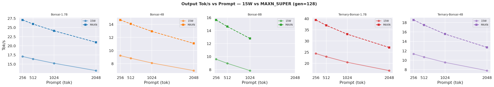

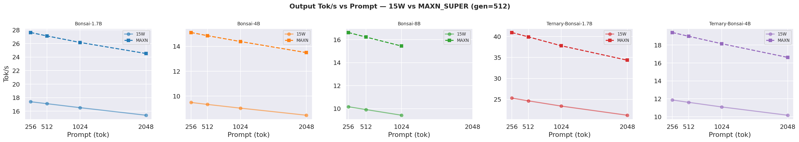

Tok/s vs power — both modes together. MAXN shifts every model right (more power) and up (more throughput):

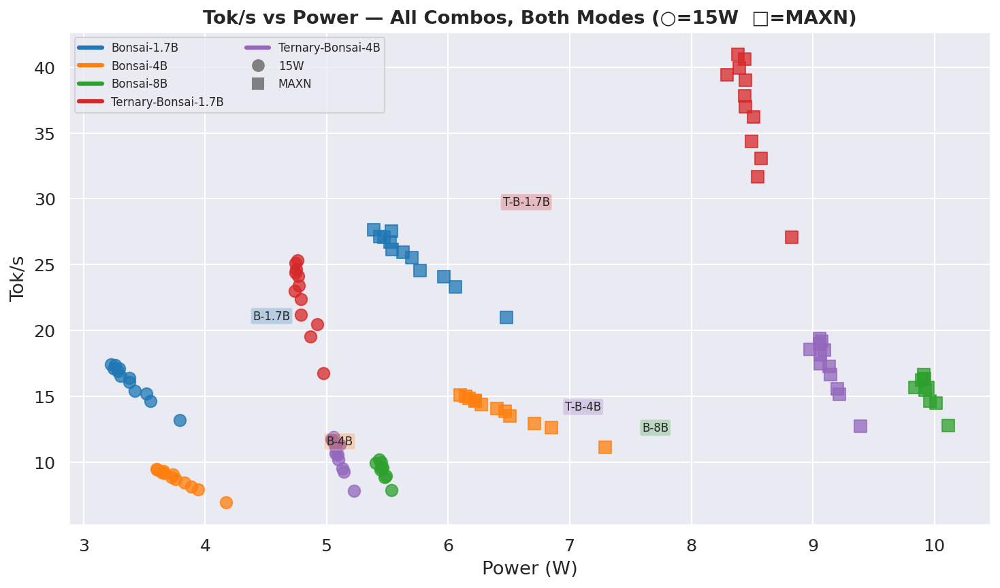

MAXN_SUPER throughput speedup over 15W — consistent ~1.6× for every model regardless of size or quantization:

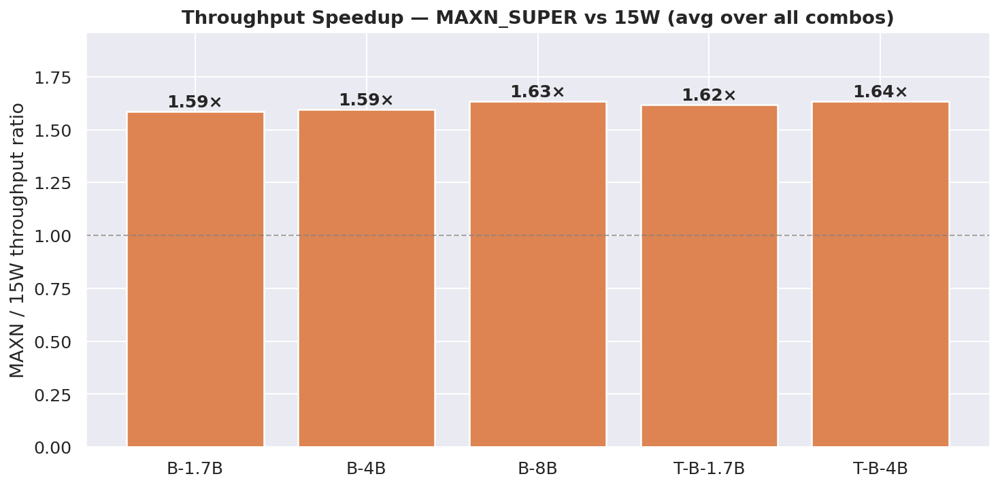

---

### 2.2 Energy Efficiency

Tok/J vs prompt length (gen=512) — 15W holds an edge at every prompt length:

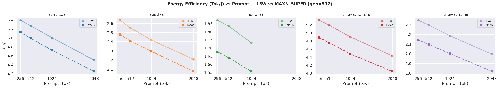

Best tok/J per model across both modes — 15W wins everywhere, MAXN is close but consistently lower:

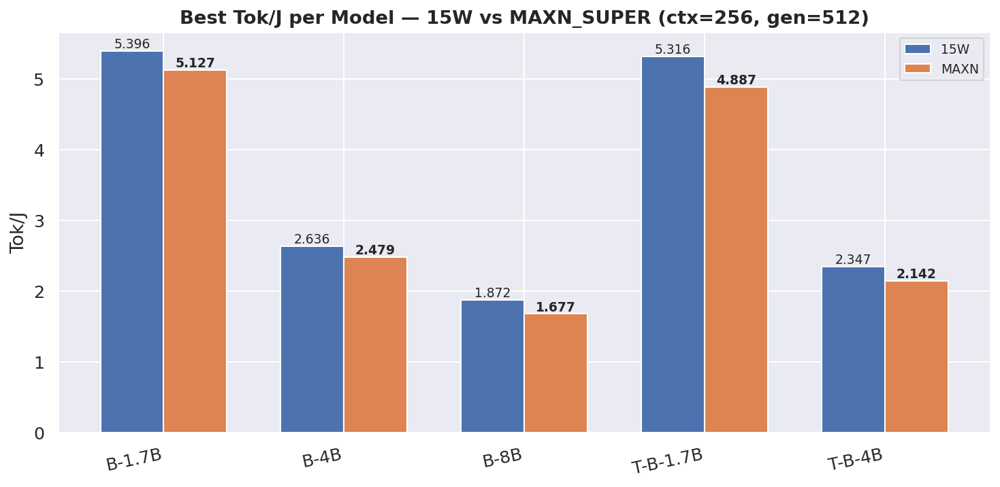

Tok/J heatmap — top row = 15W, bottom row = MAXN. The sweet spot (short prompt, long gen) is the same in both modes:

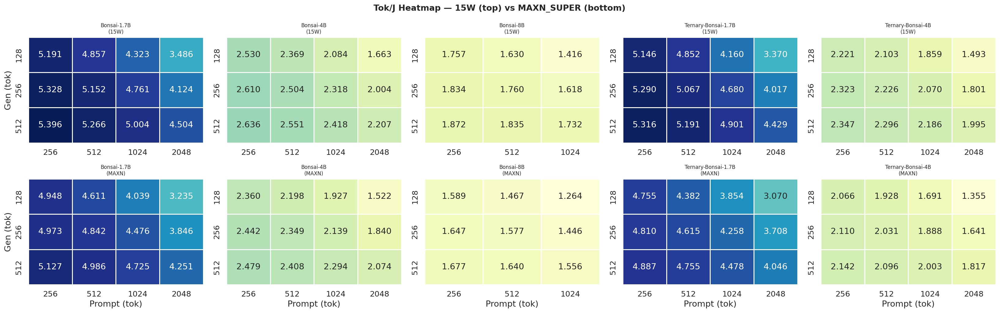

---

### 2.3 Latency

TTFT vs prompt — all models, solid = 15W, dashed = MAXN (gen=128). MAXN cuts TTFT by ~38 %:

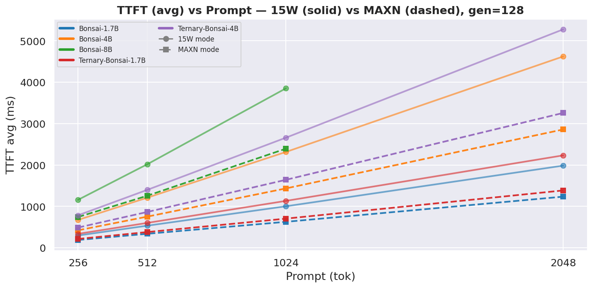

TTFT avg vs p99 spread — shaded band shows avg-to-p99 gap for each mode:

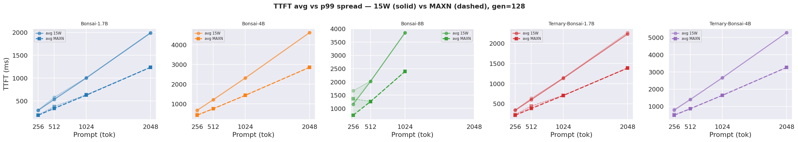

Inter-token latency — MAXN reduces ITL by ~38 % at every model:

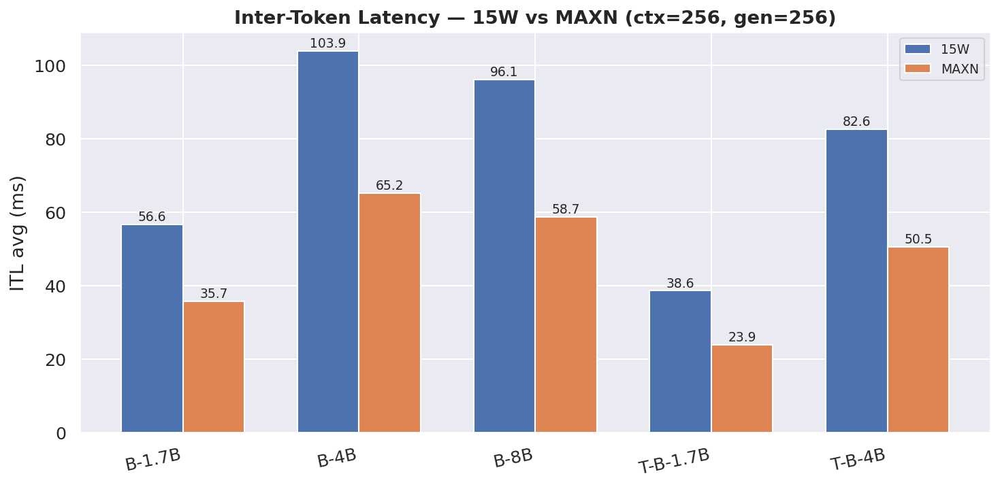

Request latency p99 — full round-trip tail, both modes:

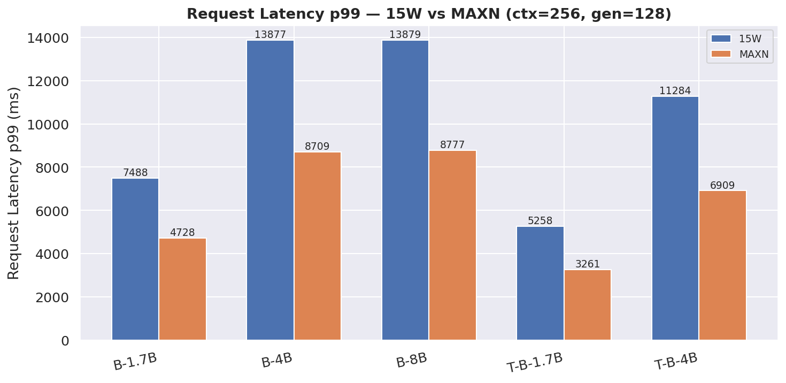

---

### 2.4 Prefill Throughput

MAXN_SUPER significantly accelerates prompt ingestion, especially for long-context use cases:

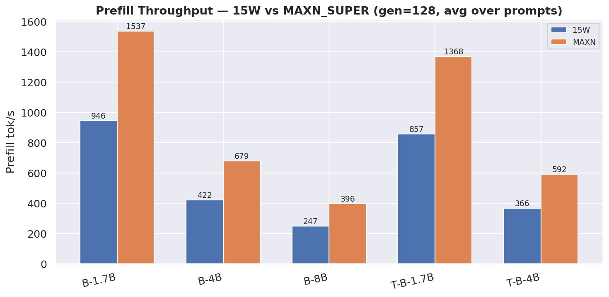

---

### 2.5 Power Draw

Average power per model across both runs — MAXN draws 65–83 % more than 15W:

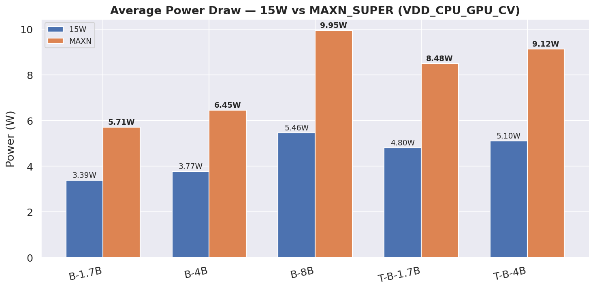

---

## 3. Analysis

### 3.1 The 1.6× Rule — Consistent Speedup Across All Models

The most striking finding from the dual-mode sweep is how **uniform the MAXN speedup is**. Every model gains 1.59–1.64× throughput at MAXN_SUPER regardless of parameter count or quantization type:

| Model | 15W tok/s | MAXN tok/s | Speedup | 15W tok/J | MAXN tok/J | Δ tok/J |
|-------|----------:|-----------:|--------:|----------:|-----------:|--------:|
| Bonsai-1.7B | 17.40 | 27.63 | **1.59×** | 5.396 | 5.127 | −5.0 % |
| Bonsai-4B | 9.48 | 15.12 | **1.59×** | 2.636 | 2.479 | −6.0 % |
| Bonsai-8B | 10.16 | 16.62 | **1.64×** | 1.872 | 1.677 | −10.4 % |
| Ternary-Bonsai-1.7B | 25.30 | 40.97 | **1.62×** | 5.316 | 4.887 | −8.1 % |
| Ternary-Bonsai-4B | 11.87 | 19.40 | **1.63×** | 2.347 | 2.142 | −8.7 % |

> Measured at ctx=256, gen=512. Numbers at other configs scale proportionally.

The GPU clock ratio is 1020 ÷ 612 = **1.667×**. The actual throughput gain (1.59–1.64×) tracks this ratio closely, confirming that these workloads are entirely GPU clock-bound rather than memory-bandwidth-bound.

### 3.2 Energy Efficiency — 15W Wins, But Only Just

At MAXN_SUPER, power draw rises 65–83 % while throughput rises only 60 %. The result: tok/J drops 5–10 % at every model. The 8B model takes the largest hit (−10.4 %) because its power nearly doubles (5.43 W → 9.91 W).

Crucially, **the order of models by tok/J is identical in both modes** — Bonsai-1.7B leads, Ternary-1.7B follows, the 4Bs are mid-range, and 8B is last. MAXN doesn't change the relative ranking, it just uniformly shifts all values down by ~7 %.

**Best tok/J per model (both modes):**

| Model | Best Tok/J (15W) | Best Tok/J (MAXN) | Config |
|-------|----------------:|------------------:|--------|
| Bonsai-1.7B | **5.396** | **5.127** | ctx=256, gen=512 |
| Ternary-Bonsai-1.7B | **5.316** | **4.887** | ctx=256, gen=512 |
| Bonsai-4B | **2.636** | **2.479** | ctx=256, gen=512 |
| Ternary-Bonsai-4B | **2.347** | **2.142** | ctx=256, gen=512 |
| Bonsai-8B | **1.872** | **1.677** | ctx=256, gen=512 |

In every case the optimal configuration is identical: **short prompt, long generation** (ctx=256, gen=512). This is where a single cheap prefill is amortised over the maximum number of decode steps.

### 3.3 Ternary vs Bonsai — Speed vs Frugality

Within each parameter size, the Q2_0 ternary models are consistently faster but draw more power:

| Size | Q1_0 tok/s (15W) | Q2_0 tok/s (15W) | Q2_0 speedup | Power difference |
|------|----------------:|----------------:|-------------:|-----------------|
| 1.7B | 17.40 | 25.30 | **+45 %** | +4.76 vs 3.22 W (+48 %) |
| 4B | 9.48 | 11.87 | **+25 %** | +5.05 vs 3.60 W (+40 %) |

The ternary (2-bit) weights map better to Ampere's Tensor core INT4/INT8 compute paths than 1-bit binary (Q1_0). Per-token latency for Ternary-1.7B is **38.6 ms** vs **56.6 ms** for Bonsai-1.7B — a 32 % reduction in decode step cost. But because power also rises proportionally, tok/J ends up nearly identical (5.316 vs 5.396 — a 1.5 % gap).

**Recommendation:** Q2_0 ternary for latency-sensitive interactive workloads; Q1_0 Bonsai for always-on or power-constrained deployments.

### 3.4 Latency Characteristics

**TTFT scales near-linearly with prompt** across both modes. MAXN reduces TTFT by ~38 % at every prompt length:

| Model | TTFT 15W (ctx=256) | TTFT MAXN (ctx=256) | TTFT 15W (ctx=2048) | TTFT MAXN (ctx=2048) |
|-------|-------------------:|--------------------:|--------------------:|---------------------:|
| Bonsai-1.7B | 298 ms | ~185 ms | 1 985 ms | ~1 230 ms |
| Bonsai-4B | 674 ms | ~418 ms | 4 622 ms | ~2 865 ms |
| Bonsai-8B | 1 124 ms | ~697 ms | (> ctx cap) | — |
| Ternary-1.7B | 338 ms | ~210 ms | 2 231 ms | ~1 385 ms |
| Ternary-4B | 786 ms | ~488 ms | 5 280 ms | ~3 275 ms |

**Latency consistency is excellent in both modes.** For nearly all configurations, avg-to-p99 TTFT spread is under 15 ms (< 5 % of mean). The only notable outlier is Bonsai-8B at ctx=256/gen=128 in the 15W run: avg 1 124 ms, p99 1 668 ms — a one-off CUDA kernel JIT spike that does not recur.

**Prefill throughput increases at longer prompts** for all models (GPU utilisation improves with larger attention batches). At MAXN, Bonsai-1.7B prefills at ~1 600+ tok/s at ctx=2048 vs ~1 030 tok/s at 15W.

### 3.5 Power Scaling

Actual VDD_CPU_GPU_CV draw per model at best-throughput config:

| Model | 15W draw | MAXN draw | Ratio |
|-------|--------:|----------:|------:|
| Bonsai-1.7B | 3.22 W | 5.39 W | 1.67× |
| Bonsai-4B | 3.60 W | 6.10 W | 1.69× |
| Bonsai-8B | 5.43 W | 9.91 W | 1.83× |
| Ternary-1.7B | 4.76 W | 8.38 W | 1.76× |
| Ternary-4B | 5.05 W | 9.06 W | 1.79× |

At 15W mode, no model ever came close to the 15 W power envelope cap — meaning the GPU clock (612 MHz) was the binding constraint, not TDP. At MAXN_SUPER, the 8B model drawing ~10 W approaches a practical thermal limit for light active cooling in an enclosure. No throttling was observed (peak junction temperature ~68 °C, far below the 95 °C threshold).

### 3.6 Why Tok/J Peaks at Short Prompt + Long Generation

Tok/J = tok/s ÷ power. When the prompt is short, the expensive prefill burst is brief. When generation is long, the GPU spends the majority of the request in the more power-efficient autoregressive decode phase. The ratio shifts in favour of decode, keeping both instantaneous power moderate and throughput high — the numerator grows while the denominator stays flat.

At ctx=2048 + gen=128, most of the energy budget is spent on a 2-second prefill producing only 128 tokens. At ctx=256 + gen=512, the same energy budget produces 512 tokens from a 300 ms prefill. The difference in tok/J is 3.5× vs 5.4× for Bonsai-1.7B.

---

## 4. Engineering Struggles

### 4.1 Running at the Wrong Power Mode

The initial benchmark script called `sudo nvpmodel -m 0`, which was assumed to be max performance. It is not — it is the **15 W default boot mode**. The full nvpmodel mapping for Jetson Orin Nano Super:

| ID | Name | GPU clock |
|----|------|-----------|
| 0 | 15W (default) | 612 MHz |
| 1 | 25W | ~820 MHz |
| 2 | **MAXN_SUPER** | **1 020 MHz** |
| 3 | 7W | ~420 MHz |

All 15W results were collected before this was caught. Rather than discard the data, both modes were benchmarked fully, producing the 15W vs MAXN comparison that ended up being one of the most informative outputs of this project. The fix: default `POWER_MODE=2` in the script, with a `--power-mode` CLI override.

### 4.2 The NvMap R36.4.7 Kernel Bug

Ternary-Bonsai-8B consistently failed to load with `NvMapMemAllocInternalTagged: error 12 (ENOMEM)` despite 6 GB+ free RAM. Investigation included reducing GPU layers to 10 (weights load, KV cache allocation still fails), attempting swap (IOVA is virtual address space, not physical RAM), rebooting (partial relief, not a fix), and inspecting `/proc/buddyinfo` and CMA (only 256 MB CMA on this board).

Root cause: JetPack R36.4.7 `nvmap` has a regression preventing contiguous IOVA allocations ≥ ~1.9 GB. Same bug blocks Gemma 3 4B (2.4 GB), Llama 3.1 8B, and any similarly-sized model. Fix: clean reflash to JetPack 6.2.2 (L4T 36.5).

### 4.3 IOVA Address Space Fragmentation

After running 4–5 models sequentially without rebooting, IOVA space fragmented enough to fail even small models. A mid-session Gemma 3 4B test (which fails at load time) partially exercised the IOVA allocator before crashing, leaving the space degraded. Subsequently, even Bonsai-4B failed on restart. Additionally, during the MAXN resume run, CMA showed only 1.5 MB free out of 256 MB total — preventing any model from loading. Fix: reboot before resuming, and `sudo systemctl stop ollama` at script startup.

### 4.4 Variable Evaluation Order Bug

`TEGRA_LOG` and `TIMING_LOG` were assigned at the top of the script before `BASE_ARTIFACT` was resolved, expanding to `/model_timing.log` (root filesystem). This produced a `Permission denied` error that appeared cosmetically minor but silently broke the entire session's power-windowing, making all tok/J values come out as `None`. Fixed by moving those two assignments to after the `BASE_ARTIFACT` block.

### 4.5 Ollama Squatting on GPU Memory

Ollama auto-starts on boot, holds IOVA memory, and introduces non-determinism. Added `sudo systemctl stop ollama` as the first action in the benchmark script's cleanup phase.

### 4.6 Power Outage and Resume Logic

A power outage mid-run prompted adding `--resume <dir>` to the script, which scans the artifact directory for completed JSON files and skips those combos, resuming from the first missing one. Without this, each interruption would have required a full restart.

---

## 5. Conclusion

### What These Numbers Mean for Edge Inference

The Bonsai family demonstrates that useful LLM inference is genuinely practical on a $250 embedded board. At 1.7B parameters:

- **17–41 tok/s** depending on power mode — fast enough for fluid interactive use
- **237–300 MB on disk** — fits on a microSD with room to spare
- **3–8 W under load** — runs on a USB-C power bank
- **5.1–5.4 tok/J** — the best energy efficiency measured in this suite

The 4B models double the capability footprint while staying under 700 MB and 10 W. The 8B model is viable for demanding tasks (multi-turn reasoning, structured output, RAG) at ~16–17 tok/s at MAXN.

### The 15W vs MAXN Trade-off

This is the clearest finding of the dual-mode sweep: **MAXN_SUPER gives you 60 % more speed for ~10 % worse energy efficiency.** The GPU clock ceiling at 15W (612 MHz) is the binding constraint — not the TDP cap, not memory bandwidth. Raising the clock ceiling to 1 020 MHz with `jetson_clocks` at MAXN_SUPER delivers throughput proportional to the clock increase.

Choose based on deployment context:

| Use case | Recommended mode |
|----------|-----------------|
| Always-on / battery / solar IoT | **15W** — best tok/J, lowest heat |
| Interactive chat, real-time assistant | **MAXN** — 60 % faster, still under 10 W |
| Long-context RAG (2K prompt) | **MAXN** — prefill 60 % faster |
| Thermally constrained enclosure | **15W** — ~4 W lower peak draw |

### What Is Still Blocked

Ternary-Bonsai-8B and any other model requiring > 1.9 GB contiguous CUDA allocation cannot run on JetPack R36.4.7. Upgrading to JetPack 6.2.2 (L4T 36.5) via SDK Manager clean flash is the only fix. At MAXN_SUPER with a working Ternary-8B, projecting from the Ternary-4B speedup pattern, expect ~26 tok/s and ~15 W — a compelling point for on-device 8B inference.

---

## Appendix A — Full Results Table (15W Run)

Raw data for all 57 valid combos from `bonsai-all-20260525-0243`. For MAXN data see `report_max.md`.

Cells marked `—` = OOM or context window exceeded by design.  
All latencies in milliseconds. Throughput in tokens/second.

| Model | Quant | ISL | OSL | OSL mm% | TTFT avg | p50 | p90 | p99 | T2T avg | p50 | p90 | p99 | ITL avg | p50 | p90 | p99 | Tok/s | Req/s | E2E avg | p50 | p90 | p99 | RLat avg | p50 | p90 | p99 | Prefill avg | p50 | p90 | p99 | Power W | **Tok/J** |
|-------|-------|:---:|:---:|---:|---:|---:|---:|---:|---:|---:|---:|---:|---:|---:|---:|---:|---:|---:|---:|---:|---:|---:|---:|---:|---:|---:|---:|---:|---:|---:|---:|---:|
| Bonsai-1.7B | Q1_0 | 256.0 | 127.9 | -0.08 | 297.8 | 297.3 | 298.6 | 302.6 | 60.1 | 60.0 | 60.6 | 60.9 | 56.61 | 56.57 | 56.64 | 57.42 | 17.08 | 0.134 | 17.09 | 17.11 | 17.12 | 17.22 | 7481.9 | 7481.9 | 7485.4 | 7488.2 | 859.6 | 861.1 | 862.3 | 862.8 | 3.29 | **5.191** |
| Bonsai-1.7B | Q1_0 | 512.0 | 128.0 | -0.04 | 534.8 | 531.6 | 532.5 | 582.9 | 60.4 | 60.6 | 60.7 | 60.8 | 57.22 | 57.20 | 57.22 | 57.59 | 16.40 | 0.128 | 16.41 | 16.42 | 16.43 | 16.43 | 7798.4 | 7795.9 | 7799.3 | 7844.6 | 957.9 | 963.2 | 964.1 | 964.2 | 3.38 | **4.857** |
| Bonsai-1.7B | Q1_0 | 1024.0 | 128.1 | 0.08 | 1003.5 | 1002.7 | 1004.3 | 1011.5 | 61.6 | 61.8 | 61.9 | 62.0 | 58.32 | 58.37 | 58.39 | 58.39 | 15.21 | 0.119 | 15.22 | 15.21 | 15.23 | 15.33 | 8415.9 | 8415.8 | 8419.0 | 8423.2 | 1020.5 | 1021.2 | 1021.8 | 1022.1 | 3.52 | **4.323** |
| Bonsai-1.7B | Q1_0 | 2048.0 | 128.0 | -0.04 | 1985.0 | 1984.4 | 1985.1 | 1995.8 | — | — | — | — | 60.65 | 60.64 | 60.66 | 61.08 | 13.20 | — | 13.21 | 13.22 | 13.22 | 13.24 | 9684.5 | 9685.4 | 9688.1 | 9698.2 | — | — | — | — | 3.79 | **3.486** |
| Bonsai-1.7B | Q1_0 | 256.0 | 255.8 | -0.08 | 297.8 | 297.6 | 297.8 | 303.3 | 60.1 | 60.0 | 60.5 | 61.0 | 56.65 | 56.60 | 56.81 | 57.18 | 17.36 | 0.068 | 17.36 | 17.38 | 17.39 | 17.44 | 14730.9 | 14728.8 | 14739.0 | 14744.7 | 859.6 | 860.3 | 861.6 | 862.3 | 3.26 | **5.328** |
| Bonsai-1.7B | Q1_0 | 512.0 | 255.8 | -0.10 | 533.3 | 531.9 | 534.2 | 550.1 | 60.7 | 60.6 | 60.8 | 61.5 | 57.27 | 57.23 | 57.45 | 57.62 | 16.90 | 0.066 | 16.91 | 16.93 | 16.94 | 16.94 | 15123.1 | 15122.6 | 15126.9 | 15145.0 | 960.1 | 962.6 | 963.3 | 963.9 | 3.28 | **5.152** |
| Bonsai-1.7B | Q1_0 | 1024.0 | 255.6 | -0.16 | 1003.5 | 1003.1 | 1004.3 | 1010.4 | 61.8 | 61.9 | 62.0 | 62.1 | 58.47 | 58.38 | 58.63 | 59.04 | 16.08 | 0.063 | 16.09 | 16.11 | 16.12 | 16.12 | 15889.9 | 15889.0 | 15891.7 | 15922.4 | 1020.4 | 1020.8 | 1021.4 | 1022.6 | 3.38 | **4.761** |
| Bonsai-1.7B | Q1_0 | 2048.0 | 255.7 | -0.14 | 1985.6 | 1985.1 | 1986.5 | 1994.2 | 63.9 | 63.9 | 64.0 | 64.1 | 60.77 | 60.69 | 60.96 | 61.57 | 14.64 | 0.057 | 14.64 | 14.66 | 14.67 | 14.71 | 17460.1 | 17459.9 | 17470.5 | 17473.8 | 1031.4 | 1031.7 | 1032.3 | 1032.8 | 3.55 | **4.124** |
| Bonsai-1.7B | Q1_0 | 256.0 | 501.9 | -1.96 | 298.1 | 297.7 | 298.2 | 305.0 | 60.1 | 60.0 | 60.9 | 61.0 | 56.97 | 56.91 | 57.06 | 57.96 | 17.40 | 0.035 | 17.41 | 17.43 | 17.45 | 17.46 | 28836.2 | 29376.6 | 29382.1 | 29397.4 | 858.7 | 860.0 | 861.1 | 861.5 | 3.22 | **5.396** |
| Bonsai-1.7B | Q1_0 | 512.0 | 509.5 | -0.49 | 532.6 | 532.1 | 533.1 | 538.7 | 60.7 | 60.6 | 60.8 | 62.2 | 57.50 | 57.51 | 57.56 | 57.68 | 17.11 | 0.034 | 17.11 | 17.11 | 17.14 | 17.15 | 29771.5 | 29919.0 | 29924.6 | 29957.6 | 961.3 | 962.3 | 963.1 | 963.6 | 3.25 | **5.266** |
| Bonsai-1.7B | Q1_0 | 1024.0 | 511.9 | -0.03 | 1003.7 | 1003.2 | 1004.5 | 1009.4 | 61.9 | 61.9 | 62.0 | 62.8 | 58.66 | 58.65 | 58.78 | 58.99 | 16.52 | 0.032 | 16.53 | 16.53 | 16.55 | 16.58 | 30972.4 | 30973.8 | 30986.5 | 31022.6 | 1020.3 | 1020.7 | 1021.3 | 1022.3 | 3.30 | **5.004** |
| Bonsai-1.7B | Q1_0 | 2048.0 | 492.3 | -3.85 | 1985.8 | 1985.3 | 1986.8 | 1992.7 | 63.9 | 64.0 | 64.1 | 64.4 | 60.98 | 60.92 | 61.15 | 61.38 | 15.40 | 0.031 | 15.41 | 15.44 | 15.45 | 15.47 | 31946.2 | 32375.0 | 32389.4 | 32476.6 | 1031.3 | 1031.6 | 1032.0 | 1032.4 | 3.42 | **4.504** |
| Bonsai-4B | Q1_0 | 256.0 | 128.0 | -0.04 | 674.0 | 673.6 | 674.7 | 678.7 | 108.4 | 108.4 | 108.5 | 108.5 | 103.89 | 103.89 | 103.91 | 103.93 | 9.23 | 0.072 | 9.23 | 9.23 | 9.23 | 9.23 | 13862.8 | 13868.6 | 13870.5 | 13876.9 | 379.8 | 380.0 | 380.4 | 380.4 | 3.65 | **2.530** |
| Bonsai-4B | Q1_0 | 512.0 | 128.0 | -0.04 | 1211.1 | 1210.7 | 1211.3 | 1217.5 | 109.1 | 109.2 | 109.3 | 109.4 | 104.63 | 104.60 | 104.63 | 105.31 | 8.82 | 0.069 | 8.83 | 8.83 | 8.84 | 8.84 | 14493.8 | 14494.4 | 14497.5 | 14513.4 | 422.8 | 422.9 | 423.1 | 423.2 | 3.72 | **2.369** |
| Bonsai-4B | Q1_0 | 1024.0 | 127.8 | -0.12 | 2316.1 | 2315.8 | 2316.6 | 2322.2 | 110.5 | 110.6 | 110.7 | 110.8 | 106.09 | 106.01 | 106.03 | 107.38 | 8.10 | 0.063 | 8.11 | 8.11 | 8.11 | 8.12 | 15773.5 | 15778.4 | 15781.0 | 15786.1 | 442.1 | 442.2 | 442.3 | 442.4 | 3.89 | **2.084** |
| Bonsai-4B | Q1_0 | 2048.0 | 128.0 | 0.00 | 4622.0 | 4621.6 | 4622.9 | 4628.9 | 113.4 | 113.4 | 113.5 | 113.9 | 108.88 | 108.87 | 108.92 | 108.97 | 6.94 | 0.054 | 6.94 | 6.94 | 6.94 | 6.94 | 18449.2 | 18447.7 | 18456.0 | 18461.1 | 443.1 | 443.1 | 443.2 | 443.3 | 4.17 | **1.663** |
| Bonsai-4B | Q1_0 | 256.0 | 256.1 | 0.02 | 674.4 | 673.8 | 675.0 | 680.9 | 108.5 | 108.4 | 108.7 | 109.6 | 103.91 | 103.94 | 103.95 | 104.27 | 9.42 | 0.037 | 9.42 | 9.42 | 9.42 | 9.48 | 27177.2 | 27178.2 | 27181.9 | 27186.4 | 379.6 | 379.9 | 380.2 | 380.4 | 3.61 | **2.610** |
| Bonsai-4B | Q1_0 | 512.0 | 255.9 | -0.04 | 1211.5 | 1211.1 | 1211.6 | 1217.6 | 109.4 | 109.3 | 109.9 | 110.4 | 104.68 | 104.65 | 104.71 | 105.40 | 9.17 | 0.036 | 9.17 | 9.18 | 9.18 | 9.21 | 27894.8 | 27895.6 | 27900.1 | 27906.4 | 422.6 | 422.7 | 422.9 | 423.0 | 3.66 | **2.504** |
| Bonsai-4B | Q1_0 | 1024.0 | 255.9 | -0.04 | 2316.6 | 2316.0 | 2317.6 | 2323.2 | 110.6 | 110.6 | 110.7 | 110.7 | 106.10 | 106.07 | 106.15 | 106.46 | 8.71 | 0.034 | 8.72 | 8.72 | 8.72 | 8.72 | 29362.1 | 29362.4 | 29366.8 | 29376.1 | 442.0 | 442.1 | 442.3 | 442.4 | 3.76 | **2.318** |
| Bonsai-4B | Q1_0 | 2048.0 | 255.9 | -0.04 | 4622.2 | 4621.8 | 4623.3 | 4628.7 | 113.2 | 113.3 | 113.5 | 113.7 | 108.96 | 108.91 | 108.99 | 109.35 | 7.90 | 0.031 | 7.90 | 7.90 | 7.90 | 7.90 | 32395.3 | 32393.6 | 32402.1 | 32409.5 | 443.1 | 443.1 | 443.2 | 443.3 | 3.94 | **2.004** |
| Bonsai-4B | Q1_0 | 256.0 | 506.9 | -1.00 | 674.4 | 674.0 | 674.6 | 680.7 | 108.3 | 108.4 | 108.5 | 108.6 | 104.29 | 104.27 | 104.31 | 104.51 | 9.48 | 0.019 | 9.49 | 9.49 | 9.49 | 9.49 | 53434.5 | 53958.1 | 53966.1 | 53974.1 | 379.6 | 379.8 | 380.1 | 380.2 | 3.60 | **2.636** |
| Bonsai-4B | Q1_0 | 512.0 | 511.6 | -0.08 | 1212.5 | 1212.0 | 1213.9 | 1219.0 | 109.2 | 109.2 | 109.4 | 110.1 | 105.08 | 105.01 | 105.22 | 105.42 | 9.32 | 0.018 | 9.32 | 9.33 | 9.33 | 9.33 | 54865.9 | 54866.5 | 54872.7 | 54875.3 | 422.3 | 422.4 | 422.8 | 422.9 | 3.65 | **2.551** |
| Bonsai-4B | Q1_0 | 1024.0 | 511.7 | -0.06 | 2318.3 | 2316.9 | 2321.1 | 2331.0 | 110.8 | 110.8 | 111.0 | 111.1 | 106.47 | 106.41 | 106.62 | 106.95 | 9.02 | 0.018 | 9.03 | 9.03 | 9.03 | 9.03 | 56694.6 | 56692.1 | 56707.2 | 56729.3 | 441.7 | 442.0 | 442.1 | 442.3 | 3.73 | **2.418** |
| Bonsai-4B | Q1_0 | 2048.0 | 499.9 | -2.36 | 4622.6 | 4622.3 | 4623.5 | 4629.2 | 113.2 | 113.3 | 113.4 | 113.5 | 109.24 | 109.23 | 109.27 | 109.46 | 8.45 | 0.017 | 8.46 | 8.46 | 8.46 | 8.46 | 59124.5 | 59126.2 | 59134.6 | 59138.6 | 443.0 | 443.1 | 443.2 | 443.2 | 3.83 | **2.207** |
| Bonsai-8B | Q1_0 | 256.0 | 128.0 | 0.00 | 1159.5 | 1123.7 | 1136.0 | 1668.1 | 100.6 | 100.6 | 100.8 | 101.3 | 95.94 | 95.93 | 95.97 | 96.15 | 9.59 | 0.075 | 9.59 | 9.62 | 9.62 | 9.62 | 13344.3 | 13306.4 | 13320.8 | 13878.6 | 223.1 | 227.8 | 227.9 | 228.0 | 5.46 | **1.757** |
| Bonsai-8B | Q1_0 | 512.0 | 128.0 | 0.00 | 2019.4 | 2018.9 | 2020.1 | 2025.5 | 101.3 | 101.4 | 101.4 | 101.9 | 96.67 | 96.68 | 96.69 | 96.69 | 8.95 | 0.070 | 8.95 | 8.95 | 8.95 | 8.96 | 14296.9 | 14297.3 | 14299.2 | 14303.3 | 253.5 | 253.6 | 253.7 | 253.7 | 5.49 | **1.630** |
| Bonsai-8B | Q1_0 | 1024.0 | 127.9 | -0.08 | 3852.9 | 3852.3 | 3853.0 | 3861.7 | 102.7 | 102.8 | 102.9 | 103.0 | 98.20 | 98.13 | 98.22 | 98.89 | 7.84 | 0.061 | 7.84 | 7.85 | 7.85 | 7.85 | 16314.6 | 16314.5 | 16317.0 | 16322.9 | 265.8 | 265.8 | 265.8 | 265.9 | 5.53 | **1.416** |
| Bonsai-8B | Q1_0 | 256.0 | 255.8 | -0.06 | 1124.1 | 1123.6 | 1124.3 | 1131.7 | 100.6 | 100.6 | 100.7 | 100.8 | 96.06 | 96.00 | 96.01 | 96.92 | 9.99 | 0.039 | 9.99 | 10.00 | 10.00 | 10.00 | 25603.9 | 25602.9 | 25606.5 | 25618.2 | 227.7 | 227.8 | 227.9 | 228.0 | 5.45 | **1.834** |
| Bonsai-8B | Q1_0 | 512.0 | 256.0 | 0.00 | 2020.4 | 2019.4 | 2020.8 | 2035.4 | 101.4 | 101.4 | 101.7 | 102.4 | 96.71 | 96.72 | 96.73 | 96.73 | 9.59 | 0.037 | 9.59 | 9.59 | 9.60 | 9.60 | 26682.6 | 26682.0 | 26687.6 | 26695.7 | 253.4 | 253.5 | 253.6 | 253.7 | 5.45 | **1.760** |
| Bonsai-8B | Q1_0 | 1024.0 | 255.9 | -0.02 | 3853.6 | 3853.3 | 3853.9 | 3860.4 | 102.9 | 102.9 | 103.1 | 103.7 | 98.18 | 98.16 | 98.18 | 98.48 | 8.86 | 0.035 | 8.86 | 8.86 | 8.86 | 8.87 | 28883.8 | 28884.5 | 28887.8 | 28888.5 | 265.7 | 265.7 | 265.8 | 265.8 | 5.47 | **1.618** |
| Bonsai-8B | Q1_0 | 256.0 | 511.9 | -0.01 | 1124.4 | 1123.8 | 1124.8 | 1133.3 | 100.5 | 100.6 | 100.7 | 100.7 | 96.35 | 96.34 | 96.36 | 96.50 | 10.16 | 0.020 | 10.17 | 10.17 | 10.17 | 10.17 | 50354.7 | 50356.3 | 50362.3 | 50363.8 | 227.7 | 227.8 | 227.9 | 227.9 | 5.43 | **1.872** |
| Bonsai-8B | Q1_0 | 512.0 | 511.9 | -0.02 | 2019.8 | 2019.4 | 2020.5 | 2026.3 | 101.4 | 101.3 | 101.6 | 102.5 | 97.08 | 97.06 | 97.11 | 97.26 | 9.91 | 0.019 | 9.92 | 9.92 | 9.92 | 9.92 | 51617.4 | 51619.2 | 51621.6 | 51631.4 | 253.5 | 253.5 | 253.6 | 253.7 | 5.40 | **1.835** |
| Bonsai-8B | Q1_0 | 1024.0 | 499.6 | -2.43 | 3853.8 | 3853.4 | 3855.2 | 3859.8 | 102.9 | 102.9 | 103.2 | 103.5 | 98.56 | 98.48 | 98.88 | 99.05 | 9.42 | 0.019 | 9.43 | 9.43 | 9.44 | 9.47 | 52991.4 | 52989.8 | 53006.3 | 53023.5 | 265.7 | 265.7 | 265.8 | 265.9 | 5.44 | **1.732** |
| Ternary-Bonsai-1.7B | Q2_0 | 256.0 | 128.0 | -0.04 | 337.9 | 337.4 | 338.7 | 344.6 | 42.1 | 42.1 | 42.2 | 42.5 | 38.59 | 38.59 | 38.64 | 38.82 | 24.40 | 0.191 | 24.43 | 24.43 | 24.47 | 24.48 | 5237.5 | 5238.5 | 5242.8 | 5258.3 | 757.6 | 758.8 | 759.5 | 760.0 | 4.74 | **5.146** |
| Ternary-Bonsai-1.7B | Q2_0 | 512.0 | 128.0 | 0.00 | 602.2 | 600.1 | 601.0 | 634.1 | 42.6 | 42.6 | 42.9 | 43.6 | 39.07 | 39.08 | 39.10 | 39.11 | 22.98 | 0.180 | 23.00 | 23.01 | 23.03 | 23.04 | 5564.6 | 5563.5 | 5566.3 | 5601.0 | 850.3 | 853.2 | 853.7 | 854.3 | 4.74 | **4.852** |
| Ternary-Bonsai-1.7B | Q2_0 | 1024.0 | 128.0 | -0.04 | 1133.7 | 1130.7 | 1141.8 | 1148.7 | 43.8 | 43.7 | 44.5 | 44.7 | 40.26 | 40.21 | 40.40 | 40.59 | 20.47 | 0.160 | 20.49 | 20.52 | 20.55 | 20.56 | 6244.1 | 6236.5 | 6262.8 | 6294.8 | 903.2 | 905.6 | 906.4 | 906.9 | 4.92 | **4.160** |
| Ternary-Bonsai-1.7B | Q2_0 | 2048.0 | 128.1 | 0.04 | 2232.8 | 2230.0 | 2232.1 | 2271.9 | 45.9 | 46.0 | 46.1 | 46.4 | 42.51 | 42.53 | 42.56 | 42.57 | 16.76 | 0.131 | 16.77 | 16.77 | 16.78 | 16.88 | 7634.2 | 7632.3 | 7635.6 | 7668.8 | 917.2 | 918.4 | 918.7 | 919.3 | 4.97 | **3.370** |
| Ternary-Bonsai-1.7B | Q2_0 | 256.0 | 250.4 | -2.19 | 338.2 | 337.5 | 338.9 | 346.0 | 42.1 | 42.1 | 42.3 | 42.8 | 38.62 | 38.62 | 38.64 | 38.72 | 25.09 | 0.100 | 25.11 | 25.13 | 25.16 | 25.17 | 9969.3 | 10183.3 | 10189.2 | 10198.5 | 757.0 | 758.4 | 759.1 | 759.5 | 4.74 | **5.290** |
| Ternary-Bonsai-1.7B | Q2_0 | 512.0 | 255.9 | -0.04 | 601.7 | 601.1 | 602.4 | 610.0 | 42.5 | 42.6 | 42.9 | 43.1 | 39.17 | 39.17 | 39.21 | 39.40 | 24.15 | 0.094 | 24.17 | 24.17 | 24.20 | 24.24 | 10587.2 | 10590.3 | 10597.9 | 10599.4 | 851.0 | 851.8 | 852.9 | 853.1 | 4.77 | **5.067** |
| Ternary-Bonsai-1.7B | Q2_0 | 1024.0 | 252.4 | -1.41 | 1131.0 | 1130.6 | 1131.0 | 1137.6 | 43.9 | 43.9 | 44.2 | 44.8 | 40.30 | 40.27 | 40.36 | 40.60 | 22.39 | 0.089 | 22.40 | 22.46 | 22.46 | 22.51 | 11261.9 | 11399.3 | 11412.6 | 11418.2 | 905.4 | 905.8 | 906.1 | 906.2 | 4.78 | **4.680** |
| Ternary-Bonsai-1.7B | Q2_0 | 2048.0 | 255.9 | -0.02 | 2231.0 | 2230.4 | 2231.8 | 2241.0 | 46.4 | 45.9 | 46.9 | 52.6 | 42.57 | 42.57 | 42.62 | 42.72 | 19.55 | 0.076 | 19.56 | 19.56 | 19.59 | 19.60 | 13083.4 | 13084.8 | 13096.7 | 13115.5 | 918.0 | 918.2 | 918.8 | 919.4 | 4.87 | **4.017** |
| Ternary-Bonsai-1.7B | Q2_0 | 256.0 | 512.0 | 0.01 | 338.3 | 337.9 | 338.7 | 344.3 | 42.1 | 42.1 | 42.3 | 42.5 | 38.91 | 38.92 | 38.93 | 38.96 | 25.30 | 0.049 | 25.32 | 25.32 | 25.34 | 25.36 | 20223.3 | 20225.2 | 20230.7 | 20244.8 | 756.6 | 757.6 | 758.5 | 759.1 | 4.76 | **5.316** |
| Ternary-Bonsai-1.7B | Q2_0 | 512.0 | 511.9 | -0.01 | 601.6 | 601.0 | 603.2 | 607.6 | 42.6 | 42.7 | 42.8 | 42.9 | 39.45 | 39.43 | 39.47 | 39.70 | 24.65 | 0.048 | 24.66 | 24.67 | 24.69 | 24.70 | 20757.7 | 20751.4 | 20766.8 | 20878.9 | 851.0 | 851.9 | 852.8 | 852.9 | 4.75 | **5.191** |
| Ternary-Bonsai-1.7B | Q2_0 | 1024.0 | 504.1 | -1.53 | 1132.0 | 1131.2 | 1133.7 | 1139.0 | 43.9 | 44.0 | 44.2 | 44.2 | 40.56 | 40.57 | 40.60 | 40.65 | 23.39 | 0.046 | 23.40 | 23.42 | 23.45 | 23.49 | 21540.3 | 21864.1 | 21878.0 | 21878.7 | 904.6 | 905.2 | 905.5 | 905.9 | 4.77 | **4.901** |
| Ternary-Bonsai-1.7B | Q2_0 | 2048.0 | 500.1 | -2.32 | 2230.3 | 2229.7 | 2231.5 | 2236.3 | 45.9 | 45.9 | 46.1 | 46.4 | 42.75 | 42.76 | 42.80 | 42.92 | 21.21 | 0.042 | 21.22 | 21.21 | 21.24 | 21.40 | 23564.9 | 23565.6 | 23580.7 | 23592.9 | 918.3 | 918.5 | 918.7 | 919.0 | 4.79 | **4.429** |
| Ternary-Bonsai-4B | Q2_0 | 256.0 | 128.0 | -0.04 | 785.5 | 783.0 | 784.2 | 820.8 | 86.0 | 87.4 | 87.6 | 87.7 | 82.61 | 82.60 | 82.62 | 83.07 | 11.34 | 0.089 | 11.35 | 11.35 | 11.36 | 11.37 | 11273.0 | 11273.0 | 11277.0 | 11283.9 | 326.0 | 326.9 | 327.1 | 327.2 | 5.11 | **2.221** |
| Ternary-Bonsai-4B | Q2_0 | 512.0 | 128.0 | -0.04 | 1400.7 | 1400.0 | 1400.8 | 1409.9 | 88.1 | 88.2 | 88.3 | 88.5 | 83.33 | 83.30 | 83.34 | 83.87 | 10.68 | 0.083 | 10.68 | 10.69 | 10.69 | 10.69 | 11979.5 | 11978.7 | 11982.9 | 11997.5 | 365.5 | 365.7 | 365.8 | 365.9 | 5.08 | **2.103** |
| Ternary-Bonsai-4B | Q2_0 | 1024.0 | 128.1 | 0.04 | 2660.6 | 2660.2 | 2661.2 | 2666.3 | 89.6 | 89.7 | 89.8 | 90.2 | 84.71 | 84.71 | 84.83 | 84.98 | 9.54 | 0.074 | 9.54 | 9.54 | 9.54 | 9.60 | 13423.3 | 13420.9 | 13433.8 | 13452.2 | 384.9 | 384.9 | 385.0 | 385.0 | 5.13 | **1.859** |
| Ternary-Bonsai-4B | Q2_0 | 2048.0 | 128.0 | -0.04 | 5276.0 | 5275.5 | 5276.5 | 5284.8 | 92.4 | 92.4 | 92.7 | 93.0 | 87.69 | 87.65 | 87.68 | 88.25 | 7.80 | 0.061 | 7.80 | 7.80 | 7.80 | 7.81 | 16407.9 | 16407.3 | 16410.1 | 16428.0 | 388.2 | 388.2 | 388.3 | 388.3 | 5.22 | **1.493** |
| Ternary-Bonsai-4B | Q2_0 | 256.0 | 255.8 | -0.08 | 786.6 | 783.6 | 784.9 | 830.7 | 85.9 | 87.3 | 87.4 | 87.5 | 82.61 | 82.55 | 82.87 | 82.88 | 11.71 | 0.046 | 11.72 | 11.72 | 11.73 | 11.74 | 21835.1 | 21833.7 | 21839.8 | 21877.4 | 325.5 | 326.7 | 326.8 | 326.9 | 5.04 | **2.323** |
| Ternary-Bonsai-4B | Q2_0 | 512.0 | 255.8 | -0.08 | 1401.8 | 1401.0 | 1401.6 | 1414.9 | 88.0 | 88.2 | 88.3 | 88.5 | 83.35 | 83.29 | 83.41 | 83.95 | 11.29 | 0.044 | 11.30 | 11.31 | 11.32 | 11.32 | 22639.8 | 22639.9 | 22652.6 | 22654.0 | 365.2 | 365.5 | 365.6 | 365.6 | 5.08 | **2.226** |
| Ternary-Bonsai-4B | Q2_0 | 1024.0 | 255.9 | -0.04 | 2662.9 | 2662.3 | 2664.4 | 2669.9 | 89.6 | 89.7 | 89.9 | 89.9 | 84.79 | 84.75 | 85.06 | 85.11 | 10.54 | 0.041 | 10.54 | 10.55 | 10.55 | 10.58 | 24276.0 | 24272.2 | 24285.7 | 24293.7 | 384.5 | 384.6 | 384.8 | 384.8 | 5.09 | **2.070** |
| Ternary-Bonsai-4B | Q2_0 | 2048.0 | 255.8 | -0.08 | 5280.3 | 5279.8 | 5281.4 | 5288.7 | 92.2 | 92.3 | 92.4 | 92.5 | 87.68 | 87.62 | 87.70 | 88.29 | 9.26 | 0.036 | 9.26 | 9.27 | 9.27 | 9.27 | 27621.4 | 27622.9 | 27634.4 | 27636.6 | 387.9 | 387.9 | 388.0 | 388.1 | 5.14 | **1.801** |
| Ternary-Bonsai-4B | Q2_0 | 256.0 | 512.0 | 0.00 | 783.9 | 783.5 | 784.2 | 790.8 | 87.2 | 87.3 | 87.3 | 87.4 | 82.89 | 82.89 | 82.94 | 83.05 | 11.87 | 0.023 | 11.87 | 11.87 | 11.87 | 11.91 | 43139.9 | 43140.5 | 43145.8 | 43163.7 | 326.6 | 326.8 | 327.0 | 327.1 | 5.05 | **2.347** |
| Ternary-Bonsai-4B | Q2_0 | 512.0 | 511.9 | -0.01 | 1401.5 | 1401.0 | 1402.3 | 1407.6 | 88.1 | 88.1 | 88.2 | 88.8 | 83.61 | 83.61 | 83.64 | 83.89 | 11.60 | 0.023 | 11.60 | 11.60 | 11.61 | 11.63 | 44120.8 | 44123.9 | 44133.0 | 44139.2 | 365.3 | 365.5 | 365.6 | 365.7 | 5.05 | **2.296** |
| Ternary-Bonsai-4B | Q2_0 | 1024.0 | 511.8 | -0.04 | 2665.1 | 2662.0 | 2664.3 | 2709.7 | 88.3 | 89.7 | 89.8 | 89.8 | 85.14 | 85.11 | 85.29 | 85.38 | 11.09 | 0.022 | 11.09 | 11.09 | 11.10 | 11.10 | 46153.4 | 46155.7 | 46175.5 | 46183.6 | 384.2 | 384.7 | 384.8 | 384.9 | 5.07 | **2.186** |
| Ternary-Bonsai-4B | Q2_0 | 2048.0 | 499.8 | -2.38 | 5280.4 | 5280.1 | 5281.5 | 5287.3 | 92.3 | 92.3 | 92.4 | 93.1 | 87.98 | 87.95 | 88.10 | 88.25 | 10.16 | 0.020 | 10.17 | 10.17 | 10.17 | 10.19 | 49164.7 | 49157.8 | 49187.4 | 49189.7 | 387.9 |a 387.9 | 388.0 | 388.1 | 5.09 | **1.995** |
| Ternary-Bonsai-8B | Q2_0 | — | — | — | — | — | — | — | — | — | — | — | — | — | — | — | — | — | — | — | — | — | — | — | — | — | — | — | — | — | — | OOM |

---

## Appendix B — Thermal & Power Summary (15W Run)

| Model | Quant | Avg Power (W) | Peak TJ (°C) | Status |
|-------|-------|---:|---:|:---:|
| Bonsai-1.7B | Q1_0 | 2.55 | 59.0 | OK |
| Bonsai-4B | Q1_0 | 3.68 | 61.7 | OK |
| Bonsai-8B | Q1_0 | 5.32 | 64.1 | OK |
| Ternary-Bonsai-1.7B | Q2_0 | 4.56 | 63.8 | OK |
| Ternary-Bonsai-4B | Q2_0 | 5.02 | 63.2 | OK |
| Ternary-Bonsai-8B | Q2_0 | — | — | OOM |

> "Avg Power" is the model-level window average (includes server startup/shutdown time) — lower than the per-run values in Appendix A. No model triggered thermal throttling (threshold ≈ 95 °C).

---

## Appendix C — Caveats & Notes

- **Power modes:** Appendices A–B use the 15W run (`bonsai-all-20260525-0243`). Full MAXN data: `report_max.md` (`bonsai-all-20260526-0239`). Both runs used the same sweep parameters and 20 requests/combo.
- **Concurrency:** Single-user (concurrency = 1). Multi-user throughput characteristics not captured.
- **Tokenizer:** Size-matched Qwen3 tokenizers used for aiperf synthetic prompt generation.
- **`--no-cache-prompt`:** Disabled llama-server prompt-state pooling; each request starts from a clean KV state.
- **`--reasoning off`:** Qwen3 chain-of-thought disabled at server level for deterministic output length.
- **Ternary-Bonsai-8B OOM:** JetPack R36.4.7 NvMap regression. Fix: clean reflash to L4T 36.5 (JetPack 6.2.2).
- **Bonsai-8B context cap:** `-c 1536` to stay within memory budget; ctx=2048 prompts excluded by design.
- **aiperf JSON:** `output_token_throughput` and `request_throughput` are avg-only. All other metrics include p50/p90/p99/min/max/std.
