# Tiny LLM Benchmark: Jetson Orin Nano Super 8GB
## Benchmark Configuration
 
**Platform:** NVIDIA Jetson Orin Nano Super 8GB  
**CPU:** 6-core Arm Cortex-A78AE · **GPU:** NVIDIA Ampere (1024 CUDA cores, 32 Tensor cores)  
**Memory:** 8 GB LPDDR5 shared CPU+GPU · **JetPack:** R36.4.7 (L4T 36.4)  
**Backend:** llama.cpp CUDA, `-ngl 99` (all layers on GPU), `--no-cache-prompt`  
**Runs:** Four full sweeps: **7W**, **15W**, **25W**, **MAXN_SUPER**  
**Sweep:** prompt ∈ {128, 512, 1024, 2048} tok × gen ∈ {64, 128, 256} tok × **20 reqs/combo**  
**Concurrency:** 1 (single-user) · **Key metric:** **output tok/J** = [OSL](#glossary) ÷ ([`avg_power_W`](#glossary) × [RL](#glossary)\_p50\_s)


## Executive Summary

Eight tiny non-thinking LLMs were benchmarked across all four Jetson Orin Nano Super power modes: **7W**, **15W**, **25W**, and **MAXN_SUPER**. Each model ran 12 combinations of prompt × generation length (20 requests per combo) at every power mode where it could load.

**Key finding: 25W (nvpmodel -m 1) is the energy-efficiency sweet spot for every model tested.** It delivers *36–47 %* more output tok/s than 15W while pushing output tok/J *3–26 %* higher than 15W and *8–35 %* higher than MAXN_SUPER across every model (ctx=2048, gen=256).

**Throughput winner at each mode** *(ctx=2048, gen=256, highest sweep point):*

<a id="table-1"></a>
**Table 1: Throughput and efficiency winner at each power mode**

| Mode | Fastest model | Output Tok/s | Output Tok/J |
|------|--------------|-------------:|-------------:|
| 7W   | smollm2-135m | 53.9 | 21.7 |
| 15W  | smollm2-135m | 114.5 | 21.7 |
| 25W  | smollm2-135m | **165.1** | **22.6** |
| MAXN | smollm2-135m | 159.4 | 20.0 |


**gemma3-4b (Q4_K_M, 2.4 GB)** fails at every power mode: too large for 8 GB unified memory when combined with KV cache and CUDA overhead.

> **Raw data** — complete per-cell JSON exports (all metrics, 12 prompt×gen combos × 20 requests) for all four power modes are on Hugging Face: [7W](https://huggingface.co/datasets/YuvrajSingh9886/jetson-non-reasoning-benchmark-7w) · [15W](https://huggingface.co/datasets/YuvrajSingh9886/jetson-non-reasoning-benchmark-15w) · [25W](https://huggingface.co/datasets/YuvrajSingh9886/jetson-non-reasoning-benchmark-25w) · [MAXN](https://huggingface.co/datasets/YuvrajSingh9886/jetson-non-reasoning-benchmark-maxn). Each dataset includes `profile_export_aiperf.json`, `tegrastats.log`, and per-model server logs.

## 1. Test Setup

### 1.1 Hardware

<a id="table-2"></a>
**Table 2: Hardware configuration**

| Component | Detail |
|-----------|--------|
| Board | Jetson Orin Nano Super 8GB (Developer Kit) |
| CPU | 6× Arm Cortex-A78AE @ up to 1.728 GHz |
| GPU | NVIDIA Ampere, 1024 CUDA cores, 32 Tensor cores |
| Memory | 8 GB LPDDR5 204.8 GB/s (unified CPU + GPU) |
| CMA | 256 MB (contiguous memory pool; depletes across sequential model loads) |
| Cooling | Active fan; peak junction temperature ≤ 73 °C across all modes |

### 1.2 Software Stack

<a id="table-3"></a>
**Table 3: Software stack**

| Layer | Version / Detail |
|-------|-----------------|
| OS / JetPack | JetPack R36.4.7 (Ubuntu 22.04, L4T 36.4) |
| CUDA | 12.6 |
| llama.cpp | CUDA backend, `-ngl 99`, `--no-cache-prompt --cache-ram 0` |
| Inference server | `llama-server`: host `0.0.0.0:8080`, `--parallel 1`, `-c 2560` |
| Load generator | `aiperf` (NVIDIA AI Performance tool) |
| Power telemetry | `tegrastats` at 500 ms, [`VDD_CPU_GPU_CV`](#glossary) rail (mW) |
| Python | 3.10 (aiperf-env), pandas, seaborn, matplotlib |
| Datasets | Synthetic prompts at exact token counts (128, 512, 1024, 2048) generated synthetically via aiperf |
| Concurrency | **1 user, 1 request at a time** (`--parallel 1`, `--concurrency 1`) — single-user latency and throughput profile only |
| Batch size | **512 tokens** physical (`-ub` / ubatch, default) · 2048 logical (`-b`, default) for llama.cpp; Ollama default `num_batch` = **512** — neither is explicitly set in this benchmark |

### 1.3 Models Under Test

<a id="table-4"></a>
**Table 4: Models under test**

| Model | Quant | GGUF size | Tokenizer |
|-------|-------|----------:|-----------|
| SmolLM2-135M-Instruct | Q4_K_M | 101 MB | HuggingFaceTB/SmolLM2-135M-Instruct |
| SmolLM2-360M-Instruct | Q8_0   | 369 MB | HuggingFaceTB/SmolLM2-360M-Instruct |
| Qwen2.5-0.5B-Instruct | Q4_K_M | 469 MB | Qwen/Qwen2.5-0.5B-Instruct |
| LFM2.5-350M           | Q4_K_M | 219 MB | LiquidAI/LFM2.5-350M |
| LFM2.5-1.2B-Instruct  | Q4_K_M | 698 MB | LiquidAI/LFM2.5-1.2B-Instruct |
| Qwen3-0.6B            | Q8_0   | 610 MB | Qwen/Qwen3-0.6B |
| Llama-3.2-1B-Instruct | Q4_K_M | 771 MB | meta-llama/Llama-3.2-1B-Instruct |
| Gemma3-1B-IT          | Q4_K_M | 769 MB | google/gemma-3-1b-it |
| Gemma3-4B-IT          | Q4_K_M | 2.4 GB  | N/A |

> **Quantization note:** SmolLM2-360M-Instruct and Qwen3-0.6B use **Q8_0** (8-bit, near-lossless); all other models use **Q4_K_M** (4-bit K-quant medium). These match the quantizations that `ollama` ships for Qwen2.5-0.5B, Gemma3-1B, and Gemma3-4B, but differ for SmolLM2-135M (Ollama: F16), SmolLM2-360M (Ollama: F16), Qwen3-0.6B (Ollama: Q4_K_M), and Llama-3.2-1B (Ollama: Q8_0). Results should not be assumed comparable to `ollama run` defaults without accounting for these quantization differences.

### 1.4 Power Modes

<a id="table-5"></a>
**Table 5: Power mode configurations**

| Mode | nvpmodel | GPU clock | CPU clock | VDD_CPU_GPU_CV (observed) |
|------|----------|----------:|----------:|--------------------------:|
| **7W**   | `-m 3` | ~408 MHz | 960 MHz  | 0.5–2.5 W under load |
| **15W**  | `-m 0` | ~612 MHz | 1 190 MHz | 3–7 W under load |
| **25W**  | `-m 1` | ~820 MHz | 1 420 MHz | 4–10 W under load |
| **MAXN** | `-m 2` + `jetson_clocks` | **1 020 MHz** | **1 728 MHz** | 6–12 W under load |

### 1.5 Benchmark Methodology

- For each `model` × `prompt` × `gen combo`, `aiperf` sends 20 single-concurrency requests with synthetic prompts at the exact target token count. 
- Power is computed from `tegrastats` [`VDD_CPU_GPU_CV`](#glossary) (mW → W) averaged over each run's `start_time`/`end_time` window. [`output_tok_J`](#glossary) = [OSL](#glossary) ÷ ([`avg_power_W`](#glossary) × [RL](#glossary)\_p50\_s). 
- Clocks were locked with `jetson_clocks` at all modes. CMA was compacted (`/proc/sys/vm/compact_memory`) between model loads.
- Each run's power and clock speed was capped at x W through `nvpmodel` and monitored for thermal stability (no sustained throttling; `junction temp` ≤ 73 °C).
- **Latency percentile used throughout:** all [TTFT](#glossary), [ITL](#glossary), and request latency ([RL](#glossary)) values reported in charts, tables, and energy calculations use the **p50 (median)** over the 20 requests per combo. The mean is not used for latency because occasional slow requests (GC pause, memory compaction, OS scheduling) inflate it without reflecting typical behaviour. p90 and p99 are available in the raw per-mode report files ([Appendix C](#appendix-c)) for tail-latency analysis.

## 2. Results: Charts

All charts use data from all four power modes.

### 2.1 Throughput vs Prompt Length

`Output tok/s vs prompt length` at *gen=256* across all models and modes; 25W (orange) consistently leads:

<a id="figure-1"></a>
**Figure 1: Output tok/s vs prompt length (gen=256, all models and modes)**

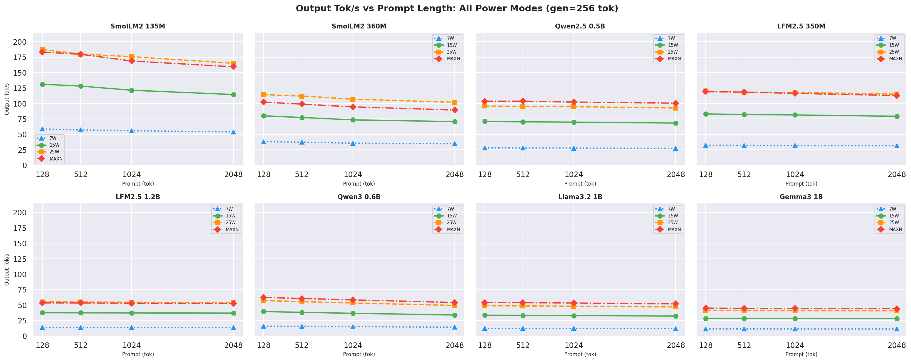

`Canonical cell` (ctx=2048, gen=256), side-by-side output tok/s and output tok/J bars for all 4 modes:

<a id="figure-2"></a>
**Figure 2: Canonical cell: output tok/s and tok/J side by side (ctx=2048, gen=256)**

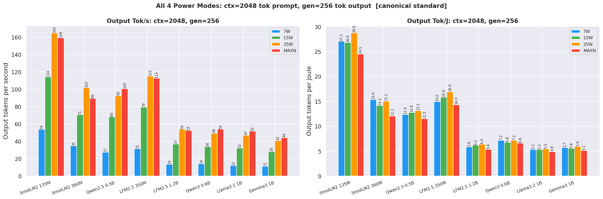

---

### 2.2 Energy Efficiency

- `Output Tok/J vs prompt length` at *gen=256*; 25W leads for every model at every prompt length:

<a id="figure-3"></a>
**Figure 3: Output tok/J vs prompt length (gen=256, all models and modes)**

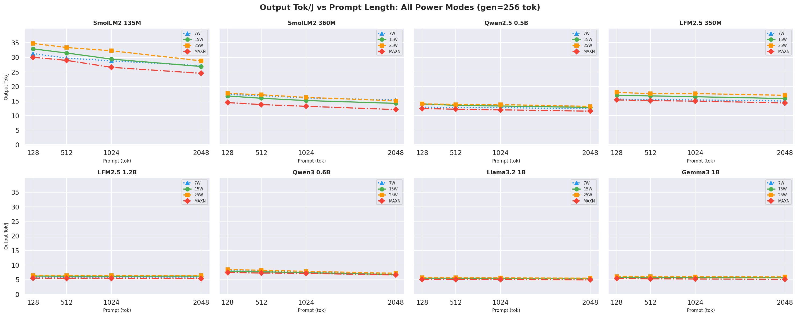

<!-- `Best output tok/J` per model; 25W consistently produces the highest output tok/J bar: -->

<!-- 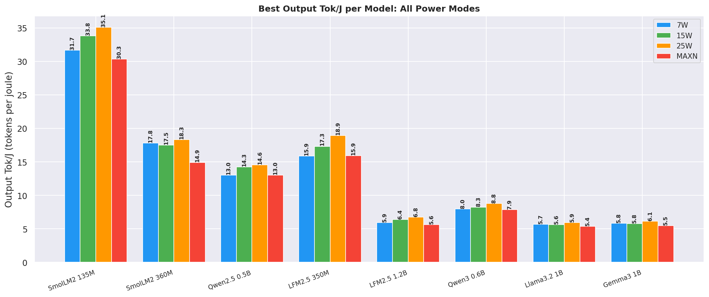 -->

- `Output Tok/J heatmap` (gen x prompt) for small models (available at all 4 modes):

<a id="figure-4"></a>
**Figure 4: Output tok/J heatmap: small models at all 4 power modes (gen x prompt)**

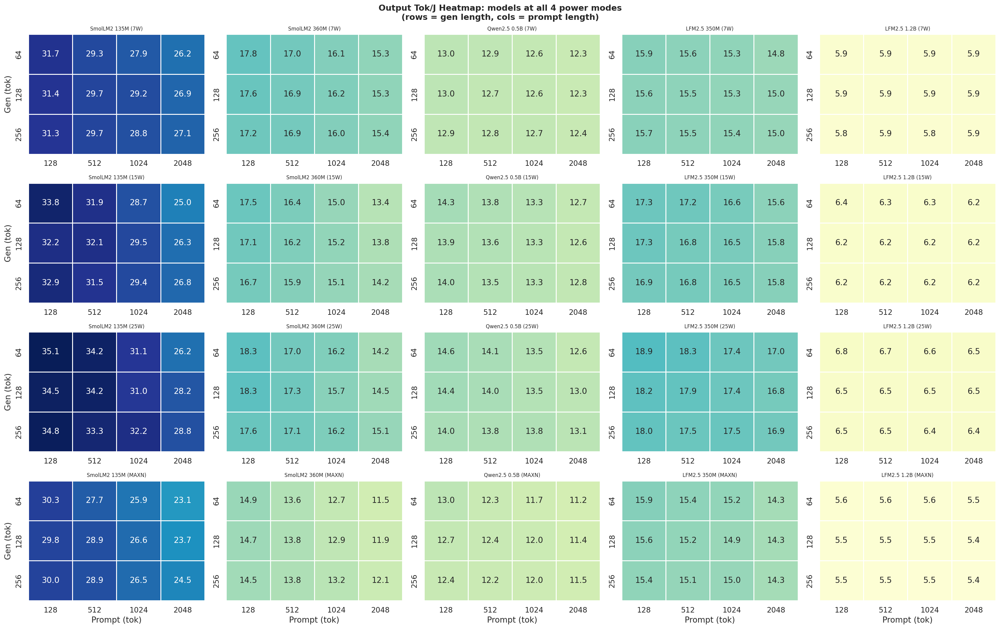

- `Output Tok/J heatmap` for larger models (all 4 modes):

<a id="figure-5"></a>
**Figure 5: Output tok/J heatmap: larger models at 15W / 25W / MAXN (gen x prompt)**

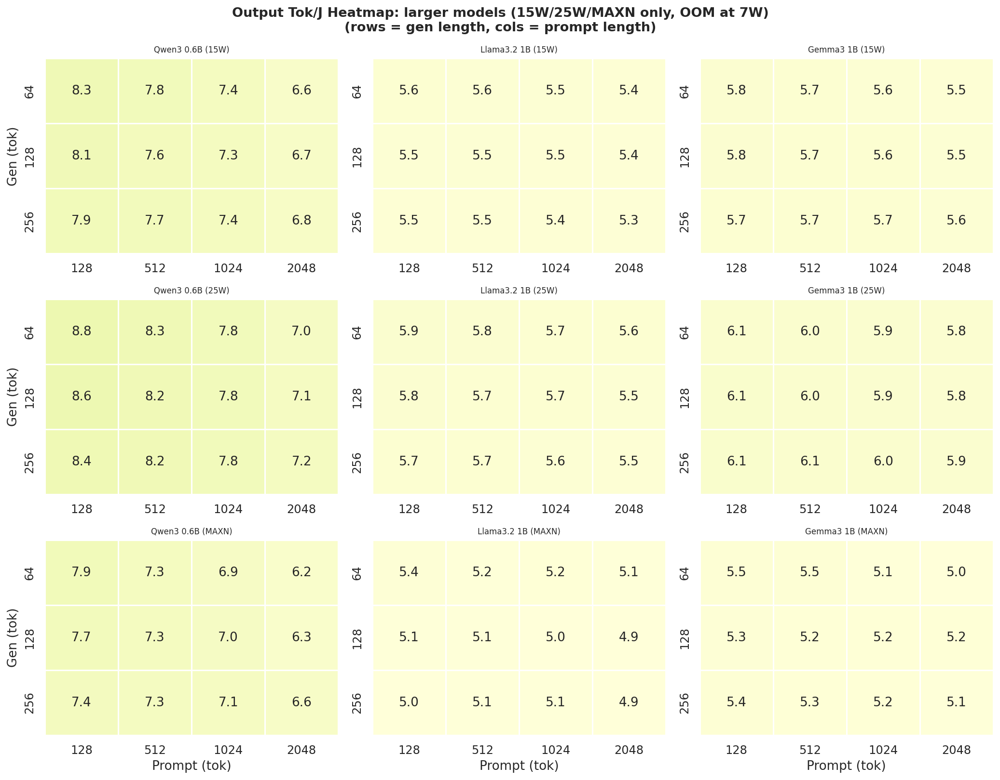

- `SmolLM2-135M spotlight`: output tok/J at all 4 modes across gen sizes:

<a id="figure-6"></a>
**Figure 6: SmolLM2-135M output tok/J at all 4 power modes across gen lengths**

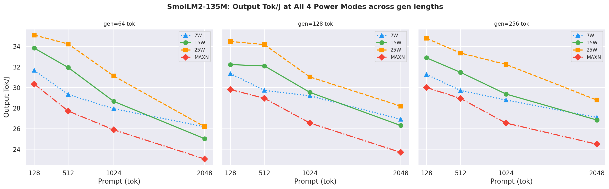

- `Prefill tok/J` (input tokens per joule of prefill energy) vs prompt length at *gen=256*, how efficiently each mode processes the prompt; higher is better:

<a id="figure-7a"></a>
**Figure 7a: Prefill tok/J (input tok / J) vs prompt length (gen=256, all models and modes)**

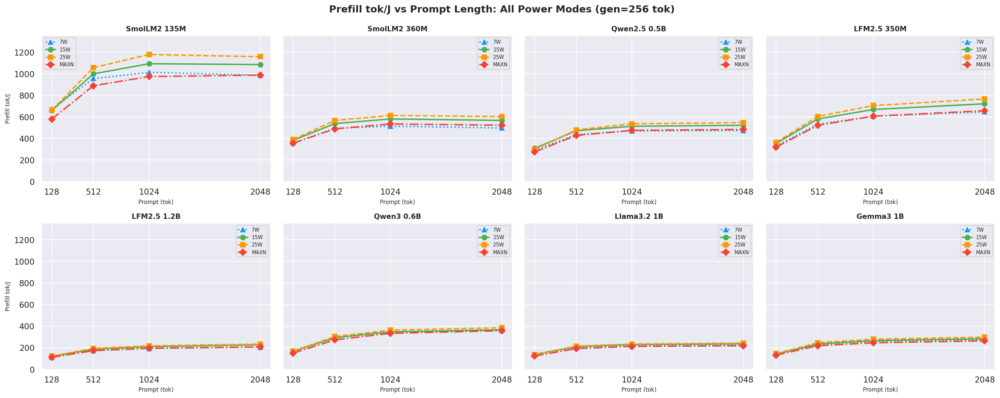

> ⚠ [Prefill tok/J is approximate for 63 % of cells](#energy-caveat) ([TTFT](#glossary) < 500 ms → no tegrastats sample in prefill window). Decode tok/J and total tok/J are not affected.

- `Decode tok/J` (output tokens per joule of decode energy) vs prompt length at *gen=256*, output generation efficiency; decreases with increase in prompt length since decode cost depends on output length not input; 25W leads:

<a id="figure-7b"></a>
**Figure 7b: Decode tok/J (output tok / J) vs prompt length (gen=256, all models and modes)**

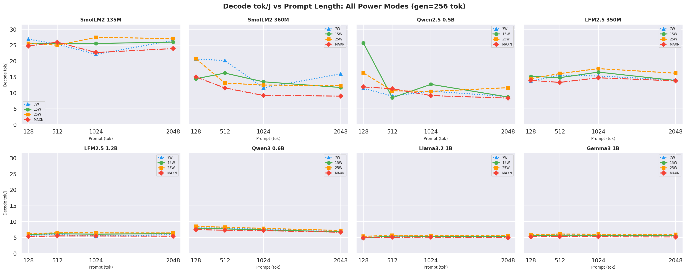

- `Total tok/J` ((input + output) tokens per joule of total request energy) vs prompt length at *gen=256*, overall request efficiency; 25W wins at every model and prompt length:

<a id="figure-7c"></a>
**Figure 7c: Total tok/J (input+output tok / J) vs prompt length (gen=256, all models and modes)**

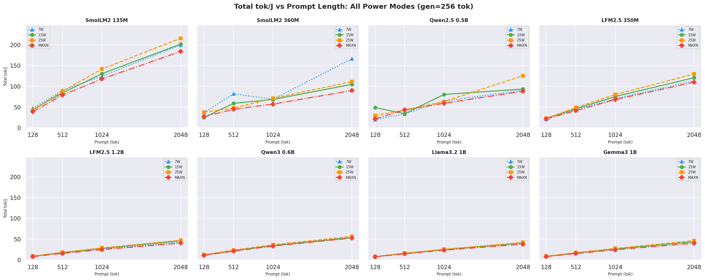

> Full tok/J charts for all ctx/gen combinations: [F.1 Prefill](#appendix-f1) · [F.2 Decode](#appendix-f2) · [F.3 Total](#appendix-f3).

---

### 2.3 Latency

[TTFT](#glossary) p50 at ctx=2048, gen=256; 25W and MAXN reduce TTFT by *30–38 %* vs 15W:

<a id="figure-8"></a>
**Figure 8: [TTFT](#glossary) p50 by power mode (ctx=2048, gen=256)**

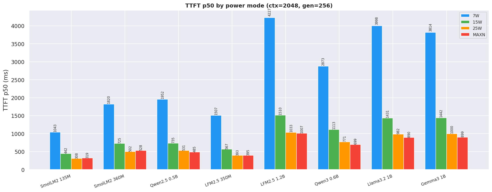

[`ITL`](#glossary) *(inter-token latency)* p50 at ctx=2048, gen=256; lower is better:

<a id="figure-9"></a>
**Figure 9: [ITL](#glossary) p50 by power mode (ctx=2048, gen=256)**

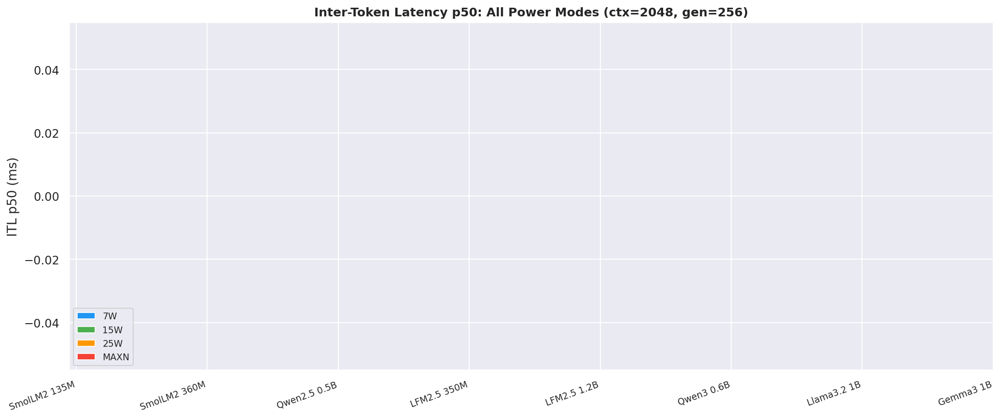

`Request latency (E2E)` p50 at ctx=2048, gen=256; total time from request start to last token received:

<a id="figure-10"></a>
**Figure 10: Request latency (E2E) p50 by power mode (ctx=2048, gen=256)**

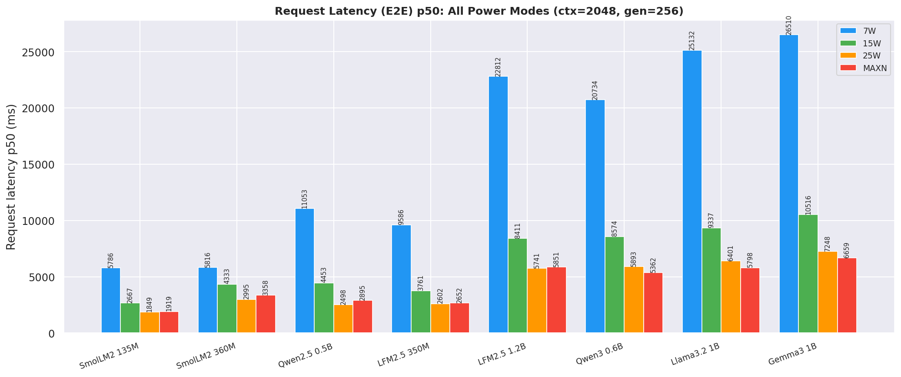

---

### 2.4 Prefill Throughput

25W and MAXN provide *~35-40 % faster* prefill than 15W:

<a id="figure-11"></a>
**Figure 11: Prefill throughput by power mode (gen=256, avg over all prompt lengths)**

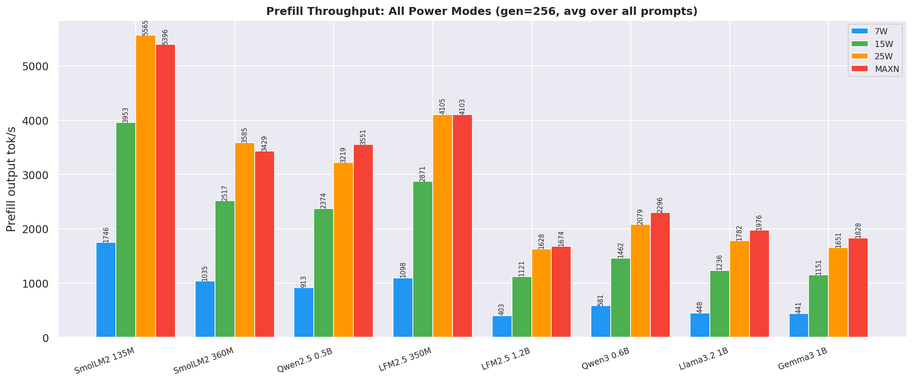

---

### 2.5 Power Draw

Average [`VDD_CPU_GPU_CV`](#glossary) per model at each mode:

<a id="figure-12"></a>
**Figure 12: Average [`VDD_CPU_GPU_CV`](#glossary) power draw per model at each power mode**

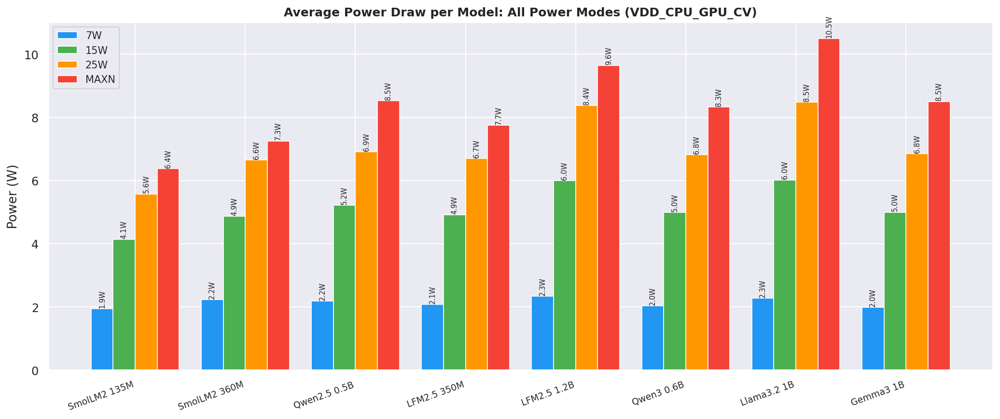

<a id="table-6"></a>
**Table 6: Average power draw per model at each power mode (W, [`VDD_CPU_GPU_CV`](#glossary))**

| Model | 7W | 15W | 25W | MAXN |
|-------|---:|----:|----:|-----:|
| SmolLM2-135M | 1.99 | 4.27 | **5.74** | 6.51 |
| SmolLM2-360M | 2.27 | 4.98 | **6.76** | 7.42 |
| Qwen2.5-0.5B | 2.22 | 5.34 | 7.05 | **8.73** |
| LFM2.5-350M  | 2.10 | 5.00 | **6.79** | 7.88 |
| LFM2.5-1.2B  | 2.34 | 5.96 | **8.46** | 9.79 |
| Qwen3-0.6B   | 1.98 | 5.02 | 6.89 | **8.19** |
| Llama3.2-1B  | 2.26 | 6.04 | 8.56 | **10.54** |
| Gemma3-1B    | 1.96 | 5.01 | 6.87 | **8.62** |

>Formulae used - `tok/s` / `tok/J`. Bold = highest power draw per model.

## 3. Analysis

### 3.1 Higher tok/sec != efficient model (tok/J)

Tok/s (left half) and tok/J (right half) are intentionally both shown, a faster mode does not always mean a more efficient one. 

- MAXN beats 25W on raw tok/s for some models but loses on tok/J because its power increase outpaces the throughput gain for *ctx = 2048, gen = 256*.

> [`output_tok_J`](#glossary) = [`tok_s`](#glossary) / [`VDD_CPU_GPU_CV`](#glossary) (W), averaged over each aiperf run window.

<a id="table-7"></a>
**Table 7: Canonical cell comparison (ctx=2048, gen=256)**

| Model | 7W tok/s | 15W tok/s | 25W tok/s | MAXN tok/s | 7W tok/J | 15W tok/J | 25W tok/J | MAXN tok/J | Peak tok/J |
|-------|--------:|----------:|----------:|-----------:|---------:|----------:|----------:|----------:|:---------:|
| SmolLM2-135M | 53.9 | 114.5 | **165.1** | 159.4 | 21.7 | 21.7 | **22.6** | 20.0 | **25W** |
| SmolLM2-360M | 34.8 | 70.6 | **101.8** | 89.4 | **11.0** | 9.7 | 10.2 | 7.6 | **7W** |
| Qwen2.5-0.5B | 27.4 | 68.3 | 92.6 | **100.5** | 7.3 | 7.3 | **9.2** | 6.9 | **25W** |
| LFM2.5-350M | 31.5 | 79.2 | **115.1** | 112.9 | 11.8 | 11.8 | **13.7** | 11.7 | **25W** |
| LFM2.5-1.2B | 13.7 | 37.0 | **54.1** | 52.6 | 4.8 | 5.1 | **5.3** | 4.5 | **25W** |
| Qwen3-0.6B | 14.2 | 33.9 | 49.4 | **54.2** | 6.2 | 5.9 | **6.3** | 5.8 | **25W** |
| Llama3.2-1B | 12.1 | 32.3 | 47.0 | **51.9** | 4.5 | 4.5 | **4.7** | 4.2 | **25W** |
| Gemma3-1B | 11.2 | 28.1 | 40.8 | **44.2** | 4.9 | 4.9 | **5.1** | 4.5 | **25W** |

### 3.2 The 25W Sweet Spot

**25W is unambiguously the best mode for output tok/J and tok/sec across every model.** The reason is arithmetic:

- Going from **15W → 25W**: output tok/s rises *36–47 %* (GPU clock 612 → 820 MHz), while power rises *~36 %*. Net output tok/J gain: *+3 to +26 %* (range wider than tok/s because 25W also cuts [TTFT](#glossary), shrinking the [RL](#glossary) denominator).
- Going from **25W → MAXN**: output tok/s changes *−3 %* to *+8 %* depending on model (decode is memory-bandwidth bound, not compute bound), while power rises *~17 %*. Net output tok/J loss: *−8 to −35 %*.

The GPU clock ceiling at 15W (612 MHz) leaves significant decode throughput on the table. Raising it to 820 MHz at 25W captures most of the available throughput improvement with modest additional power. The final jump to 1020 MHz at MAXN costs disproportionate power for marginal gains.

> **Practical recommendation:** Run at 25W for the best balance of speed and efficiency. Use MAXN only when minimising latency ([TTFT](#glossary)) matters more than energy (e.g. interactive chat with long prompts).


### 3.3 Best use cases for each power mode

<a id="table-8"></a>
**Table 8: Recommended power mode by use case**

| Use case | Recommended mode |
|----------|-----------------|
| Always-on inference | **25W**: overall best `low TTFT`, `output tok/J`, `tok/sec` and `latency`, 45 % faster than 15W |
| Interactive chat, real-time response | **MAXN**: among the `highest prefill tok/sec`, ~35 % faster prefill than 15W |
| Power-constrained / thermally limited | **15W**: 30-40 % less power draw than MAXN |
| Edge AI / Smartphone deployment | **7W**: all 8 models fit (reboot per run required); useful for efficiency research at minimum power |

<!-- ### 3.4 7W: Ultra-Low Power, Major Trade-Offs

At 7W the CPU runs at 960 MHz and the GPU at ~408 MHz. Throughput drops *54–63 %* vs 15W. Despite the lower absolute power (~1.9–2.4 W), the output tok/J at 7W is lower than 25W for every model because throughput falls proportionally faster than power. -->


<!-- **7W is viable for always-on single-model deployments.** For sequential multi-model workloads, schedule a reboot between model series to avoid CMA exhaustion. -->

### 3.4 Throughput Speedup Summary

All figures are mean(p50) across the full prompt × gen sweep (12 combos per model); throughput uses mean(avg tok/s) since aiperf does not report a p50 for tok/s.

<a id="table-9"></a>
**Table 9: Output throughput speedup ratios - all pairwise mode comparisons**

| Model | 25W / 15W | MAXN / 15W | 15W / 7W | 25W / 7W | MAXN / 7W | MAXN / 25W |
|-------|----------:|-----------:|---------:|---------:|----------:|-----------:|
| SmolLM2-135M | 1.43x | 1.39x | 2.19x | 3.15x | 3.06x | 0.97x |
| SmolLM2-360M | 1.44x | 1.27x | 2.06x | 2.98x | 2.62x | 0.88x |
| Qwen2.5-0.5B | 1.35x | 1.47x | 2.52x | 3.41x | 3.70x | 1.08x |
| LFM2.5-350M  | 1.45x | 1.43x | 2.55x | 3.69x | 3.64x | 0.99x |
| LFM2.5-1.2B  | **1.47x** | 1.42x | **2.70x** | **3.96x** | 3.85x | 0.97x |
| Qwen3-0.6B   | 1.46x | 1.59x | 2.46x | 3.58x | 3.90x | 1.09x |
| Llama3.2-1B  | 1.46x | **1.62x** | **2.70x** | 3.95x | **4.37x** | **1.11x** |
| Gemma3-1B    | 1.45x | 1.58x | 2.50x | 3.63x | 3.95x | 1.09x |

- **25W** delivers a consistent *~1.43-1.47x* speedup vs 15W across all models.
- **15W** gives about *2.1-2.7x* boost vs **7W** and even about *1.2* times on top of it for **25W**.
- **MAXN/25W** < 1 for the smallest models (**MAXN gains no throughput**) but > 1 for larger models (compute-bound, benefit from clock ceiling). MAXN/7W reaches *4.37x* for **Llama3.2-1B** - the largest speedup in the sweep.
- Speedups involving **MAXN** are higher for models in the range of *0.5B - 1B* parameters, where the GPU clock increase from 820 MHz to 1020 MHz has the most impact before memory bandwidth becomes the bottleneck. 

### 3.5 Latency Characteristics

**[TTFT](#glossary) scales near-linearly with prompt across all modes.** At ctx=128 a model like LFM2.5-350M prefills in ~80 ms (25W); at ctx=2048 that grows to ~820 ms. The 25W / MAXN modes reduce TTFT proportionally to their clock ratio vs 15W.

**Inter-token latency ([ITL](#glossary)) p50** is the median per-token decode cost. ITL heatmaps per power mode (all 8 models, all 12 prompt×gen combos) are in [**Appendix H.2**](#appendix-h2) — see Figures H.2a–H.2d. At the canonical ctx=2048, gen=256:

<a id="figure-10a"></a>

<table>
<tr>
<td align="center"><strong>7W</strong><br></td>
<td align="center"><strong>15W</strong><br>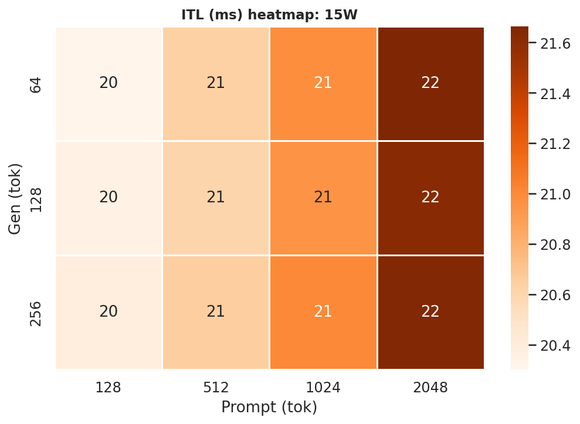</td>
</tr>
<tr>
<td align="center"><strong>25W</strong><br>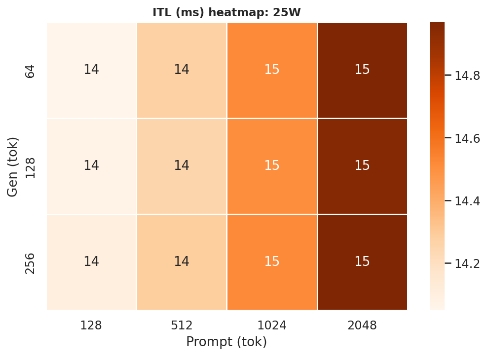</td>
<td align="center"><strong>MAXN</strong><br></td>
</tr>
</table>

**Figure 10a: [ITL](#glossary) p50 heatmaps — all 4 power modes (rows = gen length, cols = prompt length)**

- [ITL](#glossary) depends on *gen-length* (64, 128, 256) and to some extent reflects the *memory-bandwidth bound*. 
- In our case the gen-lengths tested are *not enough* to cause differences across model × mode combinations beyond the general trend: models <1B have lower ITL than ~1B models, possibly because the KV-cache stays small enough to avoid refills. 

**Decode time (s) p50** is the time spent generating output tokens: `decode_time = request_latency − TTFT`. At ctx=2048, gen=256 (computed as [RL](#glossary)_s − [TTFT](#glossary)_s where RL_s = [OSL](#glossary) / tok_s):

<a id="table-10a"></a>
**Table 10a: Decode time speedup ratios - all pairwise mode comparisons (ctx=2048, gen=256)**

| Model | 25W vs 15W | MAXN vs 15W | 15W vs 7W | 25W vs 7W | MAXN vs 7W | MAXN vs 25W |
|-------|----------:|-----------:|---------:|---------:|----------:|-----------:|
| SmolLM2-135M | 1.41x | 1.36x | 2.12x | **2.97x** | 2.88x | 0.97x |
| SmolLM2-360M | 1.47x | 1.29x | 1.72x | **2.52x** | 2.23x | 0.88x |
| Qwen2.5-0.5B | 1.33x | 1.39x | 2.85x | 3.80x | **3.98x** | 1.05x |
| LFM2.5-350M  | 1.45x | 1.43x | 2.55x | **3.69x** | 3.65x | 0.99x |
| LFM2.5-1.2B  | 1.47x | 1.42x | 2.70x | **3.96x** | 3.85x | 0.97x |
| Qwen3-0.6B   | 1.46x | 1.59x | 2.45x | 3.57x | **3.89x** | 1.09x |
| Llama3.2-1B  | 1.46x | 1.62x | 2.70x | 3.95x | **4.37x** | 1.11x |
| Gemma3-1B    | 1.45x | 1.58x | 2.50x | 3.63x | **3.95x** | 1.09x |

> Speedup = mean(decode_time_baseline) / mean(decode_time_mode) where decode_time = [RL](#glossary) p50 − [TTFT](#glossary) p50, averaged over all 12 prompt × gen combos. [`decode_J`](#glossary) = [`avg_power_W`](#glossary) × decode_time_s.

- Decode speedups closely mirror throughput speedups (Table 9) since decode time ≈ 1 / [`tok_s`](#glossary) once [TTFT](#glossary) is subtracted.
- `MAXN vs 25W` > 1.0 for 0.5B–1B models; < 1.0 for SmolLM2 (memory-bandwidth bound, extra clock gives no decode gain).

**[TTFT](#glossary) speedup** - TTFT_baseline / TTFT_mode; values > 1.0 mean the mode has lower TTFT (faster prefill). Speedup = mean(TTFT p50 at baseline) / mean(TTFT p50 at mode), averaged over all 12 prompt × gen combos:

<a id="table-11"></a>
**Table 11: [TTFT](#glossary) speedup ratios - all pairwise mode comparisons**

| Model | 25W vs 15W | MAXN vs 15W | 15W vs 7W | 25W vs 7W | MAXN vs 7W | MAXN vs 25W |
|-------|----------:|-----------:|---------:|---------:|----------:|-----------:|
| SmolLM2-135M | 1.42x | 1.37x | 2.31x | **3.28x** | 3.17x | 0.97x |
| SmolLM2-360M | 1.44x | 1.37x | 2.47x | **3.55x** | 3.38x | 0.95x |
| Qwen2.5-0.5B | 1.37x | 1.51x | 2.63x | 3.60x | **3.96x** | 1.10x |
| LFM2.5-350M  | 1.44x | 1.43x | 2.62x | **3.77x** | 3.75x | 1.00x |
| LFM2.5-1.2B  | 1.46x | 1.49x | 2.79x | 4.06x | **4.17x** | 1.03x |
| Qwen3-0.6B   | 1.43x | 1.57x | 2.54x | 3.64x | **4.01x** | 1.10x |
| Llama3.2-1B  | 1.45x | 1.61x | 2.78x | 4.03x | **4.46x** | 1.11x |
| Gemma3-1B    | 1.44x | 1.59x | 2.63x | 3.78x | **4.19x** | 1.11x |

- `MAXN` has the highest speedup ratios across all modes, with the largest gains for the bigger models (Qwen3-0.6B, Llama3.2-1B, Gemma3-1B) where the GPU clock increase has more impact.
- `MAXN/25W` ratios cluster near *1.0x* (*~0.95–1.11x*). Prefill is *compute-bound* (parallel GEMMs over all input tokens), so a naive expectation would be that higher clocks help proportionally - but this was not the case. Why? maybe it becomes memory-bandwidth bound?(let me know in the comments!). 
For the two smallest models (SmolLM2) the prefill completes so quickly (<300 ms at 25W) that kernel-launch overhead dominates, making higher clocks irrelevant (0.95–0.97x).

**Request latency (E2E) speedup** - Speedup = mean([RL](#glossary) p50 at baseline) / mean(RL p50 at mode), averaged over all 12 prompt × gen combos:

<a id="table-12"></a>
**Table 12: Request latency (E2E) speedup ratios - all pairwise mode comparisons**

| Model | 25W vs 15W | MAXN vs 15W | 15W vs 7W | 25W vs 7W | MAXN vs 7W | MAXN vs 25W |
|-------|----------:|-----------:|---------:|---------:|----------:|-----------:|
| SmolLM2-135M | 1.41x | 1.36x | 2.14x | **3.02x** | 2.92x | 0.97x |
| SmolLM2-360M | **1.46x** | 1.31x | 1.84x | 2.69x | 2.40x | 0.89x |
| Qwen2.5-0.5B | 1.34x | 1.41x | 2.81x | 3.77x | **3.97x** | 1.06x |
| LFM2.5-350M  | 1.45x | 1.43x | 2.56x | **3.70x** | 3.66x | 0.99x |
| LFM2.5-1.2B  | 1.46x | 1.43x | 2.72x | **3.98x** | 3.90x | 0.98x |
| Qwen3-0.6B   | 1.45x | 1.59x | 2.46x | 3.58x | **3.90x** | 1.09x |
| Llama3.2-1B  | 1.46x | 1.62x | 2.71x | 3.96x | **4.38x** | 1.11x |
| Gemma3-1B    | 1.45x | 1.58x | 2.52x | 3.65x | **3.98x** | 1.09x |

- Mirrors the [TTFT](#glossary) speedup trends since prefill dominates the request latency at these gen lengths.

### 3.6 Model Size vs Efficiency

The relationship is clear: **smaller quantized models always win on total tok/J**, not just tok/s.

<a id="table-13"></a>
**Table 13: Best total tok/J ranked by model size**

| Model | Params | GGUF | Best total tok/J | At mode / ctx / gen |
|-------|-------:|-----:|-----------------:|---------------------|
| SmolLM2-135M | 135M | 101 MB | **487.3** | 25W / 2048 / 64 |
| LFM2.5-350M  | 350M | 219 MB | **330.7** | 25W / 2048 / 64 |
| SmolLM2-360M | 360M | 369 MB | **262.3** | 25W / 2048 / 64 |
| Qwen2.5-0.5B | 500M | 469 MB | **237.7** | 25W / 2048 / 64 |
| Qwen3-0.6B   | 600M | 610 MB | **149.0** | 25W / 2048 / 64 |
| Gemma3-1B    | 1.0B | 769 MB | **118.5** | 25W / 2048 / 64 |
| LFM2.5-1.2B  | 1.2B | 698 MB | **116.2** | 25W / 2048 / 64 |
| Llama3.2-1B  | 1.0B | 771 MB | **108.9** | 25W / 2048 / 64 |

> Total tok/J = ([ISL](#glossary) + [OSL](#glossary)) / (avg\_power\_W × [RL](#glossary)\_p50\_s) — see [Appendix J.6](#appendix-j6) for the full formula. Peaks at ctx=2048, gen=64 for every model because the long prompt dominates the numerator while 25W minimises energy per token. All 48 mode × ctx × gen combinations were searched.

SmolLM2-135M at 25W achieves **487 total tok/J**, nearly 4.5× more efficient than Llama3.2-1B across the full request.

---

### 3.7 Energy Efficiency: Decode tok/J and Total tok/J

Two complementary tok/J lenses on energy efficiency — see [J.6](#appendix-j6) for formulas:

- **Decode tok/J** = *[OSL](#glossary) / [`decode_J`](#glossary)* — output tokens generated per joule of decode energy only ([TTFT](#glossary) excluded). Measures how efficiently the GPU runs the autoregressive generation loop.
- **Total tok/J** = *([ISL](#glossary) + [OSL](#glossary)) / [`total_J`](#glossary)* — all tokens processed per joule of the full request. Accounts for both prompt processing and generation; favours models that handle long prompts cheaply.

See [Figure 7b](#figure-7b) (decode tok/J vs prompt length) and [Figure 7c](#figure-7c) (total tok/J vs prompt length) in section 2.2 — *25W leads at every model and prompt length*. Full combinations: [F.2 Decode](#appendix-f2) · [F.3 Total](#appendix-f3).


**Key findings:**

1. **25W wins on both metrics for almost every model.** The exception is SmolLM2-360M, where 7W edges ahead on both decode and total tok/J — decode is memory-bandwidth bound for this model and the lower clock still delivers competitive throughput at much lower power.

2. ~1B around models tops at ~5-8 tok/J (decode) whereas the <1B models can reach 15-35 tok/J. Thus these are more energy efficient (decode) than ~1B models we have tested.

3. Charts in [F.2](#appendix-f2) show that the ~1B models are roughly *flat*, that is, prompt length becomes independent of tok/J in decode tok/J as going from *64* to *256 gen length*.

4. *Total tok/J* grows with *prompt length* because [ISL](#glossary) dominates ([ISL](#glossary)+[OSL](#glossary)) as ctx increases while [`total_J`](#glossary) grows more slowly (decode time is constant), see [F.3](#appendix-f3).


<a id="figure-15"></a>
**Figure 15: Total energy per request vs output length at 25W, ctx=2048**

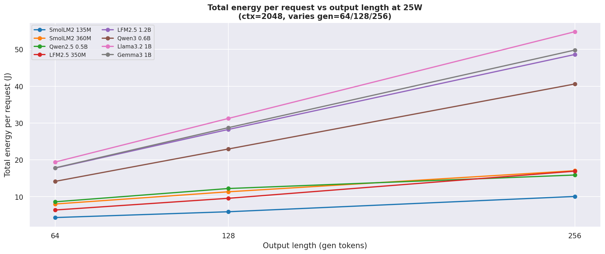

<a id="figure-16"></a>
**Figure 16: Decode energy per output token in mJ (ctx=2048, gen=256)**

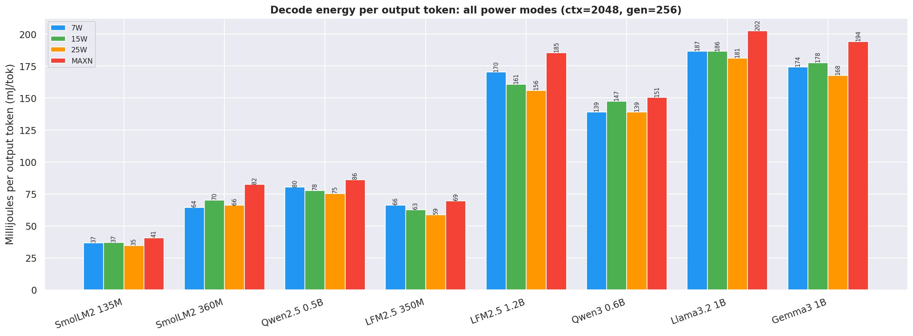

## 5. Conclusion

### What These Numbers Mean for Edge Inference

Tiny LLM inference on a $250 Jetson Orin Nano Super 8GB is genuinely practical. At SmolLM2-135M Q4_K_M:

- **187 tok/s** at 25W : real-time fluent generation  
- **101 MB on disk** : trivially portable  
- **5.4 W under load** : runs on a USB-C power bank  
- **22.6 output tok/J** : the best energy efficiency in this suite

The LFM2.5 models (Liquid AI) are a notable new entrant: LFM2.5-350M achieves **120 tok/s** at 25W (competitive with SmolLM2-360M) in 219 MB. LFM2.5-1.2B at 25W hits **55.1 tok/s** in 698 MB : the best tok/s-per-byte in the 1B class.

### The Clear Winner: 25W Mode

**25W (nvpmodel -m 1) is the Pareto-optimal power mode for edge LLM inference on the Jetson Orin Nano Super.** It is the right answer for virtually every deployment:

- *43 % more* throughput than 15W
- Only *36 % more* power than 15W
- *12-25 % better* output tok/J than MAXN
- Low enough peak power (≤ 10 W for sub-1B models) to stay comfortable for sustained operation

Use MAXN only when raw [TTFT](#glossary) matters (live interactive sessions with long prompts). Use 15W or below only when thermally constrained. Never use 7W for production inference: CMA fragmentation will eventually block model loads.

### What Is Not Yet Benchmarked

- **Multi-user concurrency**: all results are single-user. Real-world servers will see different throughput profiles at concurrency > 1.
- **Ollama backend**: matched-quant Ollama comparison (identical GGUFs) is the next phase. GGUF sizes and quantizations above are already chosen to match Ollama defaults for a fair comparison.
- **Larger models**: gemma3-4b and any model requiring > ~1.5 GB CUDA buffers is blocked by JetPack R36.4.7 CMA regression. Fix: reflash to JetPack 6.2.2 (L4T 36.5).

### **CMA fragmentation caveat:** 

- After three sequential model loads in the same OS session, the CUDA IOVA address space accumulates fragmentation that blocks `cudaMalloc` calls requiring > 300 MB contiguous buffers. Qwen3-0.6B, Llama3.2-1B, Gemma3-1B, and Gemma3-4B all hit `NvMapMemAllocInternalTagged: error 12 (ENOMEM)` when loaded after other models without a reboot. A reboot + `--resume` run recovered all three smaller models (Gemma3-4B is OOM at every mode regardless). All 8 non-gemma3-4b models produced valid 7W data after this workaround; the full 96-cell 7W dataset is now complete.

---
<a id="appendix-a"></a>
## Appendix A: Full 4-Mode Comparison (ctx=2048, gen=256)

> Raw numbers from the canonical benchmark cell. All latencies in milliseconds. Power = [`VDD_CPU_GPU_CV`](#glossary) averaged over each run window.

<a id="table-15"></a>
**Table 15: Full 4-mode comparison, ctx=2048, gen=256**

| Model | Mode | Output Tok/s | TTFT p50 (ms) | ITL p50 (ms) | Power (W) | Output Tok/J |
|-------|------|------:|----------:|---------:|----------:|------:|
| SmolLM2-135M | 7W   | 53.9 | 1044.7 | 18.55 | 1.99 | 21.72 |
| SmolLM2-135M | 15W  | 114.5 | 442.5 | 8.74 | 4.27 | 21.67 |
| SmolLM2-135M | 25W  | **165.1** | **308.7** | **6.06** | 5.74 | **22.57** |
| SmolLM2-135M | MAXN | 159.4 | 319.5 | 6.28 | 6.51 | 19.95 |
| SmolLM2-360M | 7W   | 34.8 | 1820.6 | 28.74 | 2.27 | **10.97** |
| SmolLM2-360M | 15W  | 70.6 | 725.4 | 14.16 | 4.98 | 9.74 |
| SmolLM2-360M | 25W  | **101.8** | **502.5** | **9.82** | 6.76 | 10.21 |
| SmolLM2-360M | MAXN | 89.4 | 528.3 | 11.18 | 7.42 | 7.56 |
| Qwen2.5-0.5B | 7W   | 27.4 | 1956.3 | 36.48 | 2.22 | 7.26 |
| Qwen2.5-0.5B | 15W  | 68.3 | 735.0 | 14.64 | 5.34 | 7.26 |
| Qwen2.5-0.5B | 25W  | 92.6 | 530.9 | 10.80 | 7.05 | **9.16** |
| Qwen2.5-0.5B | MAXN | **100.5** | **484.8** | **9.95** | 8.73 | 6.94 |
| LFM2.5-350M  | 7W   | 31.5 | 1509.2 | 31.79 | 2.10 | 11.83 |
| LFM2.5-350M  | 15W  | 79.2 | 568.3 | 12.63 | 5.00 | 11.78 |
| LFM2.5-350M  | 25W  | **115.1** | **393.7** | **8.69** | 6.79 | **13.74** |
| LFM2.5-350M  | MAXN | 112.9 | 396.0 | 8.86 | 7.88 | 11.72 |
| LFM2.5-1.2B  | 7W   | 13.7 | 4227.6 | 72.98 | 2.34 | 4.79 |
| LFM2.5-1.2B  | 15W  | 37.0 | 1510.0 | 27.06 | 5.96 | 5.10 |
| LFM2.5-1.2B  | 25W  | **54.1** | 1033.7 | **18.49** | 8.46 | **5.26** |
| LFM2.5-1.2B  | MAXN | 52.6 | **1008.0** | 19.00 | 9.79 | 4.47 |
| Qwen3-0.6B   | 7W   | 14.2 | 2875.1 | 70.62 | 1.98 | 6.19 |
| Qwen3-0.6B   | 15W  | 33.9 | 1113.4 | 29.52 | 5.02 | 5.90 |
| Qwen3-0.6B   | 25W  | 49.4 | 771.0 | 20.25 | 6.89 | **6.26** |
| Qwen3-0.6B   | MAXN | **54.2** | **700.3** | **18.45** | 8.19 | 5.78 |
| Llama3.2-1B  | 7W   | 12.1 | 4000.2 | 82.88 | 2.26 | 4.51 |
| Llama3.2-1B  | 15W  | 32.3 | 1432.1 | 31.00 | 6.04 | 4.54 |
| Llama3.2-1B  | 25W  | 47.0 | 982.7 | 21.27 | 8.56 | **4.67** |
| Llama3.2-1B  | MAXN | **51.9** | **890.5** | **19.27** | 10.54 | 4.19 |
| Gemma3-1B    | 7W   | 11.2 | 3817.6 | 89.08 | 1.96 | 4.92 |
| Gemma3-1B    | 15W  | 28.1 | 1442.3 | 35.57 | 5.01 | 4.85 |
| Gemma3-1B    | 25W  | 40.8 | 1000.1 | 24.51 | 6.87 | **5.14** |
| Gemma3-1B    | MAXN | **44.2** | **900.2** | **22.60** | 8.62 | 4.46 |
| Gemma3-4B    | all  | OOM: too large for 8 GB unified memory at any power mode |||||||


<a id="appendix-b"></a>
## Appendix B: Thermal Summary - All Power Modes

Power and temperature averaged over each model's full benchmark window (all *12 prompt×gen* combos). **No model triggered thermal throttling** at any power mode (threshold ≈ 95 °C).

>**Junction temperature (TJ)** is the hottest internal die temperature on the Jetson SoC, reported by `tegrastats` as `tj@`. It is the primary metric for thermal safety: if TJ reaches ~95 °C, the hardware automatically throttles clocks to prevent damage. Peak TJ < 70 °C across all runs means thermal headroom is ample.

<a id="table-16"></a>
**Table 16: Thermal summary - all power modes**

| Model | Mode | Avg Power (W) | Avg CPU (°C) | Avg GPU (°C) | Peak TJ (°C) | Throttled |
|-------|------|-------------:|-------------:|-------------:|-------------:|:---------:|
| SmolLM2-135M | 7W   | 1.95 | 47.2 | 48.9 | 50.3 | No |
| SmolLM2-135M | 15W  | 4.17 | 56.0 | 57.8 | 60.2 | No |
| SmolLM2-135M | 25W  | 5.60 | 49.2 | 51.6 | 54.3 | No |
| SmolLM2-135M | MAXN | 6.39 | 49.0 | 51.4 | 53.2 | No |
| SmolLM2-360M | 7W   | 2.23 | 49.2 | 50.9 | 52.1 | No |
| SmolLM2-360M | 15W  | 4.89 | 59.1 | 60.9 | 63.3 | No |
| SmolLM2-360M | 25W  | 6.67 | 52.7 | 55.2 | 58.6 | No |
| SmolLM2-360M | MAXN | 7.28 | 50.9 | 53.5 | 56.8 | No |
| Qwen2.5-0.5B | 7W   | 2.19 | 49.2 | 51.0 | 52.2 | No |
| Qwen2.5-0.5B | 15W  | 5.24 | 55.7 | 57.7 | 59.6 | No |
| Qwen2.5-0.5B | 25W  | 6.95 | 53.1 | 55.7 | 59.1 | No |
| Qwen2.5-0.5B | MAXN | 8.57 | 56.6 | 59.1 | 62.8 | No |
| LFM2.5-350M  | 7W   | 2.09 | 50.1 | 51.7 | 53.0 | No |
| LFM2.5-350M  | 15W  | 4.93 | 58.0 | 60.0 | 62.1 | No |
| LFM2.5-350M  | 25W  | 6.72 | 52.9 | 55.5 | 58.1 | No |
| LFM2.5-350M  | MAXN | 7.78 | 50.5 | 53.4 | 56.8 | No |
| LFM2.5-1.2B  | 7W   | 2.35 | 51.3 | 52.9 | 54.0 | No |
| LFM2.5-1.2B  | 15W  | 6.01 | 60.7 | 62.9 | 65.5 | No |
| LFM2.5-1.2B  | 25W  | 8.42 | 57.4 | 60.2 | 63.0 | No |
| LFM2.5-1.2B  | MAXN | 9.68 | 56.7 | 59.7 | 63.5 | No |
| Qwen3-0.6B   | 7W   | 2.00 | 44.2 | 46.0 | 47.5 | No |
| Qwen3-0.6B   | 15W  | 5.00 | 61.6 | 63.6 | 65.4 | No |
| Qwen3-0.6B   | 25W  | 6.83 | 57.4 | 59.9 | 63.1 | No |
| Qwen3-0.6B   | MAXN | 8.32 | 57.2 | 59.9 | 64.0 | No |
| Llama3.2-1B  | 7W   | 2.28 | 44.6 | 46.5 | 47.6 | No |
| Llama3.2-1B  | 15W  | 6.04 | 61.9 | 64.1 | 65.7 | No |
| Llama3.2-1B  | 25W  | 8.52 | 60.3 | 63.2 | 66.1 | No |
| Llama3.2-1B  | MAXN | 10.55 | 59.9 | 63.0 | 69.5 | No |
| Gemma3-1B    | 7W   | 1.98 | 45.1 | 46.9 | 50.5 | No |
| Gemma3-1B    | 15W  | 4.99 | 60.2 | 62.1 | 63.6 | No |
| Gemma3-1B    | 25W  | 6.84 | 57.5 | 60.0 | 61.9 | No |
| Gemma3-1B    | MAXN | 8.51 | 61.2 | 63.8 | 67.0 | No |


<a id="appendix-c"></a>
## Appendix C: Full Per-Mode Raw Data

Complete per-cell JSON exports (all 33 metrics, all 12 prompt×gen combos × 20 requests per cell) are published on Hugging Face Datasets:

| Mode | Dataset | Models | Cells |
|------|---------|-------:|------:|
| 7W   | [`YuvrajSingh9886/jetson-non-reasoning-benchmark-7w`](https://huggingface.co/datasets/YuvrajSingh9886/jetson-non-reasoning-benchmark-7w) | 8 | 96 |
| 15W  | [`YuvrajSingh9886/jetson-non-reasoning-benchmark-15w`](https://huggingface.co/datasets/YuvrajSingh9886/jetson-non-reasoning-benchmark-15w) | 8 | 96 |
| 25W  | [`YuvrajSingh9886/jetson-non-reasoning-benchmark-25w`](https://huggingface.co/datasets/YuvrajSingh9886/jetson-non-reasoning-benchmark-25w) | 8 | 96 |
| MAXN | [`YuvrajSingh9886/jetson-non-reasoning-benchmark-maxn`](https://huggingface.co/datasets/YuvrajSingh9886/jetson-non-reasoning-benchmark-maxn) | 8 | 96 |

Each dataset contains the full `profile_export_aiperf.json` per cell (all 33 metrics including `ISL`, `OSL`, `TTFT avg/p50/p90/p99`, `ITL`, `output tok/s`, `request latency`, `prefill tok/s`, `power W`, `output tok/J`), `tegrastats.log`, and per-model server logs.


<a id="appendix-e"></a>
## Appendix E: Full 12-Combination Heatmaps (All Power Modes)

Each heatmap is a `2×4` grid (8 models) showing all `12 prompt×gen` combinations for one power mode and one metric. Rows = gen length (64, 128, 256 tok), columns = prompt length (128, 512, 1024, 2048 tok). Brighter colour = higher value.

<a id="appendix-e1"></a>
### E.1 Output Tok/s heatmaps

**Figure E.1a: All 12 combos at 7W**

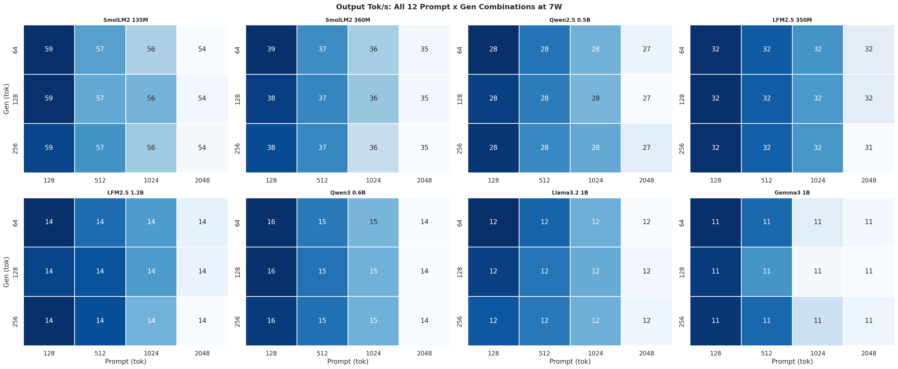

**Figure E.1b: All 12 combos at 15W**

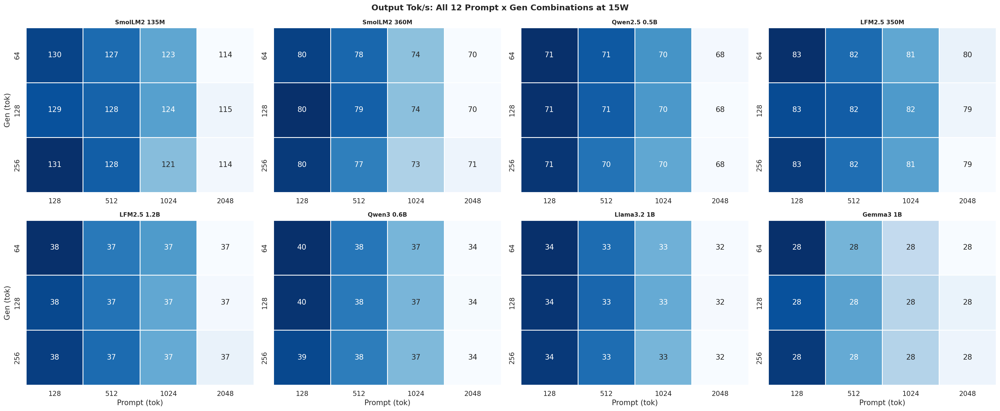

**Figure E.1c: All 12 combos at 25W**

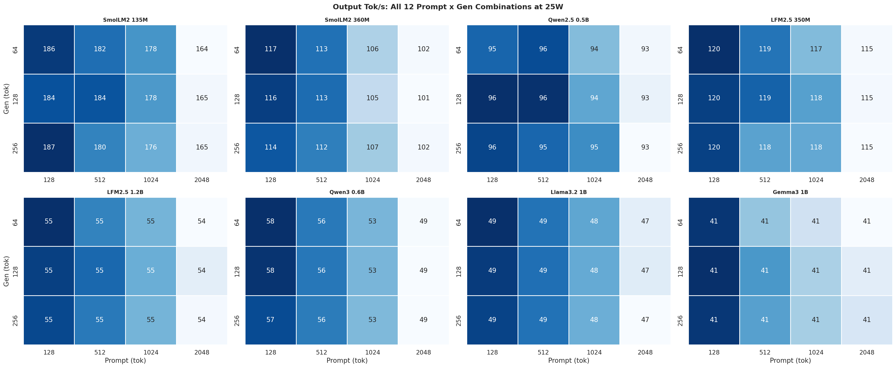

**Figure E.1d: All 12 combos at MAXN**

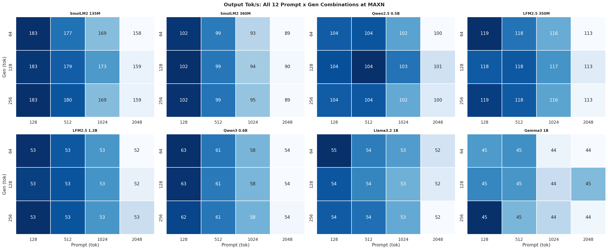

<a id="appendix-e2"></a>
### E.2 Output Tok/J heatmaps

**Figure E.2a: All 12 combos at 7W**

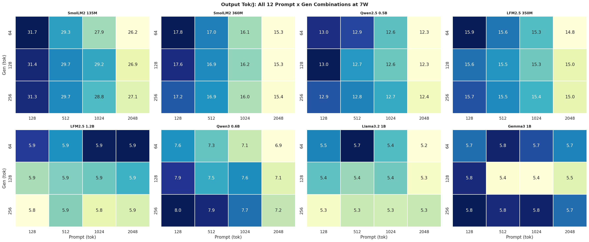

**Figure E.2b: All 12 combos at 15W**

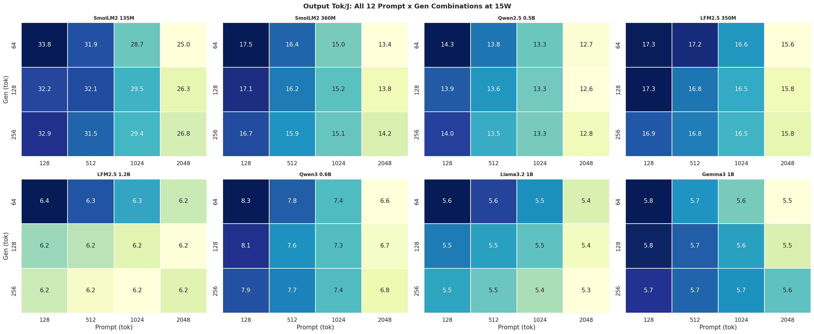

**Figure E.2c: All 12 combos at 25W**

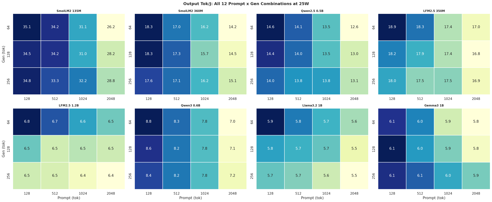

**Figure E.2d: All 12 combos at MAXN**

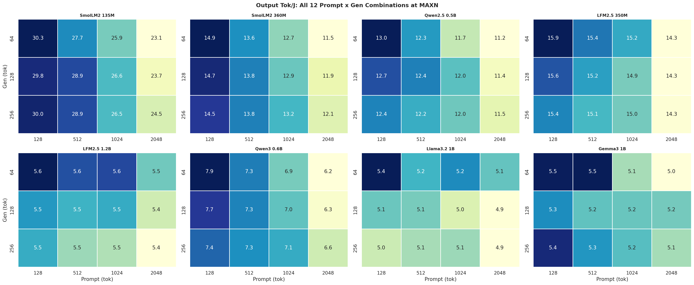


<a id="appendix-f"></a>
## Appendix F: Prefill / Decode / Total tok/J: All Combinations

All charts are 2×4 faceted line plots with a fixed y-scale across all subplots. The canonical combination (ctx=2048, gen=256) is also shown in §2.2.

<a id="appendix-f1"></a>
### F.1 Prefill tok/J (input tok / J) vs prompt length

**Figure F.1a: Prefill tok/J vs prompt length: gen=64**

<a id="figure-f1a"></a>

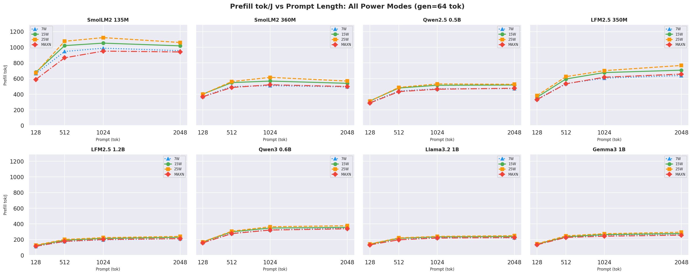

> ⚠ [Prefill tok/J is approximate for 63 % of cells.](#energy-caveat)

**Figure F.1b: Prefill tok/J vs prompt length: gen=128**

<a id="figure-f1b"></a>

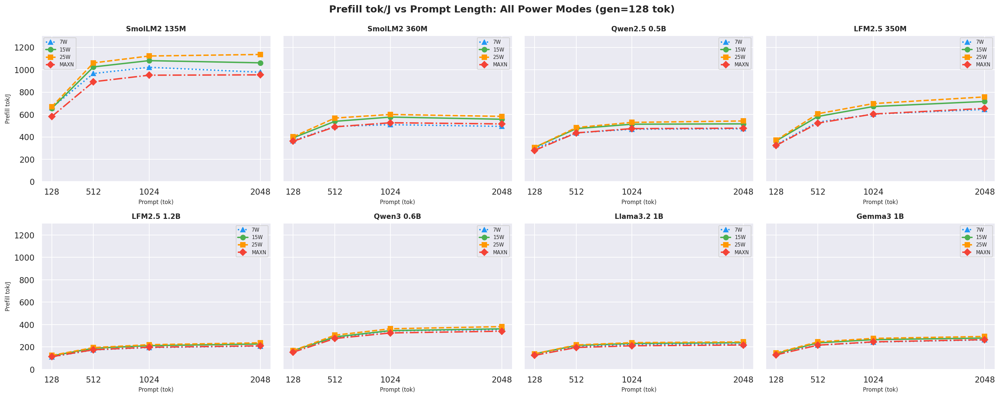

> ⚠ [Prefill tok/J is approximate for 63 % of cells.](#energy-caveat)

**Figure F.1c: Prefill tok/J vs prompt length: gen=256** *(canonical, also in § 2.2)*

<a id="figure-f1c"></a>


> ⚠ [Prefill tok/J is approximate for 63 % of cells.](#energy-caveat)

<a id="appendix-f2"></a>
### F.2 Decode tok/J (output tok / J) - independent of prompt length

Decode tok/J depends on the number of output tokens (gen length), not input prompt length, since decode happens after prefill completes. These charts show decode tok/J as a function of **gen length** for each prompt context length.

**Figure F.2a: Decode tok/J vs gen length: ctx=128**

<a id="figure-f2a"></a>

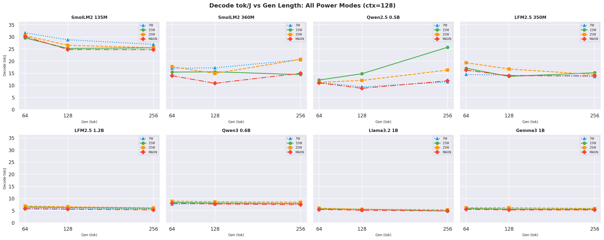

**Figure F.2b: Decode tok/J vs gen length: ctx=512**

<a id="figure-f2b"></a>

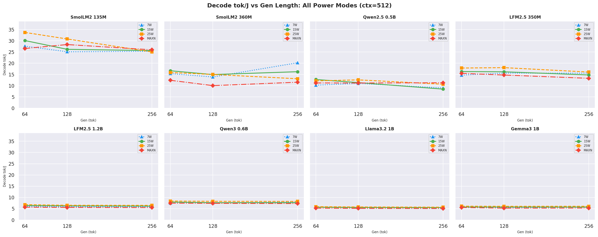

**Figure F.2c: Decode tok/J vs gen length: ctx=1024**

<a id="figure-f2c"></a>

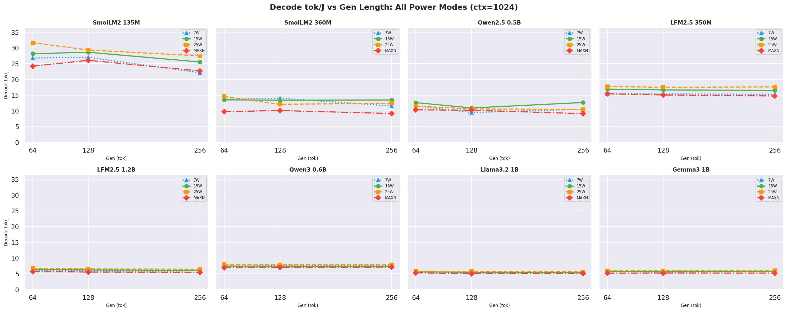

**Figure F.2d: Decode tok/J vs gen length: ctx=2048**

<a id="figure-f2d"></a>

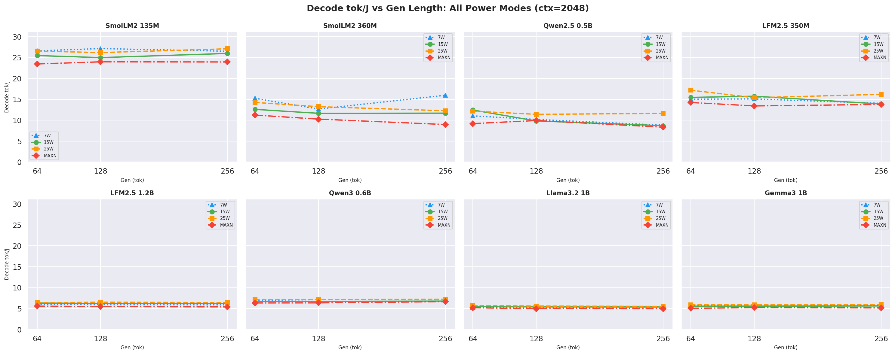

<a id="appendix-f3"></a>
### F.3 Total tok/J ((input+output) tok / J) vs prompt length

**Figure F.3a: Total tok/J vs prompt length: gen=64**

<a id="figure-f3a"></a>

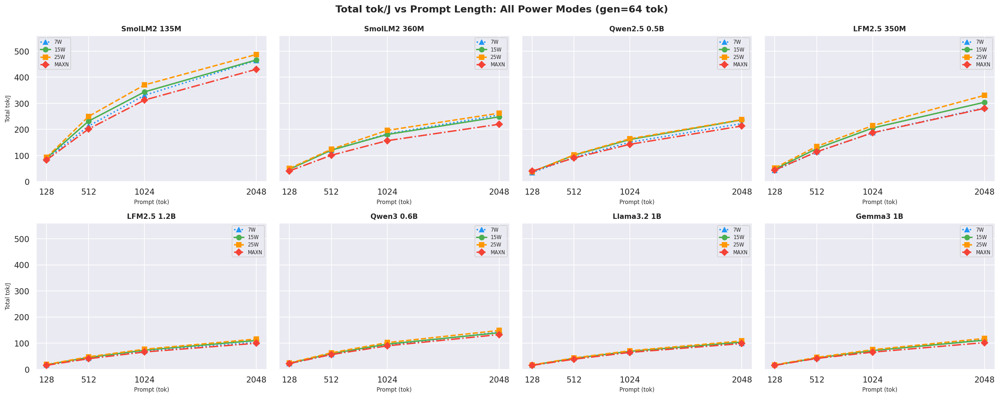

**Figure F.3b: Total tok/J vs prompt length: gen=128**

<a id="figure-f3b"></a>

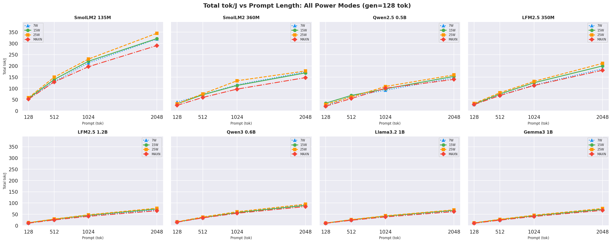

**Figure F.3c: Total tok/J vs prompt length: gen=256** *(canonical, also in § 2.2)*

<a id="figure-f3c"></a>


<a id="appendix-g"></a>
## Appendix G: Request Latency (E2E): All Combinations

Request latency (E2E) p50 - total time from request start to last token received. Line charts show variation with prompt length (2×4 facet, fixed y-scale). Grouped bar charts show per-model × per-mode breakdown.

<a id="appendix-g1"></a>
### G.1 Request latency vs prompt length (by gen length)

**Figure G.1a: Request latency vs prompt length: gen=64**

<a id="figure-g1a"></a>

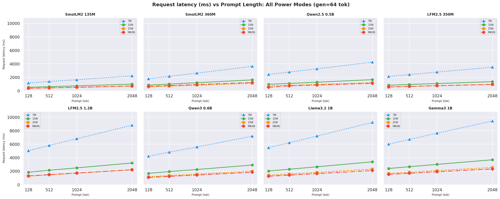

**Figure G.1b: Request latency vs prompt length: gen=128**

<a id="figure-g1b"></a>

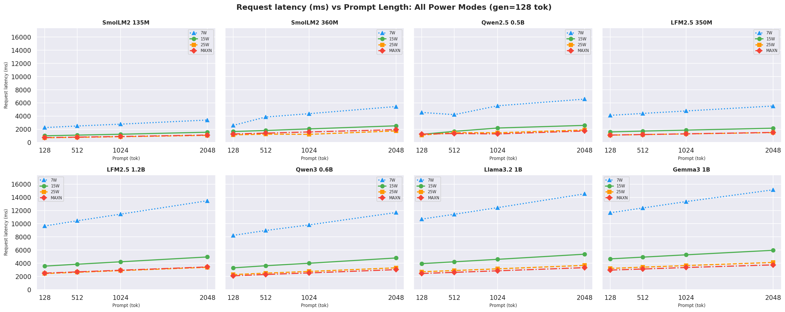

**Figure G.1c: Request latency vs prompt length: gen=256** *(canonical, also in §2.3)*

<a id="figure-g1c"></a>

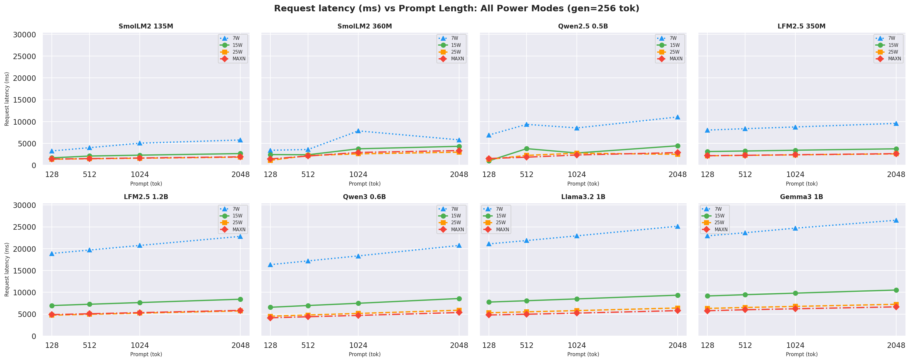


<a id="appendix-g"></a>
<a id="appendix-g-ttft"></a>
## Appendix G: TTFT: All Prompt x Gen Combinations

TTFT p50 (median time to first token, ms) is driven almost entirely by prompt length, it is the prefill cost. These charts show how it varies across all 12 prompt x gen combinations and across all 4 power modes.

<a id="appendix-g1-ttft"></a>
### G.1 TTFT vs prompt length (by gen length)

**Figure G.1a: TTFT vs prompt length: gen=64**

<a id="figure-g1a"></a>

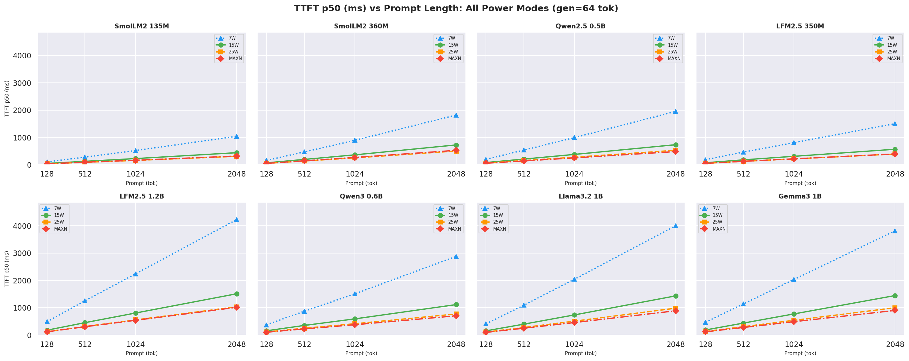

**Figure G.1b: TTFT vs prompt length: gen=256** *(canonical, also in section 2.3)*

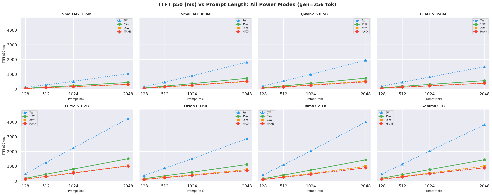

*TTFT is independent of gen length, so only gen=64 and gen=256 are shown.*

---

<a id="appendix-g2-ttft"></a>
### G.2 TTFT heatmaps (gen x prompt) per power mode

Each cell is TTFT in ms. Rows = gen length, columns = prompt length. Independent of `gen` length hence the same across rows.

<table>
<tr>
<td align="center">
  <a id="figure-g2a"></a>
  <strong>Figure G.2a: TTFT heatmap: 7W</strong><br>
  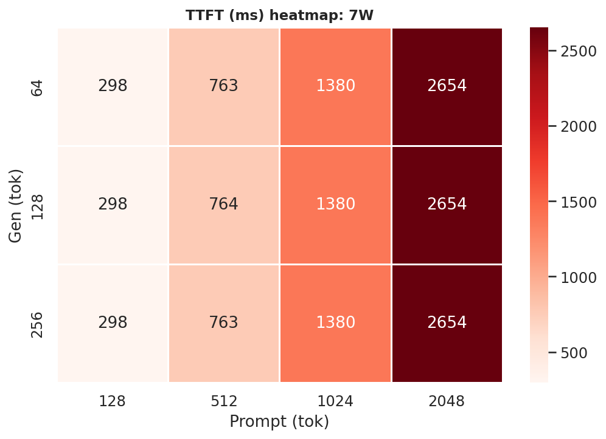
</td>
<td align="center">
  <a id="figure-g2b"></a>
  <strong>Figure G.2b: TTFT heatmap: 15W</strong><br>
  
</td>
</tr>
<tr>
<td align="center">
  <a id="figure-g2c"></a>
  <strong>Figure G.2c: TTFT heatmap: 25W</strong><br>
  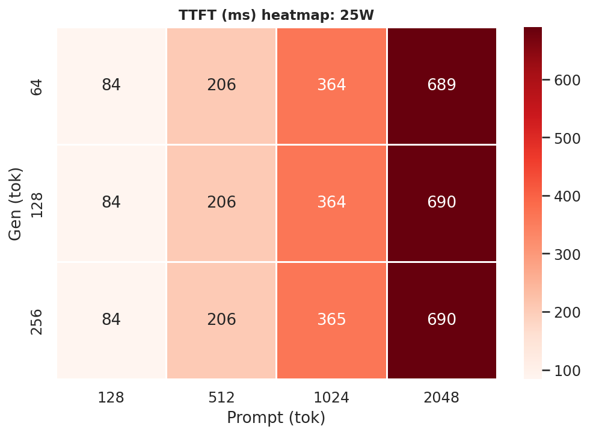
</td>
<td align="center">
  <a id="figure-g2d"></a>
  <strong>Figure G.2d: TTFT heatmap: MAXN</strong><br>
  
</td>
</tr>
</table>


<a id="appendix-h"></a>
## Appendix H: ITL: All Combinations

Inter-token latency (ms) = time between consecutive output tokens. It measures decode cost and is driven by model size and GPU clock, not prompt length.

<a id="appendix-h1"></a>
### H.1 ITL vs prompt length (by gen length)

**Figure H.1a: ITL vs prompt length: gen=64**

<a id="figure-h1a"></a>


**Figure H.1b: ITL vs prompt length: gen=128**

<a id="figure-h1b"></a>

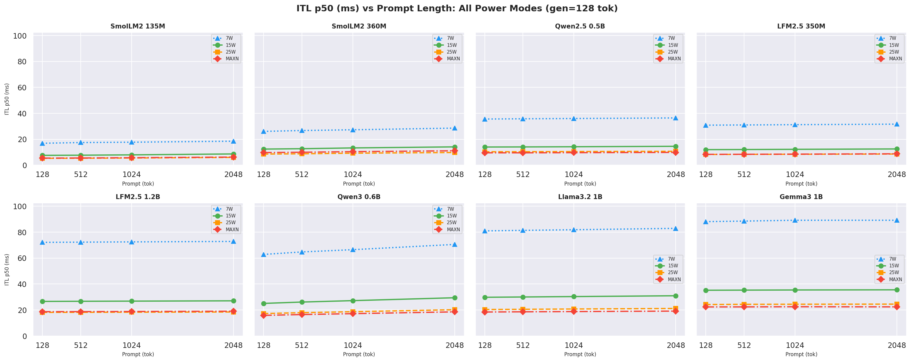

**Figure H.1c: ITL vs prompt length: gen=256** *(canonical, also in section 2.3)*

<a id="figure-h1c"></a>


---

<a id="appendix-h2"></a>
### H.2 ITL heatmaps (gen x prompt) per power mode

<table>
<tr>
<td align="center">
  <a id="figure-h2a"></a>
  <strong>Figure H.2a: ITL heatmap: 7W</strong><br>
  
</td>
<td align="center">
  <a id="figure-h2b"></a>
  <strong>Figure H.2b: ITL heatmap: 15W</strong><br>
  
</td>
</tr>
<tr>
<td align="center">
  <a id="figure-h2c"></a>
  <strong>Figure H.2c: ITL heatmap: 25W</strong><br>
  
</td>
<td align="center">
  <a id="figure-h2d"></a>
  <strong>Figure H.2d: ITL heatmap: MAXN</strong><br>
  
</td>
</tr>
</table>


<a id="appendix-i"></a>
## Appendix I: Prefill Throughput: All Combinations

Prefill throughput (tok/s) measures how fast the model processes input tokens. It scales with prompt length (longer prompts hit peak GPU utilisation) and GPU clock speed.

<a id="appendix-i1"></a>
### I.1 Prefill throughput vs prompt length (by gen length)

**Figure I.1a: Prefill throughput vs prompt length: gen=64**

<a id="figure-i1a"></a>

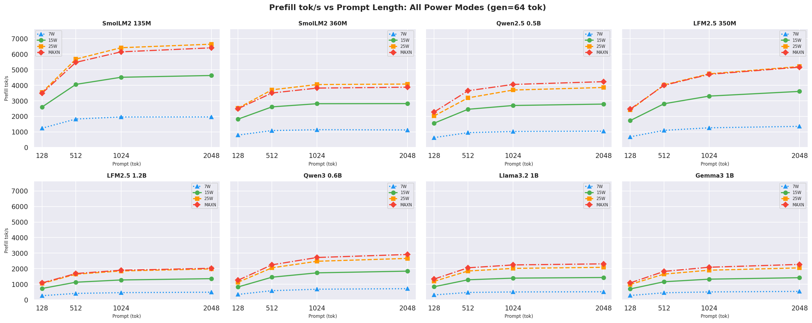

**Figure I.1b: Prefill throughput vs prompt length: gen=256** *(canonical, also in section 2.4)*

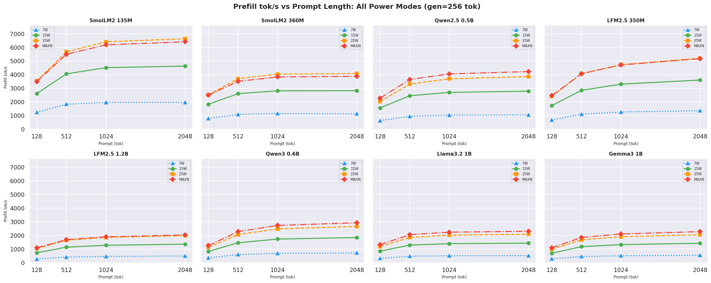

*Prefill throughput is independent of gen length, so only gen=64 and gen=256 are shown.*


<a id="appendix-i2"></a>
### I.2 Prefill throughput heatmaps (gen x prompt) per power mode

<table>
<tr>
<td align="center">
  <a id="figure-i2a"></a>
  <strong>Figure I.2a: Prefill throughput heatmap: 7W</strong><br>
  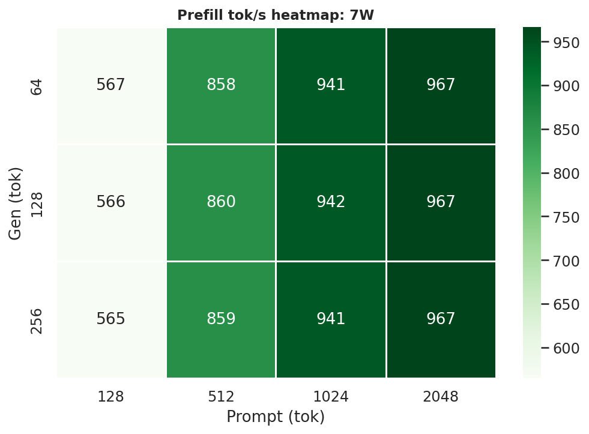
</td>
<td align="center">
  <a id="figure-i2b"></a>
  <strong>Figure I.2b: Prefill throughput heatmap: 15W</strong><br>
  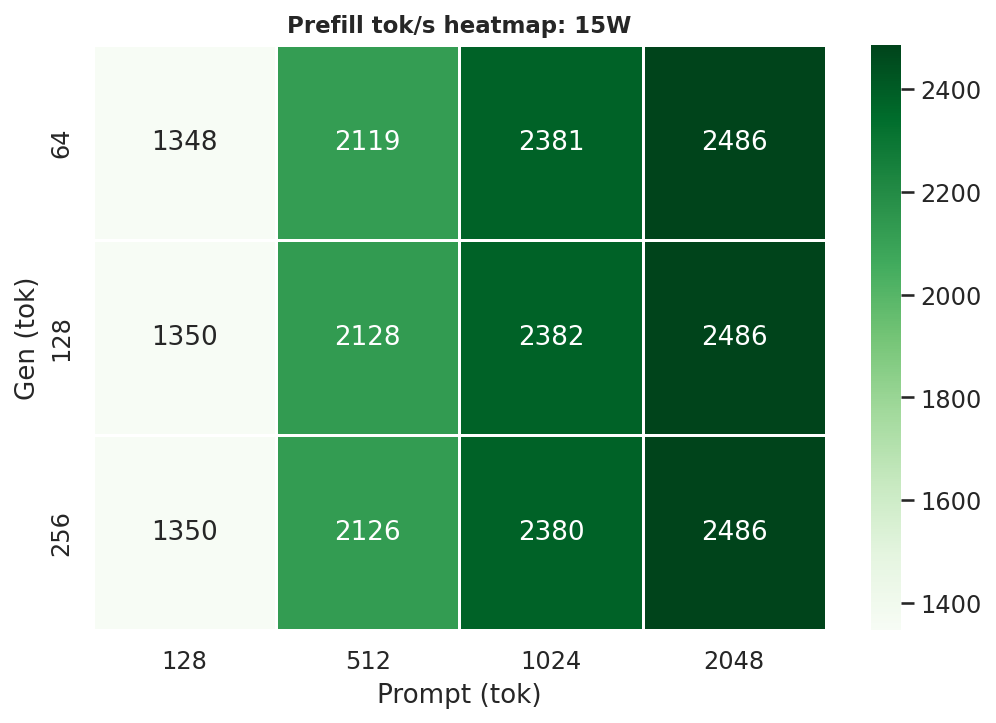
</td>
</tr>
<tr>
<td align="center">
  <a id="figure-i2c"></a>
  <strong>Figure I.2c: Prefill throughput heatmap: 25W</strong><br>
  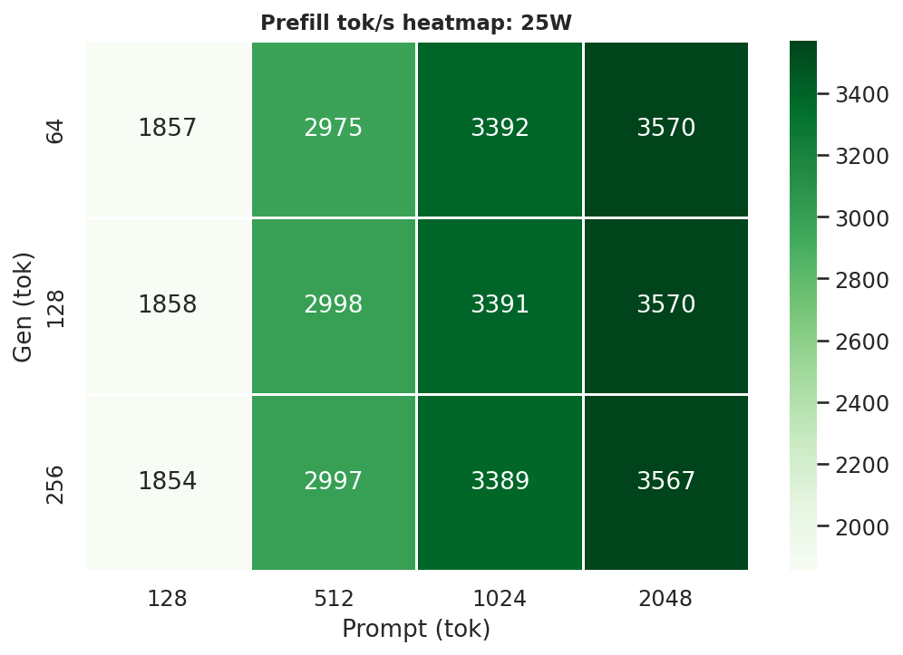
</td>
<td align="center">
  <a id="figure-i2d"></a>
  <strong>Figure I.2d: Prefill throughput heatmap: MAXN</strong><br>
  
</td>
</tr>
</table>


<a id="appendix-j"></a>
## Appendix J: All Metrics, Formulas, and Calculation Methods

This appendix documents every metric reported in this benchmark, its formula, its source, and any caveats.


<a id="glossary"></a>
<a id="appendix-j1"></a>
<a id="glossary"></a>
### J.1 Raw inputs from aiperf and tegrastats

| Symbol | Source | Definition |
|--------|--------|------------|
| `ISL` | aiperf JSON `input_sequence_length.avg` | Actual input tokens processed per request (may differ from target due to tokenizer rounding) |
| `OSL` | aiperf JSON `output_sequence_length.avg` | Actual output tokens generated per request |
| `TTFT` | aiperf JSON `time_to_first_token.p50` (ms) | Median time from request sent to first output token received; proxy for prefill duration. p50 used (not avg) to avoid skew from occasional slow requests |
| `ITL` | aiperf JSON `inter_token_latency.p50` (ms) | Median time between consecutive output tokens; per-token decode cost. p50 used for robustness against outliers |
| `RL` | aiperf JSON `request_latency.p50` (ms) | Median total wall time per request: TTFT + all inter-token intervals. p50 used for energy calculations |
| `tok_s` | aiperf JSON `output_token_throughput_per_user.avg` | Output tokens per second, single-user (OSL / RL in steady state) |
| `prefill_tput` | aiperf JSON `prefill_throughput_per_user.avg` | Input tokens processed per second during prefill phase |
| `t0`, `t1` | aiperf JSON `start_time`, `end_time` (ISO 8601) | Wall-clock start and end of the full 20-request profiling run |
| `mW_i` | tegrastats `VDD_CPU_GPU_CV` field (mW) | Instantaneous power on the CPU+GPU+CV rail at sample `i` |

All aiperf metrics are averages over 20 requests per combo. Percentile variants (p50, p90, p99) are also available in the raw JSON but not reproduced here.

---

<a id="appendix-j2"></a>
### J.2 Power

```
avg_power_W = mean(mW_i for all tegrastats samples where t0 <= sample_time <= t1) / 1000
```

- `VDD_CPU_GPU_CV` covers the CPU, GPU, and Computer Vision engine rail
- Does NOT include board overhead (fan, storage, USB) which is on `VDD_IN`
- `VDD_IN` is ~1.5-3 W higher than `VDD_CPU_GPU_CV` during inference
- Tegrastats interval: 500 ms

---

<a id="appendix-j3"></a>
### J.3 Output tok/J (main efficiency metric)

```
output_tok_J = OSL / (avg_power_W * RL_p50_s)

```

Where `RL_s = RL / 1000` (request latency in seconds).

Higher is better. This measures how many output tokens are generated per joule of compute energy. It is the primary metric of the benchmark.

**Not affected by the prefill/decode split approximation** (see section J.7).

---

<a id="appendix-j4"></a>
### J.4 Request latency energy

```
total_J = avg_power_W * (RL / 1000)
```

Energy consumed by one average request from first byte sent to last token received. Accurate for all cells regardless of TTFT.

---

<a id="appendix-j5"></a>
### J.5 Prefill and decode energy

```
prefill_J  = avg_power_W * (TTFT / 1000)
decode_J   = avg_power_W * ((RL - TTFT) / 1000)
           = total_J - prefill_J

prefill_%  = prefill_J / total_J * 100
```

**CAUTION:**  See [energy measurement caveat](#energy-caveat).

---

<a id="appendix-j6"></a>
### J.6 Phase tok/J metrics

```
prefill_tok_J = ISL / prefill_J
              = ISL / (avg_power_W * TTFT_s)

decode_tok_J  = OSL / decode_J
              = OSL / (avg_power_W * (RL_s - TTFT_s))

total_tok_J   = (ISL + OSL) / total_J
              = (ISL + OSL) / (avg_power_W * RL_s)
```

Where `TTFT_s = TTFT / 1000`, `RL_s = RL / 1000`.

- `prefill_tok_J`: input tokens processed per joule of prefill energy. Affected by the approximation in J.5.
- `decode_tok_J`: output tokens generated per joule of decode energy. Reasonably accurate.
- `total_tok_J`: all tokens (in + out) per joule of total request energy. Accurate.

---

<a id="appendix-j7"></a>
### J.7 mJ per output token

```
mJ_per_output_tok = (decode_J / OSL) * 1000
                  = 1000 / decode_tok_J
```

Millijoules per generated output token (`decode_J` is in joules, ×1000 converts to mJ for readability). Carries the same caveat as J.5 for cells where TTFT < 500 ms.

---

<a id="appendix-j8"></a>
### J.8 Prefill throughput

```
prefill_tput (tok/s) = aiperf JSON prefill_throughput_per_user.avg
```

Directly from aiperf. Measures how fast input tokens are processed during the prefill phase. Scales with prompt length (longer prompts hit peak GPU utilisation) and GPU clock.

---

<a id="appendix-j9"></a>
### J.9 Throughput speedup ratios (Table 9)

```
speedup_25W_vs_15W  = mean(tok_s_25W  over all 12 combos) / mean(tok_s_15W  over all 12 combos)
speedup_MAXN_vs_15W = mean(tok_s_MAXN over all 12 combos) / mean(tok_s_15W  over all 12 combos)
speedup_15W_vs_7W   = mean(tok_s_15W  over all 12 combos) / mean(tok_s_7W   over all 12 combos)
```

Averages are over all 4 prompt lengths × 3 gen lengths = 12 combos. `tok_s` = `output_token_throughput_per_user.avg` (aiperf); no p50 is available for throughput. Latency speedup ratios (Tables 10a, 11, 12) use mean of p50 values instead.

---

<a id="appendix-j10"></a>
### J.10 Best total tok/J per model (Table 13)

```
best_total_tok_J(model) = max(total_tok_J(mode, model, gen, ctx))
                          over all modes in {7W, 15W, 25W, MAXN}
                          and all gen in {64, 128, 256}
                          and all ctx in {128, 512, 1024, 2048}

total_tok_J = (ISL + OSL) / (avg_power_W * RL_p50_s)
```

The single highest total tok/J value observed for that model across all 48 combinations. Peaks at ctx=2048, gen=64 for every model because the long prompt dominates the (ISL + OSL) numerator.

---

<a id="appendix-j11"></a>
### J.11 TTFT, ITL, RL percentiles

All percentile variants come directly from aiperf JSON without further computation:

```
TTFT       = time_to_first_token.p50   (canonical; p50 used everywhere)
TTFT_p90   = time_to_first_token.p90
TTFT_p99   = time_to_first_token.p99
ITL        = inter_token_latency.p50    (canonical; p50 used everywhere)
ITL_p99    = inter_token_latency.p99
RL         = request_latency.p50        (canonical; p50 used everywhere)
RL_p99     = request_latency.p99
```

---

<a id="appendix-j12"></a>
### J.12 Energy caveat: which metrics are accurate vs approximate

| Metric | Accurate? | Condition |
|--------|-----------|-----------|
| `output_tok_J` | Always | No phase split needed |
| `total_J` | Always | Full window power * RL |
| `decode_J` | Mostly | avg_power approx decode power since decode dominates window |
| `decode_tok_J` | Mostly | Same as above |
| `total_tok_J` | Always | Uses total_J which is accurate |
| `prefill_J` | TTFT >= 500 ms only (37 % of cells) | Needs tegrastats sample in prefill window |
| `prefill_tok_J` | TTFT >= 500 ms only (37 % of cells) | Derived from prefill_J |
| `prefill_%` | TTFT >= 500 ms only (37 % of cells) | Derived from prefill_J |
| `mJ_per_output_tok` | Mostly | Derived from decode_J |

---

<a id="appendix-j13"></a>
### J.13 Power and temperature

```
avg_power_W = mean(tegrastats.VDD_CPU_GPU_CV[mW] / 1000
              for all samples where aiperf_t0 <= sample_time <= aiperf_t1)
```

Power is the **mean VDD_CPU_GPU_CV** (CPU+GPU+CV rail) from `tegrastats` sampled at 500 ms intervals, averaged over each model's active inference windows only (idle/cool-down between models excluded).

**Junction temperature (TJ)** is the hottest internal die temperature on the Jetson SoC, reported by `tegrastats` as `tj@`. The hardware automatically throttles GPU/CPU clocks when TJ reaches ~95 °C to prevent damage. Peak TJ < 70 °C across all runs confirms ample thermal headroom at every power mode.

| Symbol | Source | Definition |
|--------|--------|------------|
| `VDD_CPU_GPU_CV` | tegrastats | Instantaneous power (mW) on the CPU+GPU+CV rail |
| `cpu@` | tegrastats | CPU cluster temperature (°C) |
| `gpu@` | tegrastats | GPU temperature (°C) |
| `tj@` | tegrastats | Junction (hottest internal die) temperature (°C) |
| `avg_power_W` | computed | Mean VDD_CPU_GPU_CV over active inference window (W) |
| `avg_cpu_C` | computed | Mean CPU temp over active inference window |
| `avg_gpu_C` | computed | Mean GPU temp over active inference window |
| `peak_tj_C` | computed | Maximum TJ temperature observed |

Throttling is flagged when `peak_tj_C > 85 °C` (leaving a 10 °C safety margin below the hardware limit).
